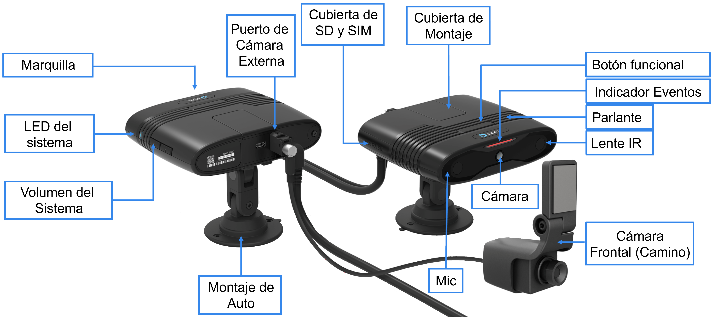
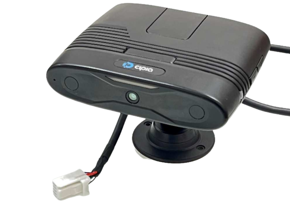
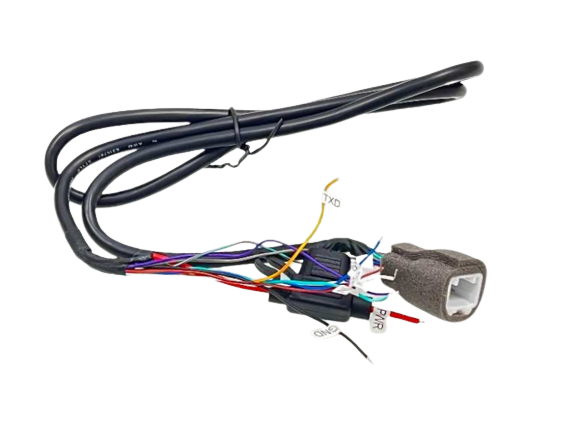
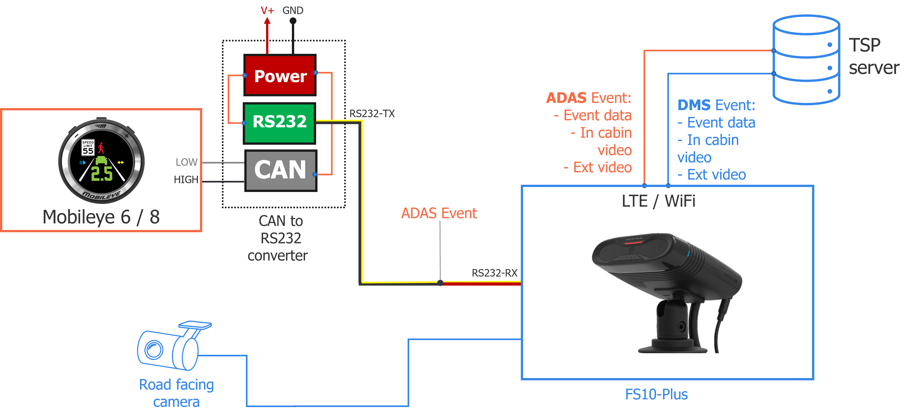

# Cipia-FS10 (Manual de Producto)
## Acerca de este manual
### Público objetivo
Este manual del producto está destinado a los equipos de desarrollo de productos, soporte técnico y servicios profesionales dentro de los proveedores de servicios telemáticos (TSP) y los proveedores de plataformas de software, que planean utilizar las capacidades telemáticas de video Cipia-FS10 como parte de su oferta de productos.

### Alcance del documento
Los objetivos principales de este documento son describir el valor, el propósito, la funcionalidad, las características y las interfaces de usuario del dispositivo Cipia-FS10.
### Documentación relacionada
Los siguientes documentos deben usarse junto con este manual para proporcionar a los equipos una imagen completa que cubra el alcance del trabajo, las herramientas y los recursos disponibles y/o necesarios para el proceso de integración exitoso.
- [Manual de Integración Cipia-FS10](01_Cipia-FS10_Integration_Manual_ES.md)
- [Manual de inicio rápido Cipia-FS10 EVK](02_Cipia-FS10_EVK_Start_Guide_ES.md)
- [Descripción de los protocolos OTA de Cipia-FS10](03_Cipia-FS10_OTA_Protocols_Description_ES.md)
- [Descripción de la API de la aplicación del instalador](04_Cipia-FS10_Installer_App_Manual_ES.md)
- [Manual del instalador de la aplicación](05_Cipia-FS10_Installer_App_Manual_ES.md)
- [Documento API de Middleware](06_Cipia-FS10_Middleware_document_ES.md)
- [Manual de protocolo serial Cipia-FS10](07_Cipia-FS10_Serial_Protocol_manual_ES.md)

## Tabla de contenidos
El siguiente manual está distribuido en la siguiente organización:
1. [Acerca de este manual](#Acerca-de-este-manual)
2. [Descripción general de Cipia-FS10](#Descripción-general-de-Cipia-FS10)
3. [Cipia-FS10 Hardware and Interfaces](#Cipia-FS10-hardware-and-interfaces)
   - [Conceptos básicos del dispositivo Cipia-FS10](#Conceptos-básicos-del-dispositivo-Cipia-FS10)
   - [Bloques de construcción del sistema](#Bloques-de-construcción-del-sistema)
   - [Especificación de hardware](#Especificaciones-del-hardware)
   - [Cable de instalación y pines](#Cable-de-instalación-y-pines)
   - [Cumplimiento ambiental](#Cumplimiento-ambiental)
   - [Certificaciones y estándares de la industrial](#Certificaciones-y-estándares-de-la-industrial)
4. [Uso de Cipia-FS10](#Uso-de-Cipia-FS10)
   - [Arquitectura de la solución](#Arquitectura-de-la-solución)
   - [Estados y modos de operación](#Estados-y-modos-de-operación)
   - [Características y funciones del modo estándar](#Características-y-funciones-del-modo-estándar)
   - [Aprovisionamiento y mantenimiento de Cipia-FS10](#Aprovisionamiento-y-mantenimiento-de-Cipia-FS10)
        - [Cambios en el archivo de configuración](#Cambios-en-el-archivo-de-configuración)
        - [Gestión de archivos de configuración por Cipia-FS10](#Gestión-de-archivos-de-configuración-por-Cipia-FS10)
        - [Entorno de depuración](#Entorno-de-depuración)
        - [Proceso de instalación y calibración](#Proceso-de-instalación-y-calibración)
        - [Inscripción de identificación de conductor](#Inscripción-de-identificación-de-conductor)
        - [Gestión de archivos de audio](#Gestión-de-archivos-de-audio)
        - [Restablecimiento del dispositivo](#Restablecimiento-del-dispositivo)
        - [Propiedades del dispositivo](#Propiedades-del-dispositivo)
   - [Integración con Mobileye 6 u 8](#Integración-con-Mobileye-6-u-8)
   - [Eventos Cipia-FS10](#Eventos-Cipia-FS10)
   - [Configuración](#Configuración)
   - [Interfaces de comunicación](#Interfaces-de-comunicación)
        - [Conexión RS232](#Conexión-RS232)
        - [USB](#USB)
        - [Bluetooth](#Bluetooth)
        - [Wi-Fi](#Wi-Fi)
        - [LTE](#LTE)
   - [Priorización de canales de comunicación](#Priorización-de-canales-de-comunicación)
   - [Seguridad de las comunicaciones](#Seguridad-de-las-comunicaciones)
        - [MQTT](#MQTT)
        - [SSH](#SSH)
5.	[Cipia-FS10 HMI](#Cipia-FS10-HMI)
6.	[Kit de prueba y evaluación](#Kit-de-prueba-y-evaluación)
7.	[Control de errores del sistema](#Control-de-errores-del-sistema)
8.	[Avisos de normas y reglamentos](#Avisos-de-normas-y-reglamentos)
    - [FCC](#FCC)
    - [IC](#IC)
    - [RED](#RED)

## Descripción general de Cipia-FS10
[Ir al Inicio](#cipia-fs10-manual-de-producto) | [Tabla de contenidos](#Tabla-de-contenidos)

Cipia-FS10 es un dispositivo de videotelemática con capacidades integradas de visión artificial. Está diseñado para mejorar la seguridad del conductor y la flota a través de aplicaciones de videotelemática. El dispositivo Cipia-FS10 detecta la somnolencia del conductor, las distracciones y las acciones peligrosas, proporcionando alertas del conductor en tiempo real, así como alertas e información personalizadas del administrador de flotas a través de su servidor de gestión de flotas.

El dispositivo Cipia-FS10 es un dispositivo en el automóvil que incorpora el motor de software de monitoreo del conductor de Cipia y está destinado a las ventas en el segmento de posventa de gestión de flotas. Los clientes objetivo incluyen proveedores de servicios telemáticos (TSP), distribuidores, revendedores e integradores, así como grandes flotas comerciales con su propia solución telemática.

El sistema tiene recursos de hardware de visión artificial integrados y está destinado a proporcionar capacidades de monitoreo, alerta e informes en tiempo real cuando el conductor está somnoliento, dormido o no está atento a la carretera.

El sistema puede conectarse opcionalmente a un sistema telemático a bordo, u otro dispositivo conectado  en el vehículo, para informar eventos de seguridad en tiempo real a la aplicación de back-end (en caso de que no esté equipado con sus propios recursos de conectividad celular).

Las principales características y funciones del sistema Cipia-FS10 incluyen:
- **Análisis del estado del controlador**
Las capacidades de análisis del estado del controlador Cipia-FS10 incluyen la detección de:
  -	**Distracción del conductor:** basada en la dirección de la mirada y el análisis de otros rasgos faciales, alerta cuando el conductor no está mirando al centro de la carretera. Las alertas se correlacionan con el estado del vehículo (velocidad, marcha, etc.)
  -	**Somnolencia del conductor (fatiga):** informar y alertar cuando el conductor está somnoliento o dormido.
  -	**Uso del teléfono móvil:** alerta cuando el conductor sostiene su teléfono móvil.
  -	**Uso del cigarrillo:** alertar cuando se identifica al conductor como fumador.
  -	**Uso del cinturón de seguridad:** alerta cuando el vehículo se está moviendo pero el conductor no usa el cinturón de seguridad.
- **Detección de identidad del conductor**
Después de un breve proceso de inscripción, que permite agregar un controlador específico a la base de datos del dispositivo, cuando se reconoce un controlador, el sistema informa su ID. Esta información se puede utilizar para las políticas de autenticación de conductores dentro de la flota.

- **A prueba de manipulaciones**
El sistema puede informar cuando la cámara tiene diferentes fallas, como sobreexposición, cámara bloqueada, desconexión de cables, desplazamiento del dispositivo, etc.

- **Informes de eventos de ADAS**
El sistema puede conectarse opcionalmente también a un dispositivo Mobileye, desde el cual puede recibir y analizar varios eventos ADAS que luego pueden analizarse, filtrarse e informarse al servidor para proporcionar una solución completa de seguridad para el conductor y la flota.

- **Captura de vídeo**
Cipia-FS10 permite la captura de vídeo de las siguientes maneras:
   - **De forma autónoma:** active la captura de video del conductor durante unos segundos antes y después de un evento de seguridad detectado por los algoritmos de visión artificial.
   - **Desde el dispositivo conectado:** active la captura de video del conductor durante unos segundos antes y después de un evento de seguridad detectado por un dispositivo conectado.
   - **Comando del servidor (instantáneo):** active la duración predefinida, la captura de video inmediata del controlador una vez que se recibe un comando del backend.
   - **Comando del servidor (DVR):** recupere imágenes del búfer de grabación de video digital en curso en la tarjeta SD, de acuerdo con los marcos de tiempo definidos en el comando.
   - 
- **Métodos de alerta e informes**
Cipia-FS10 informa sobre comportamientos y eventos detectados a:
   - **Conductor:** alertas auditivas (tanto señales como del habla), visuales y/o hápticas (por ejemplo, vibración del asiento o del cinturón de seguridad) al detectar un comportamiento no deseado.
   - **Administrador de flota:** alertas en tiempo real de eventos peligrosos con o sin imágenes de video capturadas alrededor del momento del evento detectado.

## Cipia-FS10 - hardware e interfaces
[Ir al Inicio](#Cipia-FS10-Manual-de-Producto) | [Tabla de Contenidos](#Tabla-de-contenidos)

### Conceptos básicos del dispositivo Cipia-FS10
[Tabla de Contenidos](#Tabla-de-contenidos) | [Inicio de sección](#Cipia-FS10---hardware-e-interfaces)

<div align="center">
  
  <p align="center"><strong>Fig. 1</strong> - Imagen del dispositivo Cipia-FS10.</p>
</div>

- **Dimensiones** – Las dimensiones del producto son (excluyendo accesorios de montaje) 120mm (L) X 95mm (W) X 30mm. El dispositivo Cipia-FS10 no compromete el campo de visión del conductor de una manera incómoda o ilegal.
- **Peso:** el dispositivo pesa ~390 g, incluido el arnés y el brazo de montaje.
- **Ajuste de la orientación del dispositivo:** el dispositivo tiene un brazo de montaje que permite el movimiento 3D y proporciona la mayor flexibilidad de instalación mientras mantiene la cara del conductor dentro del punto de vista de la cámara. El brazo de montaje se puede bloquear y se puede instalar en la consola o en el parabrisas, utilizando adhesivo de doble cara y/o tornillos. Las cabezas de tornillo especiales son solo para uso profesional.

<div align="center">
  
  <p align="center"><strong>Fig. 2</strong> - Sistema coordenado del dispositivo Cipia-FS10.</p>
</div>

En el diagrama anterior, el eje *x* apunta al controlador.
- **Cable  de instalación:** el cable de instalación está conectado/soldado a la placa interna y sale de la superficie de la carcasa a través de un alivio de tensión de silicona que garantiza la elasticidad y la resistencia contra la tracción. Todos los cables están cubiertos por una sola chaqueta que sale de la carcasa del dispositivo.
- **Cámara y ventana de LED IR:** la carcasa incluye una cubierta transparente IR para la lente de la cámara y los LED IR. La iluminación IR no es visible para el conductor.
- **Cámara externa orientada hacia la carretera:**  Las versiones de Cipia-FS10 Plus admiten la conexión de una cámara orientada hacia adelante (carretera) para monitorear, grabar e informar eventos de la carretera y / o video continuo.

<div align="center">
  
  <p align="center"><strong>Fig. 3</strong> - Cámara delantera para Cipia-FS10 Plus.</p>
</div>

- **Interfaces de usuario:** existen las siguientes interfaces mecánicas para las características de usuario.

<div align="center">
  
  <p align="center"><strong>Fig. 4</strong> - Interfaz de dispositivo.</p>
</div>

<table>
  <tr>
    <th>Interfaz</th>
    <th>Descripción</th>
  </tr>
  <tr>
    <td>Puerto de tarjetas</td>
    <td>Tarjetas SIM/SD. Usado por técnicos e instaladores durante la instalación o servicio.</td>
  </tr>
  <tr>
    <td>Botón funcional</td>
    <td>Activation/HW reset/Event triggering.</td>
  </tr>
  <tr>
    <td>Indicador al conductor</td>
    <td>Activation/HW reset/Event triggering.</td>
  </tr>
  <tr>
    <td>Bocina</td>
    <td>Activation/HW reset/Event triggering.</td>
  </tr>
  <tr>
    <td>Functional Button</td>
    <td>Activation/HW reset/Event triggering.</td>
  </tr>
  <tr>
    <td>Micrófono</td>
    <td>Para la grabación de voz de cabina (configurable).</td>
  </tr>
  <tr>
    <td>LED del Sistema</td>
    <td>LED Tricolor para reportar los eventos del sistema.</td>
  </tr>
  <tr>
    <td>Botón de Volumen</td>
    <td>Control de volumen (configurable).</td>
  </tr>
  <tr>
    <td>Puerto USB (micro)</td>
    <td>Puerto micro USB para el servicio de depuración y la carga de datos en caso de que los eventos y las secuencias de video no se puedan cargar de forma inalámbrica.</td>
  </tr>
</table>

### Bloques de construcción del sistema
[Tabla de Contenidos](#Tabla-de-contenidos) | [Inicio de sección](#Cipia-FS10---hardware-e-interfaces)

El siguiente diagrama muestra los principales bloques de construcción, interconexiones e interfaces del dispositivo Cipia-FS10.

<div align="center">
  
  <p align="center"><strong>Fig. 5</strong> - Diagrama de bloques interno.</p>
</div>

### Especificación de hardware
[Tabla de Contenidos](#Tabla-de-contenidos) | [Inicio de sección](#Cipia-FS10---hardware-e-interfaces)

<table>
  <tr>
    <th>Componente</th>
    <th>Descripción</th>
  </tr>
  <tr>
    <td style = "font-weight: bold;" colspan="2">Núcleo de la plataforma</td>
  </tr>
  <tr>
      <td>Procesador principal (SOC)</td>
      <td>Ambarella CV25</td>
  </tr>
  <tr>
    <td>RAM</td>
    <td>1GB</td>
  </tr>
  <tr>
    <td>ROM</td>
    <td>8GB</td>
  </tr>
  <tr>
    <td>Tarjeta de memoria</td>
    <td>Ranura para tarjeta Micro SD – Hasta 1TB, exFAT, SDHC/SDXC</td>
  </tr>
  <tr>
    <td rowspan="2">Perro guardián</td>
    <td>-Controlado por SW: para la recuperación de aplicaciones</td>
  </tr>
  <tr>
    <td>-HW controlado – para la recuperación del sistema</td>
  </tr>
  <tr>
    <td>Sensor de movimiento</td>
    <td>Acelerómetro 3D / (±16g, 12bit, 100Hz o mejor)</td>
  </tr>
  <tr>
    <td>Sistema operativo</td>
    <td>Linux based</td>
  </tr>
  <tr>
    <td style = "font-weight: bold;" colspan="2">Interfaz del controlador</td>
  </tr>
  <tr>
    <td rowspan="2">Botones físicos</td>
    <td>- 1 x configurable, multipropósito</td>
  </tr>
  <tr>
    <td>+/- Teclas de volumen</td>
  </tr>
  <tr>
    <td rowspan="2">LEDs</td>
    <td>- 1 x Estado del sistema (3 colores)</td>
  </tr>
  <tr>
    <td>- 3 x eventos del conductor</td>
  </tr>
  <tr>
    <td>Micrófono interno</td>
    <td>Alta sensibilidad, omnidireccional</td>
  </tr>
  <tr>
    <td>Bocina interna</td>
    <td>Max 85dB @ 1m / 2W, 600Hz ~ 20Khz</td>
  </tr>
  <tr>
    <td style = "font-weight: bold;" colspan="2">Comunicación inalámbrica</td>
  </tr>
  <tr>
    <td rowspan="5">Celular</td>
    <td>- LTE CAT4</td>
  </tr>
  <tr>
    <td>- FDD 1/2/3/4/5/7/8/12/13/17/20/28 (Territorios/aplicaciones no compatibles: Japón, FirstNet)</td>
  </tr>
  <tr>
    <td>- GSM 850/900/1800/1900</td>
  </tr>
  <tr>
    <td>- WCDMA 1/2/4/5/8 (DC-HSPA+)</td>
  </tr>
  <tr>
    <td>- 3FF, Micro SIM (interna)</td>
  </tr>
  <tr>
    <td rowspan="2">Módulo GNSS</td>
    <td>- 50 canales, NMEA 0183, soporte AGPS</td>
  </tr>
  <tr>
    <td>- Soporte de sistemas satelitales: GPS, GLONASS, Galileo</td>
  </tr>
  <tr>
    <td rowspan="3">LAN inalámbrica</td>
    <td>- Wi-Fi – 802.11 b/g/n/ac,</td>
  </tr>
  <tr>
    <td>- Bandas de frecuencia - 2.4G (B1-13) / 5G (B36-165)</td>
  </tr>
  <tr>
    <td>- Soporte de modo dual AP y/o Hotspot</td>
  </tr>
  <tr>
    <td>Bluetooth</td>
    <td>BLE V4.2</td>
  </tr>
  <tr>
    <td style = "font-weight: bold;" colspan="2">Cámaras integradas</td>
  </tr>
  <tr>
    <td  rowspan="7">En cabina (DMS)</td>
    <td>- Sensor de imagen monocromo de 1,2 MP (1280 x 960)</td>
  </tr>
  <tr>
    <td>- Enfoque fijo. Profundidad de visión 40-111cm</td>
  </tr>
  <tr>
    <td>- VOAF: 51º/ VFOV: 39º</td>
  </tr>
  <tr>
    <td>- Obturador global IR 940nm</td>
  </tr>
  <tr>
    <td>- 30 fps</td>
  </tr>
  <tr>
    <td>- F# 2.05</td>
  </tr>
  <tr>
    <td>- LEDs IR x 2</td>
  </tr>
  <tr>
    <td rowspan="11">Al camino (Dashcam)</td>
    <td>(Modelos FS10-Plus y FS10-XXX-ADAS)</td>
  </tr>
  <tr>
    <td>- 2MP (1920x1280), sensor de imagen de 2.8μ</td>
  </tr>
  <tr>
    <td>- Amplio rango dinámico – 120dB</td>
  </tr>
  <tr>
    <td>- Excepcional sensibilidad a la luz baja: 0.01Lux</td>
  </tr>
  <tr>
    <td>- 30 fps</td>
  </tr>
  <tr>
    <td>- F# 2.9</td>
  </tr>
  <tr>
    <td>- VOAF: 62º, VFOV: 34º</td>
  </tr>
  <tr>
    <td>- Interfaz física – Conector FAKRA</td>
  </tr>
  <tr>
    <td>- Tipo de interfaz FPD-LINK III</td>
  </tr>
  <tr>
    <td>- Alimentación: 12 V, ±8 %, pico de 400 mA, AVG de <150 mA</td>
  </tr>
  <tr>
    <td>- Carcasa: Aleación de aluminio</td>
  </tr>
  <tr>
    <td  style = "font-weight: bold;" colspan="2">Interfaces de comunicación</td>
  </tr>
  <tr>
    <td>RS-232</td>
    <td>- 1 x RS-232 (Tx, Rx, GND)</td>
  </tr>
  <tr>
    <td>USB</td>
    <td>- 1 x USB 2.0 Dispositivo/host (puerto Micro-USB)</td>
  </tr>
  <tr>
    <td style = "font-weight: bold;" colspan="2">Control de periféricos</td>
  </tr>
  <tr>
    <td rowspan="4">GPIO</td>
    <td>- 1 x sentido de encendido.</td>
  </tr>
  <tr>
    <td>- 1 x entrada (0 – VCC). Digital o analógico.</td>
  </tr>
  <tr>
    <td>- 1 x salida de colector abierto.</td>
  </tr>
  <tr>
    <td>- 1 x E/S – Totalmente configurable por SW.</td>
  </tr>
  <tr>
    <td style = "font-weight: bold;" colspan="2">Potencia</td>
  </tr>
  <tr>
    <td rowspan="2">Potencia de entrada</td>
    <td>- Conexión directa de la batería del vehículo (9V-32V)</td>
  </tr>
  <tr>
    <td>- Cumple con ISO 7637 y 16750</td>
  </tr>
  <tr>
    <td>Batería interna</td>
    <td>Li-Ion 3.7V / 550mAh - Admite un minuto de funcionalidad completa y apagado ordenado en el corte de energía.</td>
  </tr>
  <tr>
    <td>Corriente promedio @ inactivo</td>
    <td><3mA @ 12V</td>
  </tr>
  <tr>
    <td rowspan="2">Corriente media @ activo</td>
    <td>- FS10-LOC: <475mA @12V</td>
  </tr>
  <tr>
    <td>- FS10-LTE @12V <540 mA</td>
  </tr>
</table>

### Cable de instalación y pines
[Tabla de Contenidos](#Tabla-de-contenidos) | [Inicio de sección](#Cipia-FS10---hardware-e-interfaces)

El cable de instalación Cipia-FS10 consta de 2 partes:
1. Cable estilo Pigtail de un metro de largo, conectado internamente a la placa principal del dispositivo y con conector automotriz de 10 pines en el extremo.

<div align="center">
  
  <p align="center"><strong>Fig. 6</strong> - Dispositivo Cipia-FS10.</p>
</div>

2. Cable de extensión de un metro de largo equipado con un conector automotriz mate y cables abiertos en el extremo.

<div align="center">
  
  <p align="center"><strong>Fig. 7</strong> - Cableado Cipia-FS10.</p>
</div>

Esta estructura garantiza que los instaladores tengan la máxima flexibilidad en caso de que sea necesario cambiar la configuración de la instalación o corregir el hardware.

La siguiente tabla describe el pinout del dispositivo FS10:

<table>
  <tr>
    <th>Pin</th>
    <th>Señal</th>
    <th>Observación</th>
  </tr>
  <tr>
      <td>1</td>
      <td>PWR_IN</td>
      <td>Rojo - Voltaje de Entrada</td>      
  </tr>
  <tr>
      <td>2</td>
      <td>PWR_GND</td>
      <td>NMegro - Referencia de 0V</td>      
  </tr>
  <tr>
      <td>3</td>
      <td>PWR_IGN</td>
      <td>Morado - Señal de la Ignición</td>      
  </tr>
  <tr>
      <td>4</td>
      <td>RS232_TxD</td>
      <td>Amarillo/ Naranja - Transmisión de comunicación serial</td>      
  </tr>
  <tr>
      <td>5</td>
      <td>RS232_RxD</td>
      <td>Gris/ Naranja - Recepción de comunicación serial</td>  
  </tr>
  <tr>
      <td>6</td>
      <td>COM_GND</td>
      <td>Blanco - Referencia de tierra para comunicación</td>      
  </tr>
  <tr>
      <td>7</td>
      <td>GP_IN</td>
      <td>Verde - Entrada de voltaje por parámetros</td>      
  </tr>
  <tr>
      <td>8</td>
      <td>GP_OUT</td>
      <td>Azul - Señal a 0V para cierre de salida</td>      
  </tr>
  <tr>
      <td>9</td>
      <td>GP_IO</td>
      <td>Gris - Multiproposito entrada /salida</td>      
  </tr>
  <tr>
      <td>10</td>
      <td>SPARE</td>
      <td>Rojo/ Negro - Uso futuro</td>      
  </tr>
</table>

Para grantizar el mínimo de conexiones para que el Cipia-FS10 funcione, los pines (1), (2) y (3) son requeridos.

### Cumplimiento ambiental
[Tabla de Contenidos](#Tabla-de-contenidos) | [Inicio de sección](#Cipia-FS10---hardware-e-interfaces)

El dispositivo Cipia-FS10 cumple con los estándares ambientales detallados en la siguiente tabla:

<table>
  <tr>
    <th>Variable</th>
    <th>Descripción</th>
  </tr>
  <tr>
      <td rowspan="4">Rango de temperatura</td>
      <td>Temperatura de funcionamiento (arranque/funcionamiento): -30 °C a +70 °C</td>
   </tr>
   <tr>
      <td>Continuo (rendimiento completo): -20 °C a +40 °C</td>
   </tr>
   <tr>
	  <td>- De la batería: -20°C a +60°C</td>
   </tr>
   <tr>
      <td>- Almacenamiento: -30°C a +80°C</td>
   </tr>
   <tr>
	  <td>Humedad
      <td>- 95% ±5% HR @ +40°C, sin condensación</td>
   </tr>
   <tr>
	   <td>IP</td>
       <td>- IP40</td>
   </tr>
   <tr>
	   <td>Empaquetado</td>
       <td>- ASTM/ ISTA</td>
   </tr>
   <tr>
       <td>RoHS</td>
       <td>- RoHS II</td>
   </tr>
   <tr>
       <td>REACH/COP</td>
       <td>- Cumple con REACH/POP (Unión Europea)</td>
   </tr>
   <tr>
       <td>Minerales de conflicto</td>
       <td>- Cumple con la ley de minerales de conflicto</td>
   </tr>
   <tr>
	   <td>Vibración</td>
       <td>- ISO16750</td>
   </tr>
   <tr>
	   <td>Choque mecánico</td>
       <td>- ISO16750</td>
   </tr>
   <tr>
	   <td>UV</td>
       <td>Material plástico resistente a los rayos UV</td>
   </tr>  
</table>

### Certificaciones y estándares de la industria
[Tabla de Contenidos](#Tabla-de-contenidos) | [Inicio de sección](#Cipia-FS10---hardware-e-interfaces)

El dispositivo Cipia-FS10 cumple con los siguientes estándares de certificación:
- FCC IDENTIFIER: XMR201903EG25GCE/RED
- IC (Canada Industrial)
- RCM
- E-mark
- RSSC (solo los modelos LTE)
- PTCRB (solo los modelos LTE)
- GCF (solo los modelos LTE)
- IEC62471 (Protección Visual)

## Uso de Cipia-FS10
[Ir al Inicio](#Cipia-FS10-Manual-de-Producto) | [Tabla de Contenidos](#Tabla-de-contenidos)
### Arquitectura de la solución
[Tabla de Contenidos](#Tabla-de-contenidos) | [Inicio de sección](#Uso-de-Cipia-FS10)

El siguiente diagrama muestra los diversos bloques de construcción e interfaces opcionales del Cipia-FS10 cuando se integra en un entorno de solución telemática
   
### Estados y modos de operación
[Tabla de Contenidos](#Tabla-de-contenidos) | [Inicio de sección](#Uso-de-Cipia-FS10)

La aplicación Cipia-FS10 tiene tres modos operativos:
1. Modo de instalación y calibración: utilizado durante la instalación por un técnico profesional / certificado.
2. Modo de mantenimiento: utilizado durante debug el mantenimiento por técnicos o ingenieros de aplicaciones de campo.
3. Modo estándar: se utiliza durante el funcionamiento normal del sistema.

En la tabla siguiente se definen los atributos principales de cada uno de estos modos operativos.
El dispositivo Cipia-FS10 mantiene dos indicadores en su memoria no volátil para designar si el dispositivo se instaló profesionalmente y si se calibró. Estos indicadores se establecen/borran de acuerdo con los eventos de transición de modo descritos en el diagrama siguiente y pueden ser consultados por el lado del servidor como parte de la consulta de propiedades del dispositivo (consulte el Manual de integración de Cipia-FS10).

*****IMAGEN*****

Los diferentes modos de operación y atributos per cada uno se detallan en la tabla a continuación.

<table>
  <tr>
    <th>Número</th>
    <th>Modo</th>
    <th>Actividades y atributos</th>
  </tr>
  <tr>
      <td rowspan="6">1</td>
      <td rowspan="6">Instalación y calibración</td>
      <td>-El motor lógico de monitoreo de vehículos y conductores está inactivo</td>
   </tr>
   <tr>
      <td>-Todos los módulos de comunicación están habilitados independientemente de la configuración de configuración.</td>
   </tr>
   <tr>
      <td>- Adquisición y almacenamiento de ángulos de instalación física para su posterior detección de manipulaciones.</td>
   </tr>
   <tr>
      <td>- Gestión de archivos de configuración por instalador/técnico.</td>
   </tr>
   <tr>
      <td>- Proceso de calibración de la cámara.</td>
   </tr>
   <tr>
      <td>- Inscripción en Face ID.</td>
   </tr>
   <tr>
   	  <td  rowspan="8">2</td>
      <td  rowspan="8">Mantenimiento</td>
      <td>- El estado del vehículo y la lógica de supervisión del conductor están activos.</td>
   </tr>
   <tr>
      <td>- Todos los canales de comunicación están habilitados independientemente de la configuración de configuración.</td>
   </tr>
   <tr>
      <td>- Acceso completo a NVM, RAM, SD tarjeta por usuarios autorizados.</td>
   </tr>
   <tr>
      <td>- Acceso completo a los recursos de depuración por parte de usuarios autorizados.</td>
   </tr>
   <tr>
      <td>- Gestión de archivos de configuración local.</td>
   </tr>
   <tr>
      <td>- Inscripción en Face ID.</td>
   </tr>
   <tr>
      <td>- Inyección de vídeo pregrabado.</td>
   </tr>
   <tr>
      <td>- Actualizaciones de la biblioteca, OS/App/DMS.</td>
   </tr>
   <tr>
   	<td  rowspan="3">3</td>
      <td  rowspan="3">Estandar</td>
      <td>- El estado del vehículo y la lógica de supervisión del conductor están activos.</td>
   </tr>
   <tr>
	  <td>- El sistema funciona de acuerdo con la configuración del archivo de configuración.</td>
   </tr>
   <tr>
      <td>- Gestión de archivos de configuración desde el servidor a través de protocolos definidos.</td>
   </tr>
</table>

### Características y funciones del modo estándar
[Tabla de Contenidos](#Tabla-de-contenidos) | [Inicio de sección](#Uso-de-Cipia-FS10)

En la tabla siguiente se enumeran todas las características y funciones compatibles con el
dispositivo Cipia-FS10 en modo de funcionamiento estándar.

<table>
  <tr>
    <th>Número</th>
    <th>Función</th>
    <th>Descripción</th>
  </tr>
  <tr>
      <td>1</td>
      <td>Lógica de monitoreo de vehículos y conductores</td>
      <td>El dispositivo Cipia-FS10 supervisa todos los parámetros y condiciones enumerados en la sección Eventos del archivo de configuración y activa eventos cuando se cumplen las condiciones.</td>
   </tr>
   <tr>
      <td rowspan="2">2</td>
      <td rowspan="2">Gestión de eventos en memoria</td>
      <td>Cada evento generado por la aplicación Cipia-FS10 está asociado con un identificador numérico único y se registra en NVM hasta que se recibe un ACK del GW de comunicación del servidor que indica que el mensaje se recibió correctamente.</td>
   </tr>
   <tr>
      <td>El número máximo de eventos registrados antes de que el sistema comience a anularse se establece en el archivo de configuración.</td>
   </tr>
   <tr>
      <td rowspan="3">3</td>
      <td rowspan="3">ID de viaje</td>
      <td>Tras la detección de un evento de encendido (Logic Rise de la línea IGN), o tras la detección de un cambio de conductor sin apagar el motor, el dispositivo Cipia-FS10 establece un nuevo ID de viaje como el número del viaje anterior + 1.</td>
   </tr>
   <tr>
      <td>Cada evento generado por el dispositivo Cipia-FS10 se envía al backend FMS con el ID de viaje como parte de la estructura del mensaje.</td>
   </tr>
   <tr>
      <td>El ID de viaje es un entero de 3 bytes y se restablece a 0 al alcanzar D16,777,215.</td>
   </tr>
   <tr>
      <td rowspan="6">4</td>
      <td rowspan="6">Gestión de datos del vehículo</td>
      <td>La biblioteca DMS utiliza datos del vehículo para activar, desactivar o
adaptar correctamente eventos de desatención.</td>
   </tr>
   <tr>
      <td>Si la información del vehículo está disponible, la aplicación principal
informa de los siguientes parámetros a la biblioteca DMS:</td>
   </tr>
   <tr>
      <td><strong>Velocidad del vehículo (desde GPS):</strong> cuando los datos GPS no están disponibles o no están actualizados, o son inexactos (puntuación de baja calidad), la aplicación principal transfiere un valor acordado que designa la "velocidad no disponible" a la biblioteca. La aplicación principal aplica el algoritmo de "detección de movimiento" mientras los datos GPS no están disponibles y si el vehículo no se mueve, 'velocidad = 0' se informa a la biblioteca para evitar que la biblioteca informe eventos innecesarios.</td>
   </tr>
   <tr>
      <td><strong>Dirección del vehículo (estado de marcha adelante/ marcha atrás):</strong> si el indicador del interruptor de marcha atrás está conectado a una de las entradas del dispositivo y la entrada está configurada correctamente como señal de "marcha atrás", cada vez que se detecta una marcha atrás, los eventos DMS se desactivan.</td>
   </tr>
   <tr>
      <td><strong>Estado del indicador de giro (intermitentes):</strong> si el indicador de giro está conectado a una de las entradas del dispositivo.</td>
   </tr>
   <tr>
      <td><strong>Velocidad de guiñada del vehículo:</strong> designa el cambio en el ángulo
de rumbo del vehículo en comparación con el ángulo de rumbo anterior recibido del receptor GPS, siempre que los datos GPS estén disponibles y sean precisos.</td>
   </tr>
   <tr>
      <td rowspan="2">5</td>
      <td rowspan="2">Gestión del tiempo</td>
      <td>El sistema operativo Cipia-FS10 mantiene una "hora del sistema" precisa en GMT basada en fuentes de reloj disponibles como la red celular y/o GPS.</td>
   </tr>
   <tr>
      <td>Si ninguno de los dos existe o está "actualizado", el dispositivo CipiaFS10 gestiona la hora exacta (utilizando el reloj interno en tiempo real) con una desviación máxima de 86 segundos por 24 horas (0,1%).</td>
   </tr>
   <tr>
      <td rowspan="4">6</td>
      <td rowspan="4">Gestión de ubicaciones</td>
      <td>La aplicación principal Cipia-FS10 actualiza el registro de ubicación preciso (RAM) al menos cada 1 segundo durante todo el viaje.</td>
   </tr>
   <tr>
      <td>La primera ubicación en un nuevo viaje se registra solo después de que el sistema GNSS adquiere un FIX preciso.</td>
   </tr>
   <tr>
      <td>El registro de ubicación no se actualiza si el parámetro de calidad FIX no supera un umbral predefinido.</td>
   </tr>
   <tr>
      <td>Siempre que el registro de ubicación no se actualiza durante más tiempo que el parámetro de configuración TH, el dispositivo Cipia-FS10 genera un evento de "pérdida de GPS".</td>
   </tr>
   <tr>
      <td rowspan="6">7</td>
      <td rowspan="6">Captura de vídeo y subir</td>
      <td>La aplicación principal Cipia-FS10 actualiza el registro de ubicación preciso (RAM) al menos cada 1 segundo durante todo el viaje.</td>
   </tr>
   <tr>
      <td>La aplicación Cipia-FS10 gestiona dos búferes cíclicos de vídeo, para cada cámara conectada (DMS y ADAS-opcional):
      	<ul>
  			<li>Búfer de vídeo de eventos en RAM, destinado a guardar unos segundos de vídeo antes y después de la ocurrencia de un evento de seguridad.</li>
            <li>Búfer cíclico global en la tarjeta SD, destinado a permitir la recuperación de secuencias de vídeo a petición de la aplicación móvil o el servidor (si está habilitado en la configuración (consulte el parámetro 'ContRecording'').</li>
		</ul>
      </td>
   </tr>
   <tr>
      <td>El video en el búfer cíclico global se comprime utilizando el códec H.264 que puede ser utilizado también por el FMS para reproducir el video. El búfer de vídeo de eventos de la RAM se captura y se guarda en NVM cuando se produce el evento y de acuerdo con los ajustes del archivo de configuración.</td>
   </tr>
   <tr>
      <td>Es posible indicar al dispositivo Cipia-FS10 que "comience a grabar ahora" un metraje con una longitud máxima de EventVideoLen al recibir dicho comando del servidor. El video capturado incluye el "pre-buffer" que estaba en la RAM en el momento en que se recibió el comando.</td>
   </tr>
   <tr>
      <td>El dispositivo Cipia-FS10 admite la carga de secuencias de vídeo desde el búfer cíclico global, de acuerdo con el marco de tiempo definido en un comando, si el marco de tiempo todavía está disponible en la memoria del dispositivo y si el período de tiempo solicitado no es superior a 10 minutos.</td>
   </tr>
   <tr>
      <td>El protocolo bidireccional OTA admite los comandos de captura de vídeo
descritos:
      	<ul>
  			<li>Comando 'Start recording now' (Iniciar grabación).</li>
            <li>Comando 'Retrieve footage from Memory' (Recuperar material de archivo de la memoria).</li>
		</ul>
      </td>
   </tr>
   <tr>
      <td rowspan="9">8</td>
      <td rowspan="9">Gestión de energía</td>
      <td>La aplicación Cipia-FS10 distingue entre 3 modos de potencia: (1) ON, (2) OFF, (3) Standby/sleep.</td>
   </tr>
   <tr>
      <td>La línea de encendido es el desencadenante habitual para las transiciones entre los modos ON y SLEEP.</td>
   </tr>
   <tr>
      <td>El modo OFF es el estado de energía del dispositivo durante el envío o después de la pérdida de energía externa y el agotamiento de la batería de respaldo interna.</td>
   </tr>
   <tr>
      <td>En funcionamiento normal, después de que el dispositivo esté conectado a una fuente de 9- alimentación de 32 V, nunca se apagará, a menos que se desconecte la fuente de alimentación principal.</td>
   </tr>
   <tr>
      <td>Si el parámetro 'MainButtonSettings' 'DeviceTurnOnEnable' está configurado en 'enabled', presionando el botón principal durante cualquier momento entre 5 y 10 segundos, mientras el dispositivo CipiaFS10 está encendido, activa el dispositivo para entrar en modo de suspensión</td>
   </tr>
   <tr>
      <td>Si el parámetro 'MainButton settings' 'DeviceTurnOnEnable' se establece en 'disabled', el usuario nunca podrá poner el dispositivo en modo SLEEP.</td>
   </tr>
   <tr>
      <td>Independientemente de la configuración de los parámetros MainButtonSettings, si el dispositivo está encendido, supervisa la línea de encendido y se mueve entre los modos SLEEP y ON en consecuencia.</td>
   </tr>
   <tr>
      <td>Tras la detección de una caída de energía por debajo de 7V, en la línea de entrada de alimentación, durante más de 2 segundos, el dispositivo Cipia-FS10 genera un evento de error con la razón apropiada (y el búfer de video cíclico) y comienza un procedimiento de apagado que se completa en menos de 20 segundos. El dispositivo Cipia-FS10 se despierta de nuevo una vez reconectado a una fuente de alimentación estable de 9-32V.</td>
   </tr>
   <tr>
      <td>Si no hay conexión con el servidor en el momento de la pérdida de energía, el evento se almacena en NVM y se carga en el siguiente encendido exitoso.</td>
   </tr> 
   <tr>
      <td rowspan="2">9</td>
      <td rowspan="2">Detección de manipulación</td>
      <td>La aplicación Cipia-FS10 monitorea continuamente los ángulos de instalación del dispositivo utilizando su acelerómetro 3D integrado, y si se identifica una desviación de la instalación original (como se adquirió durante la calibración), se genera un evento "TamperingDetection".</td>
   </tr>
   <tr>
      <td>Además, si se pierde la imagen (la cámara está bloqueada) o no se detecta actividad, durante el estado DRIVE durante más de 30 segundos, se genera un evento de error con el motivo apropiado (bloqueo de la cámara/ borroso/ otro).</td>
   </tr> 
   <tr>
      <td rowspan="2">10</td>
      <td rowspan="2">Gestión de la carga de la batería</td>
      <td>La carga interna de la batería de iones de litio es administrada por la aplicación principal Cipia-FS10, o un servicio paralelo administrado por el sistema operativo de acuerdo con las mejores prácticas de carga conocidas para baterías de iones de litio (temperatura, envejecimiento, perfil de uso) para lograr la vida útil efectiva más larga posible sin comprometer la capacidad de la batería para alimentar el dispositivo durante al menos un minuto después de la pérdida de energía.</td>
   </tr>
   <tr>
      <td>Dado que la batería interna se usa solo como respaldo para incidentes de pérdida de energía y, en escenarios de casos de uso normales, la batería no pasará por ciclos de carga / descarga, la aplicación principal administra el voltaje de la batería en el rango de 3.9V a 4.05V siempre.</td>
   </tr>
   
   <tr>
      <td rowspan="2">11</td>
      <td rowspan="2">Gestión de la temperatura del núcleo</td>
      <td>La aplicación Cipia-FS10 monitorea la temperatura en los componentes
críticos del dispositivo (CPU, MCU, sensor de imagen) y realiza acciones como módulos HW o apagado de comunicación para evitar daños permanentes si se identifica un sobrecalentamiento.       </td>
   </tr>
   <tr>
      <td>En el caso de un incidente de sobrecalentamiento, el sistema genera y envía el evento de error por adelantado antes de un posible apagado en la comunicación.</td>
   </tr>
   <tr>
      <td rowspan="3">12</td>
      <td rowspan="3">FOTA</td>
      <td>La aplicación principal o un agente de servicio en segundo plano administra las capacidades de actualización de firmware por aire (FOTA) mediante el servicio de actualización FW de un tercero.</td>
   </tr>
   <tr>
      <td>El agente FOTA mantiene una conexión periódica con el servidor OTA para comprobar si hay actualizaciones disponibles y puede actualizar/degradar, si se le indica, tres capas diferentes del SW: OS, aplicación principal y bibliotecas DMS.</td>
   </tr>
   <tr>
      <td>Para dispositivos conectados mediante BLE o RS232, la actualización de FOTA debe realizarse utilizando un punto de acceso Wi-Fi, ya sea localmente en el vehículo o en algún hub al que llegue el vehículo.</td>
   </tr>   
   <tr>
      <td rowspan="3">13</td>
      <td rowspan="3">Señalización telemática GPI</td>
      <td>Es posible definir en el archivo de configuración una entrada digital del Cipia-FS10 que se activará cada vez que se detecte un evento de comportamiento del controlador por una caja telemática conectada.</td>
   </tr>
   <tr>
      <td>Tras la activación de esta entrada, el dispositivo Cipia-FS10 activa un evento y captura una imagen o secuencias de vídeo tal como se define en el archivo de configuración (con pre y post-buffers).</td>
   </tr>
   <tr>
      <td>El dispositivo Cipia-FS10 envía los datos del evento seguidos del archivo de imagen/vídeo. El nombre de archivo de imagen/vídeo incluye un ID que también se incluye en los datos del evento para facilitar la asociación en el lado del servidor.</td>
   </tr>   
   <tr>
      <td rowspan="2">14</td>
      <td rowspan="2">Activación de salida</td>
      <td>La aplicación principal FS10 puede activar salidas de propósito general en uno de los siguientes casos:
	  	<ul>
  			<li>Cuando la biblioteca DMS requiere dicha activación como medida para advertir al conductor o llamar su atención (por ejemplo, cuando la salida está conectada al timbre del asiento)</li>
            <li>Cuando se recibe un comando desde el servidor (MQTT) o desde el puerto serie (T-Box) o desde el enlace BT (T-Box) o desde la CLI.</li>
		</ul>
      </td>
   </tr>
   <tr>
      <td>Algunas notas de la aplicación de activación de salida:
      	<ul>
  			<li>El comando Server tiene mayor prioridad sobre la activación de DMS si existe un conflicto entre dos activaciones.</li>
            <li>El puerto GPIO solo puede activarlo el servidor, mientras que el puerto GPO puede activarse mediante lógica interna o el servidor.</li>
			<li>Desencadenado desde la salida default es "Normalmente abierto" (desconectado). Una vez activado, la salida se conecta a GND.</li>
		</ul>  
      </td>
   </tr>
   
   <tr>
      <td>15</td>
      <td>Actualización de la base de datos de controladores</td>
      <td>Tras la adquisición de un archivo de imagen/vector mejorado de una cara de controlador que ya existe en la base de datos Cipia-FS10, Cipia-FS10 genera un evento apropiado y lo envía al backend junto con el archivo de datos mejorado.</td>
   </tr>   
</table>

### Aprovisionamiento y mantenimiento de Cipia-FS10
[Tabla de Contenidos](#Tabla-de-contenidos) | [Inicio de sección](#Uso-de-Cipia-FS10)

Las características y capacidades del dispositivo Cipia-FS10, que normalmente se utilizan durante las fases de aprovisionamiento y mantenimiento del ciclo de vida del dispositivo, se describen en este capítulo: 

#### Cambios en el archivo de configuración
[Tabla de Contenidos](#Tabla-de-contenidos) | [Inicio de sección](#Aprovisionamiento-y-mantenimiento-de-Cipia-FS10)

Es posible modificar los parámetros del archivo de configuración, antes o después de la  instalación, utilizando uno de los siguientes modos de conexión: 

- Aplicación backend a través de redes celulares/Wi-Fi (solo archivo completo). 
- Aplicación móvil a través de conectividad BT/Wi-Fi (ya sea parámetros específicos compatibles con las pantallas de la aplicación o como una selección de archivos). 
- PC a través de SSH (ya sea parámetro discreto o como un archivo completo) *solo usuarios autorizados. 
- Aplicación backend a través de un dispositivo telemático conectado a través de RS232 (solo archivo completo, depende del soporte del dispositivo telemático). 

Al cargar un nuevo archivo de configuración, el dispositivo aplica los cambios inmediatamente. Algunos cambios de parámetros requieren un reinicio del dispositivo para que el cambio surta efecto. 

Consulte el manual de integración para obtener más información sobre la administración de archivos de configuración. 

#### Gestión de archivos de configuración por Cipia-FS10
[Tabla de Contenidos](#Tabla-de-contenidos) | [Inicio de sección](#Aprovisionamiento-y-mantenimiento-de-Cipia-FS10)

La aplicación principal de Cipia-FS10 aplica el formato JSON y el proceso de validación de contenido cuando: 

- El archivo de configuración JSON se recibe desde el lado de la aplicación móvil o del servidor. 
- Al arrancar el sistema: se debe validar la copia del archivo de configuración de la carpeta de datos.
  
Si el formato de archivo JSON está dañado o no es válido al arrancar, se utilizará la versión del archivo JSON "Última válida conocida" y se generará el mensaje correspondiente "Error del sistema" con el motivo "InvalidConfigRejected". 

Si el formato de un archivo JSON recibido del servidor / móvil está dañado, la operación de carga JSON será rechazada. 

La primera copia de seguridad del archivo config.json se creará una vez que Cipia-FS10 reciba un archivo de configuración de usuario válido de Middleware o de la aplicación móvil.

Al finalizar el proceso de instalación en el que la comunicación con el servidor se estableció con éxito (o en cada apretón de manos de comunicación exitoso con el servidor, incluso sin completar el proceso de instalación completo), el sistema operativo Cipia-FS10 almacena el archivo de configuración utilizado en una ubicación segura que no se puede eliminar durante el proceso de actualización OTA. Esta copia del archivo de configuración se considera "Última validez conocida". 

Además de la obtención automática de esta copia, al detectar un archivo de configuración dañado, se puede usar un patrón de activación secreto de HW, que representa el desencadenador "Recovery Reset" para activar un "restablecimiento de recuperación de archivos de configuración". 

Una vez que el dispositivo identifica dicho disparador, el sistema se inicia con el archivo de configuración JSON almacenado en la ubicación segura y se genera el mensaje "System OK" con el motivo "ConfigFileRecovery". 

De forma predeterminada, si el sistema nunca pasó el proceso de instalación correcto, esta ubicación contendría una copia del archivo de configuración predeterminado utilizado en la línea de producción.


#### Entorno de depuración
[Tabla de Contenidos](#Tabla-de-contenidos) | [Inicio de sección](#Aprovisionamiento-y-mantenimiento-de-Cipia-FS10)

Un escritorio conectado a un dispositivo a través de una conexión segura USB / Wi-Fi (SSH) permite al usuario o técnico depurar completamente el dispositivo y observar sus propiedades (ID, MAC, configuración), estados y modos de operación, eventos generados, estado de E/S, estado de conexión, mensajes de error, etc.
Tras la detección del inicio de sesión SSH mientras el dispositivo está encendido, el dispositivo Cipia-FS10 entra inmediatamente en modo de mantenimiento y está listo para la comunicación con la CLI del PC para los siguientes propósitos: 

- Descarga/eliminación de búferes de vídeo. 
- Revisión/cambio de archivos de configuración. 
- Depurar (registros de error/actividad). 
- Actualización de versiones: tanto el sistema operativo como la aplicación CipiaFS10. 
- Transmisión de video a PC para fines de evaluación y depuración. 

El acceso al sistema de archivos Cipia-FS10 y las capacidades de depuración están restringidos solo a usuarios autorizados. Solicite al equipo de soporte de Cipia para obtener más información sobre el uso de las funciones de depuración y evaluación. 

#### Proceso de instalación y calibración
[Tabla de Contenidos](#Tabla-de-contenidos) | [Inicio de sección](#Aprovisionamiento-y-mantenimiento-de-Cipia-FS10)

Hay dos procesos principales que deben completarse durante la instalación y la calibración: 
- *Calibración de la cámara de cabina:* permite que el Cipia-FS10 establezca su posición relativa en el compartimiento del pasajero en comparación con la posición del conductor y, a través de eso, proporcione cálculos precisos de la postura de la cabeza y la mirada.
- *Calibración de la cámara de carretera:* permite al instalador del Cipia-FS10 ajustar la ubicación, la elevación y la inclinación de la cámara de carretera para lograr el mejor rendimiento de supervisión de carreteras.
- *Captura de ángulos de instalación:* permite que el dispositivo Cipia-FS10 "recuerde" su orientación de instalación 3D y detecte manipulaciones físicas. 
Una vez que el proceso de instalación y calibración se ha completado correctamente, el instalador sale del modo de calibración (utilizando la aplicación móvil) y entra en el modo de operación estándar. Los ajustes de calibración se guardan en el NVM del dispositivo y la aplicación los pasa al motor Driver Sense al inicio. Si el proceso de calibración falla, el instalador recibe una alerta en la aplicación de instalación.

Mientras está en modo estándar, es posible recalibrar el dispositivo enviando un comando desde el backend o desde una aplicación móvil. Los comandos anteriores también son compatibles con la API y los protocolos del middleware del servidor. 

Consulte el Manual de instalación para obtener una descripción detallada del proceso de instalación y calibración del Cipia-FS10.

#### Inscripción de identificación de conductor
[Tabla de Contenidos](#Tabla-de-contenidos) | [Inicio de sección](#Aprovisionamiento-y-mantenimiento-de-Cipia-FS10)

Hay algunas opciones para agregar información de la cara del controlador a la base de datos del dispositivo Cipia-FS10: 

- Enviando un comando desde la aplicación móvil para capturar los atributos faciales que actualmente miran la cámara. 
- Enviando un comando desde la aplicación backend para capturar los atributos faciales que actualmente mira la cámara. 
- Mediante el envío de datos de usuario inscrito (vector de características) al dispositivo Cipia-FS10, de atributos faciales previamente capturados y guardados 
en otra ubicación (utilizando la misma cámara que se utiliza en el vehículo).

Cada entrada en la base de datos de controladores del dispositivo, administrada por la aplicación principal Cipia-FS10, contiene los siguientes atributos: 

- *ID de conductor global:* un identificador único, asignado por el TSP o por la aplicación móvil del instalador (este no es el ID privado asignado por la biblioteca DMS al inscribirse correctamente en el conductor) y notificado como ID de controlador para cualquier evento generado por Cipia-FS10.
- *Identificación privada:* la identificación del conductor asignada por la biblioteca DMS al inscribirse correctamente. Este es el ID que informa la biblioteca DMS, tras la identificación exitosa del conductor a la aplicación principal.
- *Face-ID 'archivo vectorial de características'*: Generado por la biblioteca DMS tras la inscripción exitosa. Este archivo también se informa al lado del servidor, tras el procedimiento de inscripción exitoso, para la posterior inscripción remota del conductor en otros dispositivos Cipia-FS10 instalados dentro de la operación de la flota.
- Estado de permiso: el estado del permiso: 
  - 0 – Lista negra (no autorizada) 
  - 1 – Lista blanca (autorizada) 
  - 2 – Reconocido – permiso predeterminado en caso de que no esté predefinido
  
Un bucle de inscripción cerrado significa que tanto el dispositivo Cipia-FS10 como la base de datos de administración de flotas contienen el ID de controlador global, el estado de  permiso y el archivo vectorial per cada controlador inscrito. 

Cuando se inscribe un conductor desde la aplicación móvil, se admite el siguiente flujo:
- El instalador inserta el número de licencia de conducir (Global Driver ID). 
- El instalador realiza el proceso de inscripción en la aplicación móvil. 
- La aplicación de instalación carga el número de licencia de conducir (ID de controlador global), la foto y el archivo vectorial de características, al final del proceso de instalación/inscripción, como parte de la estructura de datos del informe de instalación.
  
Cuando un conductor está inscrito mientras está sentado en el vehículo, a través de un comando backend, se admite el siguiente flujo (esto también se aplica cuando se inscriben conductores en la oficina): 
1. El servidor envía comandos al dispositivo con el ID global asignado y el estado de permiso (este proceso solo se realiza cuando el motor del vehículo está en marcha y hay una sincronización entre el conductor y el operador) para inscribir a un nuevo conductor. 
2. Una vez que el comando se recibe y ejecuta con éxito, Cipia-FS10 envía la imagen del controlador (foto) y el archivo vectorial de características al servidor. 
3. La aplicación FMS recupera los archivos vectoriales y de imagen para cerrar el bucle.
    
Cuando la aplicación FMS inscribe a un conductor ya inscrito, en otros vehículos: 
1. Por vehículo (dispositivo Cipia-FS10), se llama a la API de middleware con el número de ID global, el archivo vectorial y el estado del permiso. Este proceso no se realiza necesariamente cuando el motor del vehículo está en marcha y, por lo tanto, el dispositivo puede no estar disponible durante un período.
2. Cuando el dispositivo está disponible, el servidor envía el comando al dispositivo Cipia-FS10 para inscribir un nuevo controlador junto con el archivo vectorial de características, el estado de permiso y el ID de controlador global.

El proceso descrito anteriormente es también el proceso utilizado cuando el administrador de la flota desea actualizar el estado de permiso de un conductor en un vehículo específico: simplemente anula el registro existente con un nuevo conjunto de datos para el mismo ID de conductor global. La aplicación principal Cipia-FS10 comprueba si el ID de controlador global ya existe en la base de datos del controlador y, de ser así, lo anula con el nuevo conjunto de datos.

#### Gestión de archivos de audio
[Tabla de Contenidos](#Tabla-de-contenidos) | [Inicio de sección](#Aprovisionamiento-y-mantenimiento-de-Cipia-FS10)

Cipia-FS10 activa efectos de sonido y mensajes de voz. 

Hay una asignación fija de espacio de memoria no volátil para una carpeta de efectos de sonido, independiente del idioma de los mensajes de voz definido por el usuario.

- Hay una asignación fija de espacio NVM para 128 carpetas diferentes de mensajes de voz, que varían según idioma, dialecto, género de voz o tono e 
indexadas entre 0 (predeterminado) y 127.
- Es posible modificar/añadir una carpeta de mensajes de voz sin necesidad de actualizar el sistema operativo o la aplicación principal del dispositivo 
Cipia-FS10. 
- Es posible actualizar o agregar carpetas de voz a través del protocolo OTA o una conexión USB a un PC. 
- La aplicación Cipia-FS10 activa el archivo adecuado de acuerdo con el tipo de evento y los parámetros del archivo de configuración (lenguaje activo). 
- El conjunto predeterminado de carpetas de efectos de sonido y mensajes de voz (inglés) se carga en la línea de producción.
- Cada paquete de mensajes de voz va acompañado de archivo JSON que describe sus atributos. Por ejemplo:
  
```bash
"set": 5, 
"language": "Spanish-US", 
"description": "Female", 
"version": "1.1" 
```

- Los paquetes de voz disponibles / instalados en un dispositivo instalado se pueden recuperar a través del mensaje de propiedades del dispositivo (ver a 
continuación).

#### Restablecimiento del dispositivo
[Tabla de Contenidos](#Tabla-de-contenidos) | [Inicio de sección](#Aprovisionamiento-y-mantenimiento-de-Cipia-FS10)

Los dispositivos Cipia-FS10 admiten diferentes opciones de restablecimiento del sistema, incluyendo: 
- Restablecimiento de HW iniciado presionando el botón principal. 
- Autorrestablecimiento activado por los mecanismos de vigilancia del dispositivo. 
- Comando OTA reset que se define como parte del protocolo OTA bidireccional del dispositivo (seguro y autenticado). 
A cada evento de restablecimiento se le asigna un identificador de motivo diferente, notificado por el dispositivo al backend al arrancar. 

#### Propiedades del dispositivo
[Tabla de Contenidos](#Tabla-de-contenidos) | [Inicio de sección](#Aprovisionamiento-y-mantenimiento-de-Cipia-FS10)

Es posible enviar una consulta de propiedades del dispositivo al dispositivo Cipia-FS10 a través de OTA (tanto del lado del servidor como de la aplicación instaladora) o mediante la conexión USB. Después de recibir el informe de consulta, y después de cada arranque del sistema, el dispositivo Cipia-FS10 informa de sus propiedades con los siguientes campos en formato JSON estándar:

<table>
  <tr>
    <th>Número</th>
    <th>Campo</th>
    <th>Descripción</th>
  </tr>
  <tr>
      <td>1</td>
      <td>ID de unidad</td>
      <td>Cadena de 10 caracteres asignada en la línea de producción.</td>
   </tr>
   <tr>
      <td>2</td>
      <td>Versión HW</td>
      <td>Un identificador que designa de forma exclusiva la versión de la PCB principal del dispositivo. Esto debe incluir la especificación para el modelo de MCU, los tamaños de memoria y las revisiones.</td>
   </tr>
   <tr>
      <td>3</td>
      <td>Versión del sistema operativo</td>
      <td>Incluido el arranque cargado, si está separado.</td>
   </tr>
   <tr>
      <td>4</td>
      <td>Versión principal de la aplicación</td>
      <td>Por ejemplo: "1.0.1.31"</td>
   </tr>
   <tr>
      <td>5</td>
      <td>Versión de la biblioteca DMS</td>
      <td>Por ejemplo: "7.10.4"</td>
   </tr>
   <tr>
      <td>6</td>
      <td>Versión del módem</td>
      <td>Revisiones de hardware y software.</td>
   </tr>
   <tr>
      <td>7</td>
      <td>Versión GPS</td>
      <td>Revisiones de hardware y software.</td>
   </tr>
   <tr>
      <td>8</td>
      <td>Fecha de producción</td>
      <td>Fecha de prueba exitosa de la línea de producción.</td>
   </tr>
   <tr>
      <td>9</td>
      <td>ID del banco de pruebas</td>
      <td>&nbsp;</td>
   </tr>
   <tr>
      <td>10</td>
      <td>Versión del archivo de configuración</td>
      <td><strong>Nota:</strong> Si se cambiaron parámetros específicos en lugar de todo el archivo a través de la aplicación de instalación, el nombre del archivo de configuración original se revisa con la fecha y hora de la actualización.</td>
   </tr>
   <tr>
      <td>11</td>
      <td>Paquete de audio</td>
      <td>Atributos de cada conjunto disponible en el esquema JSON, incluidos: "id", "language", "description" y "version".</td>
   </tr>
   <tr>
      <td>12</td>
      <td>Número de tarjeta SIM</td>
      <td>ICCID.</td>
   </tr>
   <tr>
      <td>13</td>
      <td>IMSI</td>
      <td>Identificador de tarjeta SIM.</td>
   </tr>
   <tr>
      <td>14</td>
      <td>IMEI</td>
      <td>Identificador de módem celular.</td>
   </tr>
   <tr>
      <td>15</td>
      <td>Versión del módulo WiFi/BT</td>
      <td>Revisiones de hardware y software.</td>
   </tr>
   <tr>
      <td>16</td>
      <td>Dirección MAC de BT</td>
      <td>&nbsp;</td>
   </tr>
   <tr>
      <td>17</td>
      <td>Dirección MAC de Wi-Fi<sup>1</sup></td>
      <td>&nbsp;</td>
   </tr>
   <tr>
      <td>18</td>
      <td>Tarjeta SD</td>
      <td>Tamaño y tipo, si están disponibles.</td>
   </tr>
   <tr>
      <td>19</td>
      <td>Dispositivo instalado</td>
      <td>Hora y fecha de la última calibración o NULL.</td>
   </tr>
   <tr>
      <td>20</td>
      <td>Calibración de la cámara de cabina</td>
      <td>Hora y fecha de la última calibración o NULL.</td>
   </tr>
   <tr>
      <td>21</td>
      <td>Calibración de la cámara delantera</td>
      <td>Hora y fecha de la última calibración o NULL.</td>
   </tr>
   <tr>
      <td>22</td>
      <td>Tipo de dispositivo</td>
      <td>Con o sin soporte de cámara ADAS.</td>
   </tr>
   <tr>
      <td>23</td>
      <td>Nivel de API admitido</td>
      <td>Designa la última versión del protocolo compatible con la versión instalada.</td>
   </tr>
   <tr>
      <td>24</td>
      <td>Volante a la izquierda</td>
      <td>Indica si el dispositivo está configurado para el controlador del lado izquierdo o derecho.</td>
   </tr>
   <tr>
      <td>25</td>
      <td>Datos de calibración DMS</td>
      <td>Valores de la matriz de calibración Cipia-FS10.</td>
   </tr>
   <tr>
      <td style="font-size:10pt" colspan="3">1. Esta es la dirección MAC utilizada en la etiqueta del dispositivo.</td>
   </tr>
</table>

### Integración con Mobileye 6/8
[Tabla de Contenidos](#Tabla-de-contenidos) | [Inicio de sección](#Uso-de-Cipia-FS10)

El dispositivo Cipia-FS10 también admite la integración opcional con el dispositivo de posventa Mobileye. Esta integración equipa al Cipia-FS10 con capacidades ADAS para ofrecer una solución telemática de video completa para los clientes que ya instalaron dispositivos Mobileye fuera de línea en sus flotas.

La integración física se logra utilizando el convertidor CANàRS232 que convierte los mensajes CANBUS enviados periódicamente por el dispositivo ME (resolución de 10 mseg), que representan diferentes alertas e indicaciones de estado, en el protocolo serie RS232 que puede ser analizado por el Cipia-FS10 para detectar e informar eventos de la cámara orientados hacia adelante. A continuación se muestra una ilustración de las interconexiones del dispositivo ME en el vehículo con la conexión opcional al dispositivo Cipia-FS10. 
A través de la integración con los dispositivos Mobileye, el Cipia-FS10 debe ser capaz de detectar eventos aplicables a Mobileye y proporcionar retroalimentación al conductor y/ o transmitir eventos, imágenes y videos en consecuencia. El Cipia-FS10 admite los siguientes tipos de eventos:

1. PCW – Advertencia de colisión de peatones 
2. UFCW – Advertencia de colisión frontal urbana 
3 . FCW – Advertencia de colisión frontal 
4. HW – Advertencia de avance (Tailgating)
5. LDW – Advertencia de salida de carril

<div align="center">
  
  <p align="center"><strong>Fig. X</strong> - Integración Cipia-FS10 + Mobileye.</p>
</div>

Siempre que la cámara orientada hacia adelante esté conectada al dispositivo Cipia-FS10, es posible cargar imágenes y filmaciones, al recibir el evento ADAS, no solo desde la cámara en cabina sino también desde la cámara orientada hacia adelante para obtener un contexto visual completo de los eventos generados por el dispositivo Mobileye. 

### Eventos Cipia-FS10
[Tabla de Contenidos](#Tabla-de-contenidos) | [Inicio de sección](#Uso-de-Cipia-FS10)

La siguiente tabla describe los diversos tipos de eventos que pueden ser detectados e informados a la aplicación backend por el dispositivo Cipia-FS10 en función del estado del vehículo (interruptor de encendido / velocidad / cambio de ángulo de rumbo), disparadores externos, comportamiento del conductor o cambios de estado del sistema. 

Cada evento generado por la máquina de estado del dispositivo Cipia-FS10 se envía a la aplicación de servidor (si está habilitada en el archivo de configuración) con los siguientes atributos de evento: 

- ID del dispositivo : una cadena única de diez caracteres en todos los dispositivos Cipia-FS10 fabricados. 
- Tipo de evento: cadena que designa el tipo de evento que se muestra en la tabla siguiente. 
- ID del mensaje : una marca de tiempo Unix de 13 dígitos, resolución de milisegundos. 
- Self-IP: dirección IP si está conectado a través de un módem celular o punto de acceso (debe ser 0.0.0.0 si está conectado a través de BT/RS232). 
- ID de viaje: un numerador que permite al lado del servidor agrupar eventos dentro de un solo viaje realizado por un determinado conductor. 
- ID del conductor: el número de identificación del conductor si está identificado. Si el controlador no está identificado por el dispositivo Cipia-FS10, este campo contiene ceros. El ID de conductor se envía junto con el estado de permiso del conductor específico (si está inscrito). 
- Fecha y hora del evento: tras la detección del evento por parte del algoritmo DMS, la aplicación Cipia-FS10 obtiene la hora exacta del sistema y la asocia con el evento generado. 
- Última ubicación conocida : tras la detección de eventos por el algoritmo DMS, la aplicación Cipia-FS10 obtiene la ubicación del sistema (LAT/LONG, representación de ángulo decimal) y la asocia con el evento generado. 
- Hora de ubicación: tras la detección de eventos por parte del algoritmo DMS, la aplicación Cipia-FS10 obtiene la "última hora de ubicación" y la asocia con el evento generado. Si la hora de ubicación es diferente de la hora del evento, significa que la ubicación / velocidad / rumbo del evento no son necesariamente precisos
- Calidad de ubicación : tras la detección de eventos por parte del algoritmo DMS, la aplicación Cipia-FS10 obtiene la calidad FIX (HDOP) y la associate con el evento generado. Si la calidad FIX es mayor o cercana al umbral (HDOP<3), significa que puede haber una desviación significativa en la "Última ubicación conocida" de la ubicación real del dispositivo en el momento de la generación del evento. 
- Velocidad (m/seg): tras la detección de eventos por parte del algoritmo DMS, la aplicación Cipia-FS10 obtiene el registro de velocidad y lo asocia con el evento generado.
- Ángulo de rumbo : tras la detección de eventos por parte del algoritmo DMS, la aplicación Cipia-FS10 obtiene el registro del ángulo de rumbo y lo asocia con el evento generado. 
- Potencia ext (mV): voltaje de entrada externo en el momento de la detección del evento. 
- Batería interna Potencia (mV): voltaje interno de la batería de respaldo en el momento de la detección del evento. 
- Estado de la matriz de E/S: objeto que representa el estado de todas las entradas y salidas discretas/analógicas del dispositivo Cipia-FS10, incluyendo: 
   - PortID (IGN/GPI/GPIO/GPO),
   - Tipo (entrada / salida),
   - Estado lógico actual (Activo / Inactivo)
   - Nivel de voltaje del puerto (entero) 
- Evento Attr1 : información adicional relacionada con el tipo de evento proporcionado, como el tipo de error de arranque del sistema, el tipo de restablecimiento, el motivo del evento de seguridad, el motivo de activación externa, etc. Si el evento generado no tiene información adicional, este campo se 
pone a cero. 
- Existe instantánea: un campo que designa si se capturó la imagen para este evento, cuál es la fuente de la cámara y el número de instantáneas para cada 
cámara. 
- Existe material de archivo: un campo que designa si se capturó material de archivo para este evento y desde qué cámara.

El protocolo Cipia-FS10 admite la autenticación de dispositivos y tiene un mecanismo de detección de errores para verificar la validez y autenticidad del mensaje. 

Cada tipo de evento se controla mediante parámetros de configuración que definen: 

• Si el evento está habilitado o deshabilitado. Controlado por el parámetro booleano del archivo de configuración "Activation".
- Los conjuntos de datos y medios (imagen / video) que deben enviarse al servidor al generar el evento. Controlado por el parámetro booleano del archivo de 
configuración: "ReportEvent".
- Los medios (imagen / video) establecen que deben enviarse al servidor al generar el evento. Controlado por los parámetros del archivo de configuración 
"ReportImage", "ReportFootage" que puede aceptar los siguientes valores:
   - Imagen del informe: 
      - SingleDMS (imagen única de la cámara DMS) 
      - SingleADAS (imagen única de la cámara ADAS)
      - BothSingle (imagen única de cámaras DMS y ADAS)
      - TimelapseDMS (5 imágenes de la cámara DMS)
      - TimelapseADAS (5 imágenes de la cámara ADAS)
      - BothTimelaps (10 imágenes de cámaras DMS y ADAS)
      - Ninguno
   - Imágenes del informe:
      - DMS (imágenes de la cámara DMS)
      - ADAS (imágenes de la cámara ADAS)
      - Ambos (imágenes de cámaras DMS y ADAS)
      - Ninguno 
- Los patrones de comentarios del usuario se activaron en la detección de eventos. Controlado por los parámetros booleanos del archivo de configuración: 
   - "FeedbackVisual": proporciona retroalimentación visual (LED) sobre event al conductor.
   - "FeedbackAudio": proporciona retroalimentación de audio (pitido) sobre event al conductor.
   - "FeedbackSpeech": dar speak retroalimentación al conductor sobre el evento.
   - "FeedbackOutput": activa la salida de propósito general al detectar eventos. 

Cuando el audio y la voz están habilitados, el sonido de alerta es seguido por el mensaje de voz. 

Los valores predeterminados de los archivos de configuración mencionados anteriormente se pueden revisar en el archivo de configuración predeterminado 
acompañado de cada versión de SO lanzada del Cipia-FS10. 

Cada evento generado se reenvía a través del enlace preferido/activo como se establece en el archivo de configuración. Consulte el capítulo de comunicación priorizada para obtener más información sobre el enlace de comunicación seleccionado.
Cuando se define la activación de salida, se utiliza GP_OUT.

<table>
  <tr>
    <th>Identificador</th>
    <th>Nombre del Evento</th>
    <th>Descripción</th>
  </tr>
  <tr>
      <td>1</td>
      <td>SystemBootOK</td>
      <td>Generado al completar con éxito las pruebas del sistema después del encendido.</td>
   </tr>
   <tr>
      <td>2</td>
      <td>SystemBootFailure</td>
      <td>Generado tras la detección de fallos en las pruebas integradas del sistema después del encendido.</td>
   </tr>
   <tr>
      <td>3</td>
      <td>SystemReset</td>
      <td>Se generó el arranque posterior al sistema que se produjo debido a un evento de restablecimiento automático. Enviado con el tipo de motivo Restart.</td>
   </tr>
   <tr>
      <td>4</td>
      <td>EnteringSleepMode</td>
      <td>Generado justo antes de que el dispositivo Cipia-FS10 entre en modo de suspensión (después de que haya transcurrido el filtro de tiempo de espera).</td>
   </tr>
   <tr>
      <td>5</td>
      <td>IgnitionON</td>
      <td>Generado tras la detección de la activación del conmutador IGN (después del filtro de tiempo de espera).</td>
   </tr>
   <tr>
      <td>6</td>
      <td>DriverIdentified</td>
      <td>Generado tras la detección visual del controlador inscrito (guardado en Cipia-FS10 DB).</td>
   </tr>
   <tr>
      <td>7</td>
      <td>IgnitionOff</td>
      <td>Se genera cuando el interruptor IGN está apagado (después del filtro de tiempo de espera).</td>
   </tr>
   <tr>
      <td>8</td>
      <td>MovementStarted</td>
      <td>Generado tras la transición del estado STOP a DRIVE.</td>
   </tr>
   <tr>
      <td>9</td>
      <td>MovementStop</td>
      <td>Se genera al pasar del estado DRIVE al STOP.</td>
   </tr>
   <tr>
      <td>10</td>
      <td>UnidentifiedUnauthDriver</td>
      <td>Generado la primera vez en un viaje en el que se detecta movimiento durante más de 10 segundos y el conductor no está identificado o no autorizado (se muestra en la lista negra).</td>
   </tr>
   <tr>
      <td>11</td>
      <td>DriverDisappeared</td>
      <td>Se genera si la imagen del conductor se pierde para T>DriverDisappearTimeThreshold durante un viaje.</td>
   </tr>
   <tr>
      <td>12</td>
      <td>DriverChange</td>
      <td>Generado tras la identificación exitosa de un conductor diferente en el mismo viaje (mientras el motor está funcionando).</td>
   </tr>
   <tr>
      <td>13</td>
      <td>DriverDistracted</td>
      <td>Asignado por un tiempo acumulado en un estado de falta de atención al camino por una zona preestablecida por ciertos ángulos.</td>
   </tr>
   <tr>
      <td>15</td>
      <td>Drowsiness</td>
      <td>Generado cuando el sistema detecta un nivel de oclusión de una pupila mayor un valor prestablecido, por un periodo de muestreo asignado por la biblioteca DMS.</td>
   </tr>
   <tr>
      <td>16</td>
      <td>DriverAsleep</td>
      <td>Generado tras detectar al conductor con los ojos cerrados por un tiempo T>SleepDuration.</td>
   </tr>
   <tr>
      <td>17</td>
      <td>PhoneUse</td>
      <td>Generado tras la detección por la biblioteca DMS de acuerdo con la configuración de detección de uso del teléfono.</td>
   </tr>
   <tr>
      <td>18</td>
      <td>Smoking</td>
      <td>Generado tras la detección por la biblioteca DMS de acuerdo con la configuración de detección de cigarrillo.</td>
   </tr>
   <tr>
      <td>19</td>
      <td>Seatbelt</td>
      <td>Generado tras la detección por la biblioteca DMS de acuerdo con la configuración de detección del cinturón de seguridad que no lleva.</td>
   </tr>
   <tr>
      <td>20</td>
      <td>SystemError</td>
      <td>Generado al completar con éxito las pruebas del sistema después del encendido.</td>
   </tr>
   <tr>
      <td>21</td>
      <td>SystemOK</td>
      <td>Se genera al recuperarse de un determinado error del sistema si la nueva condición es persistente durante más de 10 segundos.</td>
   </tr>
   <tr>
      <td>22</td>
      <td>CameraCalibrationCompleted</td>
      <td>Generado al finalizar el proceso de calibración exitoso.</td>
   </tr>
   <tr>
      <td>23</td>
      <td>3DAccelerometerCalibrationCompleted</td>
      <td>Generado al capturar los valores del acelerómetro 3D para fines de detección de
manipulación.</td>
   </tr>
   <tr>
      <td>24</td>
      <td>ExternalEventTriggering</td>
      <td>Generado cuando se detecta el comando/ señalización correspondiente. Las razones
pueden ser GPI/ GPIO/ Response to Server command/ Main button.</td>
   </tr>
   <tr>
      <td>25</td>
      <td>TamperingDetection</td>
      <td>Generado al retirar la cámara de sus posiciones de instalación.</td>
   </tr>
   <tr>
      <td>26</td>
      <td>DriverIDUpdated</td>
      <td>Se genera cuando la biblioteca DMS captura un archivo vectorial de cara del controlador mejorado. Enviado con el ID del conductor en el campo de motivo. Los medios adjuntos a dicho evento serán un archivo vectorial en lugar de una foto.</td>
   </tr>
   <tr>
      <td>27</td>
      <td>Heartbeat</td>
      <td>Se genera periódicamente de acuerdo con la configuración de latidos en el archivo de configuración.</td>
   </tr>
   <tr>
      <td>28</td>
      <td>GpsStatusUpdate</td>
      <td>Se genera cada vez que se pierde o recupera una posición válida después de un
tiempo de espera definido en el archivo de configuración.</td>
   </tr>
   <tr>
      <td>29</td>
      <td>ForwardCollisionWarning</td>
      <td>Se genera cada vez que el dispositivo Mobileye o la biblioteca ADAS integrada
detectan una posible colisión frontal.</td>
   </tr>
   <tr>
      <td>30</td>
      <td>Tailgating (HMW)</td>
      <td>Se genera siempre que TTC (Time to collision) esté dentro del rango de
"advertencia" o "emergencia" durante más tiempo que el establecido en el parámetro
de configuración 'Time to Trigger tailgating'.</td>
   </tr>
   <tr>
      <td>31</td>
      <td>LaneDepartureWarning</td>
      <td>Se genera cada vez que se detecta uno de los patrones de salida/ cruce relacionados.</td>
   </tr>
   <tr>
      <td>35</td>
      <td>PedestrianCollisionWarning</td>
      <td>Se genera cada vez que el dispositivo Mobileye identifica al peatón dentro de la
trayectoria de movimiento del vehículo y dentro de una distancia peligrosa.</td>
   </tr>
   <tr>
      <td>36</td>
      <td>UrbanForwardCollisionWarning</td>
      <td>Se activa cada vez que se detecta una posible colisión a baja velocidad con el
vehículo de delante.</td>
   </tr>
   <tr>
      <td>37</td>
      <td>CameraCalibrationFailed</td>
      <td>Generado al fallar la calibración de la cámara.</td>
   </tr>
   <tr>
      <td>38</td>
      <td>FwUpdateStarted</td>
      <td>Este evento se genera justo antes de que el Cipia-FS10 se desconecte del servidor para completar el proceso de actualización de FW.</td>
   </tr>
   <tr>
      <td>39</td>
      <td>FwUpdateCompleted</td>
      <td>Se genera si se produce un error en el proceso de actualización de FW.</td>
   </tr>
   <tr>
      <td>40</td>
      <td>FwUpdateFailed</td>
      <td>Este evento se genera cuando la biblioteca DMS informa de un determinado error de
aplicación. El tipo de error se proporciona en el campo Motivo del evento.</td>
   </tr>
   <tr>
      <td>41</td>
      <td>ApplicationError</td>
      <td>Este evento se genera cuando la biblioteca DMS informa de un determinado error de
aplicación. El tipo de error se proporciona en el campo Motivo del evento.</td>
   </tr>
   <tr>
      <td>42</td>
      <td>CameraError</td>
      <td>Este evento se genera cuando el DMS o la biblioteca ADAS detecta un posible problema de la cámara, como funcionamiento, sobreexposición, borroso, oscuro, etc. El tipo de error se proporciona en el campo Motivo del evento.</td>
   </tr>
</table>


### Configuración
[Tabla de Contenidos](#Tabla-de-contenidos) | [Inicio de sección](#Uso-de-Cipia-FS10)

<table>
  <tr>
    <th>Número</th>
    <th>Nombre</th>
    <th>Descripción</th>
    <th>Tipo</th>
    <th>Valores</th>
    <th>Default</th>
  </tr>
  <tr>
      <td>1</td>
      <td style="font-family: Lucida Console">IGNOnFilter</td>
      <td>El tiempo después de un aumento constante en el estado físico de la línea IGN se interpreta en el estado lógico "ON".</td>
	  <td>Integer [seg]</td>
      <td style="font-size: 13px">
        <li>0-255</li>
        <li>0-Inmediato</li>
      </td>
      <td>3</td>
   </tr>
   <tr>
      <td>2</td>
      <td style="font-family: Lucida Console">IGNOffFilter</td>
      <td>El tiempo después de una caída constante en el estado físico de la línea
IGN se interpreta en el estado lógico "OFF".</td>
	  <td>Integer [seg]</td>
      <td style="font-size: 13px">
        <li>0-255</li>
        <li>0-Inmediato</li>
      </td>
      <td>15</td>
   </tr>
   <tr>
      <td>3</td>
      <td style="font-family: Lucida Console">SleepModeTO</td>
      <td>El tiempo contado desde IGN_OFF evento (lógica) hasta que el dispositivo Cipia-FS10 entra en modo de suspensión (ahorro de energía).</td>
	  <td>Integer [min]</td>
      <td style="font-size: 13px">
        <li>0-255</li>
        <li>0-Nunca</li>
      </td>
      <td>5</td>
   </tr>
   <tr>
      <td>4</td>
      <td style="font-family: Lucida Console">CommChannelState</td>
      <td>El canal de comunicación que se utiliza para comunicarse con el servidor.</td>
	  <td>String</td>
      <td style="font-size: 13px">
        <li>LTE</li>
        <li>WiFi</li>
        <li>RS232</li>
        <li>BT</li>
      </td>
      <td style="font-size: 13px">
        <li>LTE</li>
        <li>WiFi</li>
      </td>
   </tr>
   <tr>
      <td>5</td>
      <td style="font-family: Lucida Console">APNSettings</td>
      <td colspan="4">Los atributos de conexión de datos que se van a utilizar (cuando se configura más de un APN en la SIM).</td>
   </tr>
   <tr>
      <td>5.a</td>
      <td style="font-family: Lucida Console; font-size: 15px"> .APN</td>
      <td>&nbsp;</td>
	  <td>String</td>
      <td style="font-size: 13px">String</td>
      <td style="font-family: Lucida Console; font-size: 12px">null</td>
   </tr>
   <tr>
      <td>5.b</td>
      <td style="font-family: Lucida Console; font-size: 15px"> .User</td>
      <td>&nbsp;</td>
	  <td>String</td>
      <td style="font-size: 13px">String</td>
      <td style="font-family: Lucida Console; font-size: 12px">null</td>
   </tr>
   <tr>
      <td>5.c</td>
      <td style="font-family: Lucida Console; font-size: 15px"> .Password</td>
      <td>&nbsp;</td>
	  <td>String</td>
      <td style="font-size: 13px">String</td>
      <td style="font-family: Lucida Console; font-size: 12px">null</td>
   </tr>
   <tr>
      <td>6</td>
      <td style="font-family: Lucida Console">ServerAddress</td>
      <td>La IP/URL del servidor de destino utilizado para la conexión Wi-Fi/Cellular.</td>
      <td>String</td>
      <td style="font-size: 13px">String</td>
      <td style="font-family: Lucida Console; font-size: 12px">"fs1.cipia.cloud"</td>
   </tr>
   <tr>
      <td>7</td>
      <td style="font-family: Lucida Console">Port</td>
      <td>El puerto de escucha del servidor.</td>
      <td>Integer</td>
      <td style="font-size: 13px">
      	<li>0-65353</li>
        <li>1883 (http)</li>
        <li>8883 (https)</li>
      </td>
      <td style="font-family: Lucida Console; font-size: 12px">1883</td>
   </tr>
   <tr>
      <td>8</td>
      <td style="font-family: Lucida Console">ServerPassword</td>
      <td>Una contraseña que utiliza el FS10, junto con su UnitID para una autenticación correcta en el agente MQTT.</td>
      <td>String</td>
      <td>La cadena debe tener al menos 8 caracteres de longitud. Debe contener al menos una letra mayúscula, un dígito y un carácter especial. Si está vacío, device
utilizará una contraseña única y segura asignada en la línea de producción.</td>
      <td style="font-family: Lucida Console; font-size: 12px">null</td>
   </tr>
   <tr>
      <td>9</td>
      <td style="font-family: Lucida Console">APNSettings</td>
      <td colspan="4">Esta sección contiene la configuración de Wi-Fi para dos redes separadas: Self Wi-Fi Access Point (AP) para la conexión con la aplicación del instalador o el escritorio y Hotspot externo para la conectividad del servidor (T-Box o enrutador celular).</td>
   </tr>
   <tr>
      <td>9.a</td>
      <td style="font-family: Lucida Console; font-size: 15px"> .APModeEnable</td>
      <td>&nbsp;</td>
	  <td>Boolean</td>
      <td style="font-family: Lucida Console; font-size: 13px">
      	<li>true</li>
      	<li>false</li>
      </td>
      <td style="font-family: Lucida Console; font-size: 12px">true</td>
   </tr>
   <tr>
      <td>9.b</td>
      <td style="font-family: Lucida Console; font-size: 15px"> .APSSID</td>
      <td>&nbsp;</td>
	  <td>String</td>
      <td style="font-size: 13px">String</td>
      <td style="font-family: Lucida Console; font-size: 12px">"FS-WiFi"</td>
   </tr>
   <tr>
      <td>9.c</td>
      <td style="font-family: Lucida Console; font-size: 15px"> .APPassword</td>
      <td>&nbsp;</td>
	  <td>String</td>
      <td style="font-size: 13px">String</td>
      <td style="font-family: Lucida Console; font-size: 12px">"1234567890"</td>
   </tr>
   <tr>
      <td>9.d</td>
      <td style="font-family: Lucida Console; font-size: 15px"> .SSID</td>
      <td>&nbsp;</td>
	  <td>String</td>
      <td style="font-size: 13px">String</td>
      <td style="font-family: Lucida Console; font-size: 12px">null</td>
   </tr>
   <tr>
      <td>9.e</td>
      <td style="font-family: Lucida Console; font-size: 15px"> .Password</td>
      <td>&nbsp;</td>
	  <td>String</td>
      <td style="font-size: 13px">String</td>
      <td style="font-family: Lucida Console; font-size: 12px">null</td>
   </tr>
   <tr>
      <td>10</td>
      <td style="font-family: Lucida Console">BLESettings</td>
      <td colspan="4">Esta sección contiene atributos de conectividad Bluetooth</td>
   </tr>
   <tr>
      <td>10.a</td>
      <td style="font-family: Lucida Console; font-size: 15px"> .Mode</td>
      <td>Determina si se requiere o no el emparejamiento basado en clave de paso.</td>
	  <td>Boolean</td>
      <td style="font-family: Lucida Console; font-size: 13px">
      	<li>true (Just works)</li>
      	<li>false (PassKey)</li>
      </td>
      <td style="font-family: Lucida Console; font-size: 12px">true</td>
   </tr>
   <tr>
      <td>10.b</td>
      <td style="font-family: Lucida Console; font-size: 15px"> .PasswordKey</td>
      <td>&nbsp;</td>
	  <td>String</td>
      <td style="font-size: 13px">String</td>
      <td style="font-family: Lucida Console; font-size: 12px">"123456"</td>
   </tr>
   <tr>
      <td>10.c</td>
      <td style="font-family: Lucida Console; font-size: 15px"> .SelfName</td>
      <td>&nbsp;</td>
	  <td>String</td>
      <td style="font-size: 13px">String</td>
      <td style="font-family: Lucida Console; font-size: 12px">"FS-BLE"</td>
   </tr>
   <tr>
      <td>11</td>
      <td style="font-family: Lucida Console">RS232Settings</td>
      <td colspan="4">Esta sección contiene atributos de conectividad Bluetooth</td>
   </tr>
   <tr>
      <td>11.a</td>
      <td style="font-family: Lucida Console; font-size: 15px"> .Baud</td>
      <td>Determina si se requiere o no el emparejamiento basado en clave de paso.</td>
	  <td>Boolean</td>
      <td style="font-size: 13px">
      	<li>9600</li>
      	<li>14400</li>
        <li>19200</li>
        <li>38400</li>
        <li>56000</li>
        <li>57600</li>
        <li>115200</li>
      </td>
      <td style="font-family: Lucida Console; font-size: 12px">115200</td>
   </tr>
   <tr>
      <td>11.b</td>
      <td style="font-family: Lucida Console; font-size: 15px"> .DataBits</td>
      <td>&nbsp;</td>
	  <td>Integer</td>
      <td style="font-size: 13px">5 a 9</td>
      <td style="font-family: Lucida Console; font-size: 12px">8</td>
   </tr>
   <tr>
      <td>11.c</td>
      <td style="font-family: Lucida Console; font-size: 15px"> .Parity</td>
      <td>&nbsp;</td>
	  <td>String</td>
      <td style="font-family: Lucida Console; font-size: 13px">
      	<li>true</li>
      	<li>false</li>
      </td>
      <td style="font-family: Lucida Console; font-size: 12px">false</td>
   </tr>
   <tr>
      <td>11.d</td>
      <td style="font-family: Lucida Console; font-size: 15px"> .StopBit</td>
      <td>&nbsp;</td>
	  <td>Integer</td>
      <td style="font-size: 13px">
      	<li>1</li>
        <li>2</li>
      </td>
      <td style="font-family: Lucida Console; font-size: 12px">1</td>
   </tr>
   <tr>
      <td>12</td>
      <td style="font-family: Lucida Console">InstallerAccessCode</td>
      <td>El código de acceso del dispositivo que ingresa un instalador autorizado para iniciar el proceso de prueba de instalación.</td>
	  <td>String</td>
      <td style="font-size: 13px">String</td>
      <td style="font-family: Lucida Console; font-size: 12px">"Cipia2021$"</td>
   </tr>
   <tr>
      <td>13</td>
      <td style="font-family: Lucida Console">EventVideoLen</td>
      <td colspan="4">Las longitudes de vídeo de un evento que deben capturarse antes y después del tiempo de ocurrencia del evento. Aplicable tanto a cámaras de cabina como de carretera</td>
   </tr>
    <tr>
      <td>13.a</td>
      <td style="font-family: Lucida Console; font-size: 15px"> .Before</td>
      <td>Longitud de video antes del evento.</td>
	  <td>Integer [seg]</td>
      <td style="font-size: 13px">0 a 60</td>
      <td style="font-family: Lucida Console; font-size: 12px">3</td>
   </tr>
    <tr>
      <td>13.b</td>
      <td style="font-family: Lucida Console; font-size: 15px"> .After</td>
      <td>Longitud de video después del evento.</td>
	  <td>Integer [seg]</td>
      <td style="font-size: 13px">0 a 60</td>
      <td style="font-family: Lucida Console; font-size: 12px">7</td>
   </tr>
   <tr>
      <td>14</td>
      <td style="font-family: Lucida Console">EventsStorageNumber</td>
      <td>El número máximo de de eventos (sin medios) guardados en la memoria del dispositivo que no han sido cargados en el servidor, antes de ser reescritos por nuevos eventos.</td>
	  <td>Integer [eventos]</td>
      <td style="font-size: 13px">0-5000</td>
      <td style="font-family: Lucida Console; font-size: 12px">1000</td>
   </tr>
   <tr>
      <td>15</td>
      <td style="font-family: Lucida Console">VideoStorageNumber</td>
      <td>El número máximo de vídeos de eventos (ya sea cámara de cabina o de carretera) guardados en la memoria que no han sido cargados en el servidor antes de ser reescritos.</td>
	  <td>Integer [videos]</td>
      <td style="font-size: 13px">0-1000</td>
      <td style="font-family: Lucida Console; font-size: 12px">250</td>
   </tr>
   <tr>
      <td>16</td>
      <td style="font-family: Lucida Console">ContRecording</td>
      <td>El espacio máximo de memoria (GB) utilizado en SD para la grabación de vídeo cíclico (independientemente de los eventos).</td> 	  
      <td>Integer [GB]</td>
      <td style="font-size: 13px">0-512</td>
      <td style="font-family: Lucida Console; font-size: 12px">250</td>
   </tr>
   <tr>
      <td>17</td>
      <td style="font-family: Lucida Console">MicStatus</td>
      <td>Determina si la voz se graba/captura junto con los videos de eventos y/o DVR.</td>
	  <td>Boolean</td>
      <td style="font-family: Lucida Console; font-size: 13px">
      	<li>true</li>
        <li>false</li>
      </td>
      <td style="font-family: Lucida Console; font-size: 12px">false</td>
   </tr>
   <tr>
      <td>18</td>
      <td style="font-family: Lucida Console">DriverFeedbackOptions</td>
      <td colspan="4">Este parámetro determina los tipos habilitados de alertas audibles y
visuales proyectadas al controlador para los eventos detectados. Este parámetro se utiliza como un conmutador maestro para la configuración de comentarios de eventos específicos.</td>
   </tr>
    <tr>
      <td>18.a</td>
      <td style="font-family: Lucida Console; font-size: 15px"> .LED</td>
      <td>Alertas de LED globales para los eventos.</td>
	  <td>Boolean</td>
      <td style="font-family: Lucida Console; font-size: 13px">
      	<li>true</li>
        <li>false</li>
      </td>
      <td style="font-family: Lucida Console; font-size: 12px">true</td>
   </tr>
   <tr>
      <td>18.b</td>
      <td style="font-family: Lucida Console; font-size: 15px"> .Beeps</td>
      <td>Alertas sonoras globales para los eventos.</td>
	  <td>Boolean</td>
      <td style="font-family: Lucida Console; font-size: 13px">
      	<li>true</li>
        <li>false</li>
      </td>
      <td style="font-family: Lucida Console; font-size: 12px">true</td>
   </tr>
   <tr>
      <td>18.c</td>
      <td style="font-family: Lucida Console; font-size: 15px"> .Voice</td>
      <td>Alertas de voz globales para los eventos.</td>
	  <td>Boolean</td>
      <td style="font-family: Lucida Console; font-size: 13px">
      	<li>true</li>
        <li>false</li>
      </td>
      <td style="font-family: Lucida Console; font-size: 12px">true
      </td>
   </tr>
   
   <tr>
      <td>19</td>
      <td style="font-family: Lucida Console">SpeakerVolume</td>
      <td>El nivel de volumen del altavoz interno para todas las alarmas sonoras excepto para el
evento 'driver asleep' y 'FCW'.</td>
	  <td>Integer [%]</td>
      <td style="font-size: 13px">10-100 (En incrementos de 10)</td>
      <td style="font-family: Lucida Console; font-size: 12px">70</td>
   </tr>
   <tr>
      <td>20</td>
      <td style="font-family: Lucida Console">DriverAsleepEventSpeakerVolume</td>
      <td>El nivel de volumen del altavoz interno para la alarma de eventos 'driver asleep' y
'FCW'.</td>
	  <td>Integer [%]</td>
      <td style="font-size: 13px">50-100 (En incrementos de 10)</td>
      <td style="font-family: Lucida Console; font-size: 12px">100</td>
   </tr>
   <tr>
      <td>21</td>
      <td style="font-family: Lucida Console">SpeakerControl</td>
      <td>Determina si el control de volumen está activo para ser manipulado mediante las teclas de
volumen.</td>
	  <td>Boolean</td>
      <td style="font-family: Lucida Console; font-size: 13px">
      	<li>true</li>
        <li>false</li>
      </td>
      <td style="font-family: Lucida Console; font-size: 12px">false</td>
   </tr>
   <tr>
      <td>22</td>
      <td style="font-family: Lucida Console">SystemLEDActivation</td>
      <td>Determina si el LED de notificación de eventos del sistema está habilitado.</td>
      <td>Boolean</td>
      <td style="font-family: Lucida Console; font-size: 13px">
      	<li>true</li>
        <li>false</li>
      </td>
      <td style="font-family: Lucida Console; font-size: 12px">true</td>
   </tr>
   <tr>
      <td>23</td>
      <td style="font-family: Lucida Console">DriverDisappearTimeThreshold</td>
      <td>El tiempo de espera [seg] antes de que se genere una advertencia cuando el conductor desaparece de la vista de la cámara durante el estado de "conducción".</td>
	  <td>Integer [sec]</td>
      <td style="font-size: 13px">5 a 60</td>
      <td style="font-family: Lucida Console; font-size: 12px">30</td>
   </tr>
   <tr>
      <td>24</td>
      <td style="font-family: Lucida Console">TelematicsDataForwardOptions</td>
      <td>El tipo de datos reenviados al  servidor a través de la interfaz telemática si la conexión LTE/Wi-Fi no está disponible. Este parámetro se utiliza como un interruptor maestro para todas las configuraciones de informes de eventos mientras está configurado para funcionar en modo RS232/ BT.</td>
	  <td>String</td>
      <td style="font-size: 13px">
      	<li>"Event"</li>
        <li>"EventAndImage"</li>
      </td>
      <td style="font-family: Lucida Console; font-size: 12px">"EventAndImage"</td>
   </tr>
   <tr>
      <td>25</td>
      <td style="font-family: Lucida Console">ResolutionOfUploadedVideo</td>
      <td>La relación entre la resolución completa del sensor y la resolución del vídeo enviado al servidor. Aplicable tanto a cámaras de cabina como de carretera</td>
	  <td>Integer</td>
      <td style="font-size: 13px">
      	1/2/4
      	<li>1 - InCabin: 1280x960 / Dashcam: 1920x1280</li>
        <li>2 - InCabin: 640x480 / Dashcam: 960x640</li>
        <li>4 - InCabin: 320x240 / Dashcam: 480x320</li>
      </td>
      <td style="font-family: Lucida Console; font-size: 12px">1</td>
   </tr>
   <tr>
      <td>26</td>
      <td style="font-family: Lucida Console">ResolutionOfUploadedImage</td>
      <td>La relación entre la resolución completa del sensor y la resolución de la imagen JPEG enviada al servidor. Aplicable tanto a cámaras de cabina como de carretera</td>
	  <td>Integer</td>
      <td style="font-size: 13px">
      	1/2/4
      	<li>1 - InCabin: 1280x960 / Dashcam: 1920x1280</li>
        <li>2 - InCabin: 640x480 / Dashcam: 960x640</li>
        <li>4 - InCabin: 320x240 / Dashcam: 480x320</li>
      </td>
      <td style="font-family: Lucida Console; font-size: 12px">1</td>
   </tr>
   <tr>
      <td>27</td>
      <td style="font-family: Lucida Console">MinSpeedMonitorThreshold</td>
      <td>El umbral de velocidad, por encima del cual, el movimiento del vehículo se considera verdadero para la generación de eventos "MovementStarted". Para "MovementStopped" el umbral es inferior a MinSpeedMonitorThreshold en 5km/h.</td>
	  <td>Integer [km/h]</td>
      <td style="font-size: 13px">10-30</td>
      <td style="font-family: Lucida Console; font-size: 12px">10</td>
   </tr>
   <tr>
      <td>28</td>
      <td style="font-family: Lucida Console">Acc3DDriveTimeFilter</td>
      <td>El tiempo continuo de detección de movimiento, basado en 3D ACC, requerido para establecer el movimiento del vehículo en verdadero cuando el GPS no está disponible.</td>
	  <td>Integer [videos]</td>
      <td style="font-size: 13px">3-30</td>
      <td style="font-family: Lucida Console; font-size: 12px">5</td>
   </tr>
   <tr>
      <td>29</td>
      <td style="font-family: Lucida Console">Acc3DStopTimeFilter</td>
      <td>La detección continua de tiempo de inactividad, basada en 3D ACC, necesaria para configurar el movimiento del vehículo en false cuando el GPS no está disponible.</td>
	  <td>Integer [sec]</td>
      <td style="font-size: 13px">0-30</td>
      <td style="font-family: Lucida Console; font-size: 12px">3</td>
   </tr>
   <tr>
      <td>30</td>
      <td style="font-family: Lucida Console">GPSFixLossOrRecoveryTime</td>
      <td>El tiempo después del cual la pérdida de posición GNSS y la recuperación de posición GNSS (Pérdida + 5 segundos) se consideran si la resolución de posición recibida de GNSS no es válida.</td>
	  <td>Integer [sec]</td>
      <td style="font-size: 13px">0-500</td>
      <td style="font-family: Lucida Console; font-size: 12px">15</td>
   </tr>
   <tr>
      <td>31</td>
      <td style="font-family: Lucida Console">MaxHeadingAngleForEvents</td>
      <td>El cambio máximo permitido en el ángulo de rumbo del vehículo dentro de 1 segundo para el cual los eventos de atención del conductor siguen siendo aplicables.</td>
	  <td>Integer [º/sec]</td>
      <td style="font-size: 13px">0-90</td>
      <td style="font-family: Lucida Console; font-size: 12px">15</td>
   </tr>
   <tr>
      <td>32</td>
      <td style="font-family: Lucida Console">GPInputs</td>
      <td colspan="4">Configuración de entrada de uso general.</td>
   </tr>
   <tr>
      <td>32.a</td>
      <td style="font-family: Lucida Console; font-size: 15px"> .VoltageThreshold</td>
      <td>Nivel de voltaje que debe cruzarse para generar el evento. (15%/0.5V histéresis para desactivación)</td>
	  <td>Float [V]</td>
      <td style="font-family: Lucida Console; font-size: 13px">0-VCC</td>
      <td style="font-family: Lucida Console; font-size: 12px">0.7</td>
   </tr>
   <tr>
      <td>32.b</td>
      <td style="font-family: Lucida Console; font-size: 15px"> .ActiveLevel</td>
      <td>Dirección del cruce de nivel de voltaje requerido para generar el evento.</td>
	  <td>Boolean</td>
      <td style="font-family: Lucida Console; font-size: 13px">
      	<li>true - [on rise/ascenso]</li>
        <li>false - [on fall/descenso]</li>
      </td>
      <td style="font-family: Lucida Console; font-size: 12px">false</td>
   </tr>
   <tr>
      <td>32.c</td>
      <td style="font-family: Lucida Console; font-size: 15px"> .StateDuration</td>
      <td>Tiempo de rebote en décimas de milisegundos</td>
	  <td>Integer [1/10 sec]</td>
      <td style="font-family: Lucida Console; font-size: 13px">10-500</td>
      <td style="font-family: Lucida Console; font-size: 12px">20</td>
   </tr>
   <tr>
      <td>32.d</td>
      <td style="font-family: Lucida Console; font-size: 15px"> .SpecialFunction</td>
      <td>Define, si procede, el tipo de dispositivo/accesorio conectado al puerto</td>
	  <td>String</td>
      <td style="font-size: 13px">
      	<li>'Other'</li>
        <li>'Blinkers'</li>
        <li>'Telematics'</li>
        <li>'Reverse'</li>
      </td>
      <td style="font-family: Lucida Console; font-size: 12px">'Other'</td>
   </tr>
   <tr>
      <td>33</td>
      <td style="font-family: Lucida Console">GPIO</td>
      <td colspan="4">Configuración de entrada de uso general (puerto híbrido). (si se usa como entrada, ignorar configuración de línea 34)</td>
   </tr>
   <tr>
      <td>33.a</td>
      <td style="font-family: Lucida Console; font-size: 15px"> .State</td>
      <td>Determina el uso del puerto.</td>
	  <td>String</td>
      <td style="font-family: Lucida Console; font-size: 13px">
      	<li>'In'</li>
        <li>'Out'</li>
        <li>'AnalogIn'</li>
      </td>
      <td style="font-family: Lucida Console; font-size: 12px">'In'</td>
   </tr>
   <tr>
      <td>33.b</td>
      <td style="font-family: Lucida Console; font-size: 15px"> .VoltageThreshold</td>
      <td>Nivel de voltaje que debe cruzarse para generar el evento. (15%/0.5V histéresis para desactivación)</td>
	  <td>Float [V]</td>
      <td style="font-family: Lucida Console; font-size: 13px">0-VCC</td>
      <td style="font-family: Lucida Console; font-size: 12px">0.7</td>
   </tr>
   <tr>
      <td>33.c</td>
      <td style="font-family: Lucida Console; font-size: 15px"> .ActiveLevel</td>
      <td>Dirección del cruce de nivel de voltaje requerido para generar el evento.</td>
	  <td>Boolean</td>
      <td style="font-family: Lucida Console; font-size: 13px">
      	<li>true - [on rise/ascenso]</li>
        <li>false - [on fall/descenso]</li>
      </td>
      <td style="font-family: Lucida Console; font-size: 12px">false</td>
   </tr>
   <tr>
      <td>33.d</td>
      <td style="font-family: Lucida Console; font-size: 15px"> .StateDuration</td>
      <td>Tiempo de rebote en décimas de milisegundos</td>
	  <td>Integer [1/10 sec]</td>
      <td style="font-family: Lucida Console; font-size: 13px">10-500</td>
      <td style="font-family: Lucida Console; font-size: 12px">20</td>
   </tr>
   <tr>
      <td>33.e</td>
      <td style="font-family: Lucida Console; font-size: 15px"> .SpecialFunction</td>
      <td>Define, si procede, el tipo de dispositivo/accesorio conectado al puerto</td>
	  <td>String</td>
      <td style="font-size: 13px">
      	<li>'Other'</li>
        <li>'Blinkers'</li>
        <li>'Telematics'</li>
        <li>'Reverse'</li>
      </td>
      <td style="font-family: Lucida Console; font-size: 12px">'Other'</td>
   </tr>
   <tr>
      <td>34</td>
      <td style="font-family: Lucida Console">GPIO</td>
      <td colspan="4">Configuración de salida de uso general (puerto híbrido). (si se usa como salida, ignorar configuración de línea 33)</td>
   </tr>
   <tr>
      <td>34.a</td>
      <td style="font-family: Lucida Console; font-size: 15px"> .Source</td>
      <td>Patrón de onda de la salida</td>
	  <td>String</td>
      <td style="font-family: Lucida Console; font-size: 13px">
      	<li>'LED'</li>
        <li>'Waveform'</li>
      </td>
      <td style="font-family: Lucida Console; font-size: 12px">'LED'</td>
   </tr>
   <tr>
      <td>34.b</td>
      <td style="font-family: Lucida Console; font-size: 15px"> .Length</td>
      <td>Para la forma de onda (Waveform): la longitud total del patrón de activación en segundos.</td>
	  <td>Integer [sec]</td>
      <td style="font-family: Lucida Console; font-size: 13px">0 a 60</td>
      <td style="font-family: Lucida Console; font-size: 12px">5</td>
   </tr>
   <tr>
      <td>34.c</td>
      <td style="font-family: Lucida Console; font-size: 15px"> .Frequency</td>
      <td>Para la forma de onda (Waveform): la frecuencia del cambio de nivel de señal (0/1)</td>
	  <td>Float [Hz]</td>
      <td style="font-family: Lucida Console; font-size: 13px">0.1 a 10</td>
      <td style="font-family: Lucida Console; font-size: 12px">1</td>
   </tr>
   <tr>
      <td>34.d</td>
      <td style="font-family: Lucida Console; font-size: 15px"> .DutyCycle</td>
      <td>Relación entre el estado alto y el período de estado bajo en cada ciclo.</td>
	  <td>Integer [%]</td>
      <td style="font-family: Lucida Console; font-size: 13px">10-100</td>
      <td style="font-family: Lucida Console; font-size: 12px">50</td>
   </tr>
   <tr>
      <td>35</td>
      <td style="font-family: Lucida Console">GPOut</td>
      <td colspan="4">Este parámetro determina los tipos habilitados de alertas audibles y
visuales proyectadas al controlador para los eventos detectados. Este parámetro se utiliza como un conmutador maestro para la configuración de comentarios de eventos específicos.</td>
   </tr>
   <tr>
      <td>35.a</td>
      <td style="font-family: Lucida Console; font-size: 15px"> .Source</td>
      <td>Patrón de onda de la salida</td>
	  <td>String</td>
      <td style="font-family: Lucida Console; font-size: 13px">
      	<li>'LED'</li>
        <li>'Waveform'</li>
      </td>
      <td style="font-family: Lucida Console; font-size: 12px">'LED'</td>
   </tr>
   <tr>
      <td>35.b</td>
      <td style="font-family: Lucida Console; font-size: 15px"> .Length</td>
      <td>Para la forma de onda (Waveform): la longitud total del patrón de activación en segundos.</td>
	  <td>Integer [sec]</td>
      <td style="font-family: Lucida Console; font-size: 13px">0 a 60</td>
      <td style="font-family: Lucida Console; font-size: 12px">5</td>
   </tr>
   <tr>
      <td>35.c</td>
      <td style="font-family: Lucida Console; font-size: 15px"> .Frequency</td>
      <td>Para la forma de onda (Waveform): la frecuencia del cambio de nivel de señal (0/1)</td>
	  <td>Float [Hz]</td>
      <td style="font-family: Lucida Console; font-size: 13px">0.1 a 10</td>
      <td style="font-family: Lucida Console; font-size: 12px">1</td>
   </tr>
   <tr>
      <td>35.d</td>
      <td style="font-family: Lucida Console; font-size: 15px"> .DutyCycle</td>
      <td>Relación entre el estado alto y el período de estado bajo en cada ciclo.</td>
	  <td>Integer [%]</td>
      <td style="font-family: Lucida Console; font-size: 13px">10-100</td>
      <td style="font-family: Lucida Console; font-size: 12px">50</td>
   </tr>
   
   <tr>
      <td>36</td>
      <td style="font-family: Lucida Console">MainButtonSettings</td>
      <td colspan="4">Este parámetro determina los tipos habilitados de alertas audibles y
visuales proyectadas al controlador para los eventos detectados. Este parámetro se utiliza como un conmutador maestro para la configuración de comentarios de eventos específicos.</td>
   </tr>
   <tr>
      <td>36.a</td>
      <td style="font-family: Lucida Console; font-size: 15px"> .DeviceTurnOnEnable</td>
      <td>En caso de habilitación, el usuario puede activar el dispositivo para entrar/salir del modo de suspensión presionando el botón principal continuamente durante cualquier momento entre 5 y 10 segundos.</td>
	  <td>Boolean</td>
      <td style="font-family: Lucida Console; font-size: 13px">
      	<li>true</li>
        <li>false</li>
      </td>
      <td style="font-family: Lucida Console; font-size: 12px">false</td>
   </tr>
   <tr>
      <td>36.b</td>
      <td style="font-family: Lucida Console; font-size: 15px"> .HWResetEnable</td>
      <td>Habilitar el restablecimiento de HW por usuario. Si está habilitado, el dispositivo realizará el restablecimiento de HW una vez que se presione el botón continuamente durante 10 segundos.</td>
	  <td>Boolean</td>
      <td style="font-family: Lucida Console; font-size: 13px">
      	<li>true</li>
        <li>false</li>
      </td>
      <td style="font-family: Lucida Console; font-size: 12px">true</td>
   </tr>
   <tr>
      <td>36.c</td>
      <td style="font-family: Lucida Console; font-size: 15px"> .SelfEventTriggerEnable</td>
      <td>Si está habilitado, el usuario puede activar el evento 'Externo' presionando el botón principal durante 3 segundos.</td>
	  <td>Boolean</td>
      <td style="font-family: Lucida Console; font-size: 13px">
      	<li>true</li>
        <li>false</li>
      </td>
      <td style="font-family: Lucida Console; font-size: 12px">true</td>
   </tr>
   <tr>
      <td>37</td>
      <td style="font-family: Lucida Console">ComunicationWatchdog</td>
      <td colspan="4">Este parámetro determina los tipos habilitados de alertas audibles y
visuales proyectadas al controlador para los eventos detectados. Este parámetro se utiliza como un conmutador maestro para la configuración de comentarios de eventos específicos.</td>
   </tr>
   <tr>
      <td>37.a</td>
      <td style="font-family: Lucida Console; font-size: 15px"> .KeepAliveInSec</td>
      <td>El intervalo en segundos en el que el dispositivo envía un mensaje keepalive al servidor.</td>
	  <td>Integer [sec]</td>
      <td style="font-family: Lucida Console; font-size: 13px">0 a 300</td>
      <td style="font-family: Lucida Console; font-size: 12px">false</td>
   </tr>
   <tr>
      <td>37.b</td>
      <td style="font-family: Lucida Console; font-size: 15px"> .SocketResetTimeInMin</td>
      <td>El tiempo en minutos, transcurrido desde la última comunicación exitosa y hasta que el dispositivo intenta restablecer el socket de comunicación (si corresponde).</td>
	  <td>Integer [min]</td>
      <td style="font-family: Lucida Console; font-size: 13px">0 a 30 (En pasos de 5)</td>
      <td style="font-family: Lucida Console; font-size: 12px">15</td>
   </tr>
   <tr>
      <td>37.c</td>
      <td style="font-family: Lucida Console; font-size: 15px"> .ModemResetSignalTimeInMin</td>
      <td>Tiempo adicional transcurrido desde la última comunicación exitosa y hasta que el sistema operativo intente restablecer el módulo de comunicación (si corresponde).</td>
	  <td>Integer [min]</td>
      <td style="font-family: Lucida Console; font-size: 13px">0 a 30 (En pasos de 5)</td>
      <td style="font-family: Lucida Console; font-size: 12px">5</td>
   </tr>
   <tr>
      <td>37.d</td>
      <td style="font-family: Lucida Console; font-size: 15px"> .ModemResetHWTimeInMin</td>
      <td>Tiempo adicional transcurrido en minutos desde la última comunicación exitosa y hasta que el sistema operativo intente hacer cumplir el restablecimiento de HW al módulo de comunicación (si corresponde).</td>
	  <td>Integer [min]</td>
      <td style="font-family: Lucida Console; font-size: 13px">0 a 30 (En pasos de 5)</td>
      <td style="font-family: Lucida Console; font-size: 12px">5</td>
   </tr>
   <tr>
      <td>37.e</td>
      <td style="font-family: Lucida Console; font-size: 15px"> .SelfPowerRecycleTimeInMin</td>
      <td>Tiempo adicional transcurrido en minutos desde la última comunicación exitosa y hasta que el sistema operativo intente realizar el reinicio automático.</td>
	  <td>Integer [min]</td>
      <td style="font-family: Lucida Console; font-size: 13px">0 a 30 (En pasos de 5)</td>
      <td style="font-family: Lucida Console; font-size: 12px">5</td>
   </tr>
   <tr>
      <td>37.f</td>
      <td style="font-family: Lucida Console; font-size: 15px"> .RepeatCycleUntilCommRecovery</td>
      <td>Determina si todo el proceso de restablecimiento se repite o se realiza una sola vez.</td>
	  <td>Boolean</td>
      <td style="font-family: Lucida Console; font-size: 13px">
      	<li>true</li>
        <li>false</li>
      </td>
      <td style="font-family: Lucida Console; font-size: 12px">true</td>
   </tr>
   
   <tr>
      <td>38</td>
      <td style="font-family: Lucida Console">VoiceNotificationsLang</td>
      <td>Determina el tiempo máximo que espera el sistema para obtener el resultado del proceso de calibración del DMS.</td>
      <td>Integer [sec]</td>
      <td style="font-size: 13px">10 a 60</td>
      <td style="font-family: Lucida Console; font-size: 12px">30</td>
   </tr>
   <tr>
   <tr>
      <td>39</td>
      <td style="font-family: Lucida Console">SerialProtocolSettings</td>
      <td colspan="4">Los atributos y configuraciones de los mensajes entrantes y salientes hacia y desde el puerto de comunicación serie del dispositivo, utilizados para comunicarse con el servidor de gestión de flotas a través de un dispositivo telemático conectado en modo passthrough (siempre que el canal de comunicación esté configurado para ser RS232 o BT). La validación JSON para este bloque se realiza solo en el nivel deestructura.</td>
   </tr>
   <tr>
      <td>40</td>
      <td style="font-family: Lucida Console">GSensorWakeThreshold</td>
      <td>Establece la sensibilidad del sensor G para activar el dispositivo desde el modo de suspensión cuando se detecta movimiento.</td>
      <td>Integer</td>
      <td style="font-size: 13px">2 a 63</td>
      <td style="font-family: Lucida Console; font-size: 12px">30</td>
   </tr>
   <tr>
   <tr>
      <td>41</td>
      <td style="font-family: Lucida Console">RemoteBluetoothMAC</td>
      <td>Dirección MAC con la que conectarse automáticament e después del primer emparejamiento exitoso.</td>
      <td>String</td>
      <td style="font-size: 13px">String</td>
      <td style="font-family: Lucida Console; font-size: 12px">"00:00:00:00:00:00</td>
   </tr>
   <tr>
   <tr>
      <td>42</td>
      <td style="font-family: Lucida Console">MqttClientAuth</td>
      <td>Define si se debe utilizar la autenticación de cliente MQTT. Si está habilitado, el dispositivo utilizará el certificado de cliente instalado (en la línea de producción) y el agente mqtt debe configurarse en consecuencia.</td>
      <td>Boolean</td>
      <td style="font-family: Lucida Console; font-size: 13px">
      	<li>true</li>
        <li>false</li>
      </td>
      <td style="font-family: Lucida Console; font-size: 12px">false</td>
   </tr>
   <tr>
   <tr>
      <td>43</td>
      <td style="font-family: Lucida Console">CipiaLog</td>
      <td>Determina si el registro de actividad de DMS está habilitado o no. (Por favor refiérase a Cipia Applications Engineering para cambiar este valor).</td>
      <td>Boolean</td>
      <td style="font-family: Lucida Console; font-size: 13px">
      	<li>true</li>
        <li>false</li>
      </td>
      <td style="font-family: Lucida Console; font-size: 12px">false</td>
   </tr>
   <tr>
   <tr>
      <td>44</td>
      <td style="font-family: Lucida Console">WifiCountryCode</td>
      <td>Determina el código de país utilizado (ISO3166) para aplicar la utilización de bandas Wi-Fi</td>
      <td>String</td>
      <td style="font-size: 13px">ISO3166 aplha-2 code</td>
      <td style="font-family: Lucida Console; font-size: 12px">'US'</td>
   </tr>
   <tr>
   <tr>
      <td rowspan="2">45</td>
      <td rowspan="2" style="font-family: Lucida Console">OTAMessageBackOff</td>
      <td rowspan="2">El tiempo en minutos en el que las ocurrencias adicionales del mismo evento DMS/ADAS no se notifican al back-end. Si el tiempo expira y el estado sigue activo o se detecta una nueva ocurrencia, se genera otro evento OTA y se vuelve a activar el temporizador de retroceso.</td>
      <td rowspan="2">Integer Matrix [min]</td>
      <td style="font-family: Lucida Console; font-size: 13px">
      	<li>Asleep: 0-1</li>
        <li>Light drowsiness: 0-30</li>
        <li>Drowsiness: 0-30</li>
        <li>Driver Distracted: 0-30**</li>
        <li>Seatbelt: 0-30</li>
        <li>Phone use: 0-30</li>
        <li>Smoking: 0-30</li>
        <li>FCW: 0-30</li>
        <li>PCW: 0-30</li>
        <li>UFCW: 0-30</li>
        <li>LDW: 0-30</li>
        <li>HMW: 0-30</li>
      </td>
      <td rowspan="2" style="font-family: Lucida Console; font-size: 12px">
      	<li>Asleep: 0</li>
        <li>Light drowsiness: 15</li>
        <li>Drowsiness: 15</li>
        <li>Driver Distracted: 1</li>
        <li>Seatbelt: 10</li>
        <li>Phone use: 5</li>
        <li>Smoking: 5</li>
        <li>FCW: 0</li>
        <li>PCW: 0</li>
        <li>UFCW: 5</li>
        <li>LDW: 5</li>
        <li>HMW: 5</li>
       </td>
   </tr>
   <tr>
   	<td style="font-size: 12px">
    	**El tercer evento dentro del tiempo de retroceso OTA activará otra transmisión de mensajes al servidor, incluso si el tiempo de retroceso no expiró.
    </td>
   </tr>
   <tr>
      <td>46</td>
      <td style="font-family: Lucida Console">OTAClosureEvent</td>
      <td>Este parámetro determina si se genera un final de evento para asignar el cierre del estado de peligro del conductor.</td>
      <td>Boolean Matrix</td>
      <td style="font-family: Lucida Console; font-size: 13px">
      	<li>Asleep</li>
        <li>Light drowsiness</li>
        <li>Drowsiness</li>
        <li>Driver Distracted</li>
        <li>Seatbelt</li>
        <li>Phone use</li>
        <li>Smoking</li>
      </td>
      <td style="font-family: Lucida Console; font-size: 12px">All in false</td>
   </tr>
   <tr>
      <td>47</td>
      <td style="font-family: Lucida Console">Calibration.Timeout</td>
      <td>Determina el tiempo máximo que espera el sistema para obtener el resultado del proceso de calibración del DMS.</td>
      <td>Integer [sec]</td>
      <td style="font-size: 13px">10 a 60</td>
      <td style="font-family: Lucida Console; font-size: 12px">30</td>
   </tr>
   <tr>
     <td>48</td>
     <td style="font-family: Lucida Console">DsEngineParams</td>
     <td colspan="4">Una lista de parámetros establecidos por el FS10 durante o después de la inicialización de la biblioteca DMS. Estos parámetros se utilizan para ajustar la funcionalidad DMS en términos de retardos de tiempo, filtros, umbrales de sensibilidad, etc. En caso de que desee realizar cambios in estos parámetros para ajustar el rendimiento del sistema, solicite al equipo de soporte de Cipia. Para obtener la lista completa de parámetros de la biblioteca DMS, consulte la tabla a continuación.</td>
   </tr> 
   <tr>
      <td>49</td>
      <td style="font-family: Lucida Console">OTAupdateEnable</td>
      <td>Determinar si el servicio de actualización OTA se está ejecutando.</td>
	  <td>Boolean</td>
      <td style="font-size: 13px">
      	<li>true</li>
      	<li>false</li>
      </td>
      <td style="font-family: Lucida Console; font-size: 12px">false</td>
   </tr>
   <tr>
     <td>50</td>
     <td style="font-family: Lucida Console">HeartbeatConfig</td>
     <td colspan="4">Configuración del mensaje de Heartbeat.</td>
   </tr>
   <tr>
      <td>50.a</td>
      <td style="font-family: Lucida Console; font-size: 15px"> .IGNOnInterval</td>
      <td>Intervalo de tiempo en segundos entre dos eventos consecutivos de latidos cardíacos mientras la línea de encendido está activa.</td>
	  <td>Integer [sec]</td>
      <td style="font-family: Lucida Console; font-size: 13px">5 a 600</td>
      <td style="font-family: Lucida Console; font-size: 12px">60</td>
   </tr>
   <tr>
      <td>50.b</td>
      <td style="font-family: Lucida Console; font-size: 15px"> .IGNOffInterval</td>
      <td>Intervalo de tiempo en minutos entre dos eventos consecutivos de latidos cardíacos mientras la línea de encendido está inactiva.</td>
	  <td>Integer [min]</td>
      <td style="font-family: Lucida Console; font-size: 13px">15 a 1440</td>
      <td style="font-family: Lucida Console; font-size: 12px">30</td>
   </tr>
   <tr>
      <td>50.c</td>
      <td style="font-family: Lucida Console; font-size: 15px"> .TimeToWaitGPSFix</td>
      <td>Tiempo en segundos entre el encendido en el evento y el inicio de la actividad DMS (eventos dependientes de la velocidad) en caso de que el GPS fijo no esté disponible y, por lo tanto, se desconozca la velocidad del vehículo.</td>
	  <td>Integer [sec]</td>
      <td style="font-family: Lucida Console; font-size: 13px">0 a 300</td>
      <td style="font-family: Lucida Console; font-size: 12px">120</td>
   </tr>
   <tr>
     <td>51</td>
     <td style="font-family: Lucida Console">VehicleConfig.VehicleCategory</td>
     <td>El tipo de vehículo en el que el FS10 está instalado.</td>
     <td>String</td>
      <td style="font-family: Lucida Console; font-size: 13px">
      	<li>'Private'</li>
        <li>'LCV'</li>
        <li>'MCV'</li>
        <li>'HCV'</li>
        <li>'BUS'</li>
      </td>
      <td style="font-family: Lucida Console; font-size: 12px">'LCV'</td>
   </tr>
   <tr>
   <tr>
     <td>52</td>
     <td style="font-family: Lucida Console">AdasConfig</td>
     <td colspan="4">Funcionalidades para el sistema ADAS para la integración de Mobileye.</td>
   </tr>
   <tr>
      <td>52.a</td>
      <td style="font-family: Lucida Console; font-size: 15px"> .Type</td>
      <td>Define si las funciones ADAS están habilitadas y cuál es el origen de los eventos ADAS.</td>
	  <td>String</td>
      <td style="font-family: Lucida Console; font-size: 13px">
      	<li>'disabled'</li>
        <li>'Mobileye'</li>
        <li>'MobileyeRC'</li>
        <li>'DVR'</li>
      </td>
      <td style="font-family: Lucida Console; font-size: 12px">'Disabled'</td>
   </tr>
   <tr>
      <td>52.b</td>
      <td style="font-family: Lucida Console; font-size: 15px"> .AdasCamera.InstallationHeight</td>
      <td>Designa la altura de la cámara orientada hacia la carretera desde el suelo en cm.</td>
	  <td>Integer [cm]</td>
      <td style="font-family: Lucida Console; font-size: 13px">50-500</td>
      <td style="font-family: Lucida Console; font-size: 12px">150</td>
   </tr>
   <tr>
      <td>52.c</td>
      <td style="font-family: Lucida Console; font-size: 15px"> .AdasCamera.OffsetFromCenter</td>
      <td>Designa el desplazamiento horizontal de la dashcam desde el centro del parabrisas en cm. (Izquierda desde el centro son valores negativos)</td>
	  <td>Integer [cm]</td>
      <td style="font-family: Lucida Console; font-size: 13px">-50 a 50</td>
      <td style="font-family: Lucida Console; font-size: 12px">0</td>
   </tr>
   <tr>
      <td>52.d</td>
      <td style="font-family: Lucida Console; font-size: 15px"> .ActiveLaneDepartureType.DashedLaneCrossing</td>
      <td>Determina si se debe activar la advertencia de cambio de carril para el cruce de línea discontinua.</td>
	  <td>Boolean</td>
      <td style="font-family: Lucida Console; font-size: 13px">
      	<li>true</li>
        <li>false</li>
      </td>
      <td style="font-family: Lucida Console; font-size: 12px">true</td>
   </tr>
   <tr>
      <td>52.e</td>
      <td style="font-family: Lucida Console; font-size: 15px"> .ActiveLaneDepartureType.SolidLaneCrossing</td>
      <td>Determina si la advertencia de salida de carril debe activarse para el cruce de línea continua.</td>
	  <td>Boolean</td>
      <td style="font-family: Lucida Console; font-size: 13px">
      	<li>true</li>
        <li>false</li>
      </td>
      <td style="font-family: Lucida Console; font-size: 12px">true</td>
   </tr>
   <tr>
      <td>52.f</td>
      <td style="font-family: Lucida Console; font-size: 15px"> .ActiveLaneDepartureType.SpeedThreshold</td>
      <td>Determina la velocidad mínima para la que se activa la advertencia de cambio de carril.</td>
	  <td>Integer [km/h]</td>
      <td style="font-family: Lucida Console; font-size: 13px">10-100</td>
      <td style="font-family: Lucida Console; font-size: 12px">20</td>
   </tr>
   <tr>
      <td>52.g</td>
      <td style="font-family: Lucida Console; font-size: 15px"> .Tailgating.TtcWarningRange</td>
      <td>Determina el umbral de tiempo mínimo de frenado considerado como nivel de conducción cercana en precaución.</td>
	  <td>Float [sec]</td>
      <td style="font-family: Lucida Console; font-size: 13px">0.1 a 5</td>
      <td style="font-family: Lucida Console; font-size: 12px">2</td>
   </tr>
   <tr>
      <td>52.h</td>
      <td style="font-family: Lucida Console; font-size: 15px"> .Tailgating.TtcEmergencyRange</td>
      <td>Determina el umbral de tiempo mínimo de frenado considerado como nivel de conducción cercana en emergencia.</td>
	  <td>Float [sec]</td>
      <td style="font-family: Lucida Console; font-size: 13px">0.1 a 2</td>
      <td style="font-family: Lucida Console; font-size: 12px">0.8</td>
   </tr>
   <tr>
      <td>52.i</td>
      <td style="font-family: Lucida Console; font-size: 15px"> .Tailgating.TimeToTriggerTailgating</td>
      <td>Determina el umbral de tiempo mínimo de frenado considerado como nivel de conducción cercana en precaución.</td>
	  <td>Boolean</td>
      <td style="font-family: Lucida Console; font-size: 13px">1 a 60</td>
      <td style="font-family: Lucida Console; font-size: 12px">5</td>
   </tr>
   <tr>
      <td>52.j</td>
      <td style="font-family: Lucida Console; font-size: 15px"> .Tailgating.HMWSpeedThreshold</td>
      <td>Determina si la función SIMLOCK está activa.</td>
	  <td>Boolean</td>
      <td style="font-family: Lucida Console; font-size: 13px">
      	<li>true</li>
        <li>false</li>
      </td>
      <td style="font-family: Lucida Console; font-size: 12px">35</td>
   </tr>
   <tr>
      <td>52.k</td>
      <td style="font-family: Lucida Console; font-size: 15px"> .FCW.FCWlevel</td>
      <td>Determina si la función SIMLOCK está activa.</td>
	  <td>Boolean</td>
      <td style="font-family: Lucida Console; font-size: 13px">
      	<li>true</li>
        <li>false</li>
      </td>
      <td style="font-family: Lucida Console; font-size: 12px">false</td>
   </tr>
   <tr>
      <td>52.l</td>
      <td style="font-family: Lucida Console; font-size: 15px"> .FCW.SpeedThreshold</td>
      <td>Determina si la función SIMLOCK está activa.</td>
	  <td>Boolean</td>
      <td style="font-family: Lucida Console; font-size: 13px">
      	<li>true</li>
        <li>false</li>
      </td>
      <td style="font-family: Lucida Console; font-size: 12px">false</td>
   </tr>   
   <tr>
     <td>53</td>
     <td style="font-family: Lucida Console">SIMLOCK</td>
     <td colspan="4">Define si el dispositivo está bloqueado para funcionar con un proveedor de tarjeta SIM específico.</td>
   </tr>
   <tr>
      <td>53.a</td>
      <td style="font-family: Lucida Console; font-size: 15px"> .Active</td>
      <td>Determina si la función SIMLOCK está activa.</td>
	  <td>Boolean</td>
      <td style="font-family: Lucida Console; font-size: 13px">
      	<li>true</li>
        <li>false</li>
      </td>
      <td style="font-family: Lucida Console; font-size: 12px">false</td>
   </tr>
   <tr>
      <td>53.b</td>
      <td style="font-family: Lucida Console; font-size: 15px"> .AllowedNetwork</td>
      <td>Una matriz separada por comas de identificadores de redes que permite ser utilizada por el FS10.</td>
	  <td>String</td>
      <td style="font-family: Lucida Console; font-size: 13px">Una lista separada por comas de código de país móvil (MCC) y códigos de red móvil (MNC), como pares concatenados (<MCC><MNC>), que representan las redes permitidas en las que el FS10 puede registrarse.</td>
      <td style="font-family: Lucida Console; font-size: 12px">[]</td>
   </tr>
   <tr>
     <td>54</td>
     <td style="font-family: Lucida Console">CommChannelSettings</td>
     <td colspan="4">Este es un bloque de propiedades opcional que solo se puede agregar si es necesario. Determina el canal de comunicación que se debe utilizar para transmitir diferentes tipos de conjuntos de datos. Por favor refiérase a Capítulo "Priorización de canales de comunicación" para obtener información detallada sobre el uso de este bloque de propiedades.</td>
   </tr>
   <tr>
      <td>54.a</td>
      <td style="font-family: Lucida Console; font-size: 15px"> .FOTA</td>
      <td>Controla el canal de la actualización de firmware remoto</td>
	  <td>String</td>
      <td style="font-family: Lucida Console; font-size: 13px">
      	<li>'LTE'</li>
        <li>'WiFi'</li>
      </td>
      <td style="font-family: Lucida Console; font-size: 12px">N/A</td>
   </tr>
   <tr>
      <td>54.b</td>
      <td style="font-family: Lucida Console; font-size: 15px"> .Alert</td>
      <td>Canal de transmisión para los eventos</td>
	  <td>String</td>
      <td style="font-family: Lucida Console; font-size: 13px">
      	<li>'LTE'</li>
        <li>'WiFi'</li>
        <li>'RS232'</li>
        <li>'BT'</li>
      </td>
      <td style="font-family: Lucida Console; font-size: 12px">N/A</td>
   </tr>
   <tr>
      <td>54.c</td>
      <td style="font-family: Lucida Console; font-size: 15px"> .Image</td>
      <td>Canal de transmisión para las imágenes.</td>
	  <td>String</td>
      <td style="font-family: Lucida Console; font-size: 13px">
      	<li>'LTE'</li>
        <li>'WiFi'</li>
        <li>'RS232'</li>
        <li>'BT'</li>
      </td>
      <td style="font-family: Lucida Console; font-size: 12px">N/A</td>
   </tr>
   <tr>
      <td>54.d</td>
      <td style="font-family: Lucida Console; font-size: 15px"> .Video</td>
      <td>Canal de transmisión para los videos.</td>
	  <td>String</td>
      <td style="font-family: Lucida Console; font-size: 13px">
      	<li>'LTE'</li>
        <li>'WiFi'</li>
      </td>
      <td style="font-family: Lucida Console; font-size: 12px">N/A</td>
   </tr>
   <tr>
     <td>55</td>
     <td style="font-family: Lucida Console">Networks</td>
     <td colspan="4">Este es un bloque de propiedades opcional que solo se puede agregar si es necesario. Permite la definición de múltiples redes WiFi priorizadas que pueden ser utilizadas por el FS10 como un enlace de comunicación predeterminado siempre que esté disponible. Refiérase a: Capítulo "Priorización de canales de comunicación" para obtener información detallada sobre el uso de este bloque de propiedades.</td>
   </tr>
   <tr>
      <td>55.a</td>
      <td style="font-family: Lucida Console; font-size: 15px"> .SSID</td>
      <td>Este es el nombre de la red.</td>
	  <td>String</td>
      <td style="font-family: Lucida Console; font-size: 13px">String</td>
      <td style="font-family: Lucida Console; font-size: 12px">null</td>
   </tr>
   <tr>
      <td>55.b</td>
      <td style="font-family: Lucida Console; font-size: 15px"> .Password</td>
      <td>Este es el password de la red, obligatorio y sin caracteres especiales.</td>
	  <td>String</td>
      <td style="font-family: Lucida Console; font-size: 13px">String</td>
      <td style="font-family: Lucida Console; font-size: 12px">null</td>
   </tr>
   <tr>
      <td>56</td>
      <td style="font-family: Lucida Console">VideoOverlay</td>
      <td colspan="4">Este bloque de parámetros proporciona al usuario la flexibilidad para definir si se imprimirá el texto de superposición de medios, y el atributo de la etiqueta de tiempo impresa, en cada medio generado por el FS10.</td>
   </tr>
   <tr>
      <td>56.a</td>
      <td style="font-family: Lucida Console; font-size: 15px"> .Enable</td>
      <td>Define si el texto superpuesto debe mostrarse.</td>
	  <td>Boolean</td>
      <td style="font-family: Lucida Console; font-size: 13px">
      	<li>true</li>
        <li>false</li>
      </td>
      <td style="font-family: Lucida Console; font-size: 12px">true</td>
   </tr>
   <tr>
      <td>56.b</td>
      <td style="font-family: Lucida Console; font-size: 15px"> .TimeOffset</td>
      <td>Utilizado en el caso de "VideoOverlay.TimeSource":"Fix". En este caso, la hora se
presentará en UTC + Offset.</td>
	  <td>Integer [UTC]</td>
      <td style="font-family: Lucida Console; font-size: 13px">-11 to 12</td>
      <td style="font-family: Lucida Console; font-size: 12px">0</td>
   </tr>
   <tr>
      <td>56.c</td>
      <td style="font-family: Lucida Console; font-size: 15px"> .TimeSource</td>
      <td>Este parámetro determina si la etiqueta de tiempo impresa se obtendrá de la red celular
(Cell), de GNSS (UTC) o de GNSS, pero con un desplazamiento de tiempo específico (Fix).</td>
	  <td>String</td>
      <td style="font-family: Lucida Console; font-size: 13px">
      	<li>'UTC'</li>
        <li>'Fix'</li>
        <li>'Cell'</li>
      </td>
      <td style="font-family: Lucida Console; font-size: 12px">UTC</td>
   </tr>
   <tr>
      <td>56.d</td>
      <td style="font-family: Lucida Console; font-size: 15px"> .OverlayText</td>
      <td>Permite a los clientes la habilidad de añadir texto adicional al lado izquierdo inferior de la imagen.</td>
	  <td>String</td>
      <td style="font-family: Lucida Console; font-size: 13px">
      	<li>'unitID'</li>
        <li>'DriverID'</li>
        <li>String</li>
      </td>
      <td style="font-family: Lucida Console; font-size: 12px">No text</td>
   </tr>
   <tr>
      <td rowspan="3" >57</td>
      <td rowspan="3" style="font-family: Lucida Console">SDCardSettings</td>
      <td colspan="4">Este parámetro define si la información de la tarjeta SD debe cifrarse, para proteger los datos de ser revisados por usuarios no autorizados.</td>
   </tr>
   <tr>
      <td colspan="4">Siempre que la tarjeta SD esté configurada para ser protegida, se puede acceder, externamente al dispositivo FS10 (usando una computadora Linux), solo con nombre de usuario y contraseña donde el nombre de usuario es el unitID y la contraseña es una contraseña de 10 caracteres asignada al dispositivo en la línea de producción (solicite al equipo de soporte de Cipia en caso de que no haya recibido las contraseñas de sus dispositivos.</td>
   </tr>
   <tr>
      <td colspan="4">En caso de que la contraseña no exista en las carpetas de datos FS10 (solo dispositivos antiguos), la contraseña se tomará del parámetro de contraseña del dispositivo en el archivo de configuración.</td>
   </tr>
   <tr>
      <td>57.a</td>
      <td style="font-family: Lucida Console; font-size: 15px"> .EncryptSDCard</td>
      <td>Protección de la tarjeta de memoria.</td>
	  <td>Boolean</td>
      <td style="font-family: Lucida Console; font-size: 13px">
      	<li>true</li>
        <li>false</li>
      </td>
      <td style="font-family: Lucida Console; font-size: 12px">false</td>
   </tr>
   <tr>
      <td>58</td>
      <td style="font-family: Lucida Console">WiFiTO</td>
      <td>Determina el tiempo adicional en minutos que el FS10 esperará antes de entrar en modo de suspensión cuando el encendido está apagado, para habilitar la carga de medios a través de la red Wi-Fi disponible.</td>
	  <td>Integer [min]</td>
      <td style="font-size: 13px">0 a 360 (0 significa sin limite de tiempo)</td>
      <td style="font-family: Lucida Console; font-size: 12px">0</td>
   </tr>
</table>

A continuación se muestra una lista de parámetros de biblioteca DMS establecidos por el FS10 durante o después de la inicialización de la biblioteca. Estos parámetros se utilizan para ajustar la funcionalidad de la lógica DMS y las redes neuronales. Para cada parámetro, se proporciona el valor predeterminado utilizado. Solicite a su ingeniero de soporte de Cipia para obtener más información sobre la forma de cambiar estos parámetros de configuración en su aplicación y la forma en que afectan el comportamiento del sistema.

<table>
  <tr>
    <th>Número</th>
    <th>Nombre</th>
    <th>Descripción</th>
    <th>Tipo</th>
    <th>Valores</th>
    <th>Default</th>
  </tr>
  <tr>
  	<td>1</td>
    <td style="font-family: Lucida Console;font-size: 16px" colspan="5">PreStartSetParams</td>
  </tr>
  <tr>
    <td>1.1</td>
    <td style="font-family: Lucida Console;font-size: 14px"> .EnableImagesIdDB</td>
    <td>Almacenar la imagen del controlador inscrito en la base de datos del dispositivo además del archivo vectorial.</td>
    <td>Boolean</td>
    <td style="font-family: Lucida Console; font-size: 12px">
    	<li>true</li>
        <li>false</li>
    </td>
    <td style="font-family: Lucida Console; font-size: 12px">true</td>
  </tr>
  <tr>
    <td>1.2</td>
    <td style="font-family: Lucida Console;font-size: 14px"> .EnableSleepBlockingByDrowsiness</td>
    <td>Activar el evento de conductor dormido (DriverAsleep) tras recibir el de somnolencia (Drowsiness).</td>
    <td>Boolean</td>
    <td style="font-family: Lucida Console; font-size: 12px">
    	<li>true</li>
        <li>false</li>
    </td>
    <td style="font-family: Lucida Console; font-size: 12px">true</td>
  </tr>
  <tr>
    <td>1.3</td>
    <td style="font-family: Lucida Console;font-size: 14px"> .SleepDuration</td>
    <td>Establece el tiempo de ojos cerrados para detectar conductor dormido (Driver Asleep).</td>
    <td>Float [sec]</td>
    <td style="font-family: Lucida Console; font-size: 12px">1.0 a 5.0</td>
    <td style="font-family: Lucida Console; font-size: 12px">4.0</td>
  </tr>
  <tr>
    <td>1.4</td>
    <td style="font-family: Lucida Console;font-size: 14px"> .LeftHandDrive</td>
    <td>Determina si el conductor sentado en el lado izquierdo del vehículo.</td>
    <td>Boolean</td>
    <td style="font-family: Lucida Console; font-size: 12px">
    	<li>true</li>
        <li>false</li>
    </td>
    <td style="font-family: Lucida Console; font-size: 12px">true</td>
  </tr>
  <tr>
    <td>1.6</td>
    <td style="font-family: Lucida Console;font-size: 14px"> .TrackingGraceTimer</td>
    <td>Tiempo de gracia en fotogramas para anunciar la desaparición del controlador, sabiendo que la cámara tiene una resolución de 30 fotogramas por segundo.</td>
    <td>Integer [frames]</td>
    <td style="font-family: Lucida Console; font-size: 12px">30 a 1800</td>
    <td style="font-family: Lucida Console; font-size: 12px">150</td>
  </tr>
  <tr>
    <td>1.7</td>
    <td style="font-family: Lucida Console;font-size: 14px"> .InhibitSeatbeltAlertsOnStop</td>
    <td>Desactivación de las alertas del cinturón de seguridad mientras el vehículo no está en movimiento.</td>
    <td>Boolean</td>
    <td style="font-family: Lucida Console; font-size: 12px">
    	<li>true</li>
        <li>false</li>
    </td>
    <td style="font-family: Lucida Console; font-size: 12px">true</td>
  </tr>
  <tr>
    <td>1.7</td>
    <td style="font-family: Lucida Console;font-size: 14px"> .SeatbeltAlertTime</td>
    <td>Tiempo mínimo en no se detecta el cinturón de seguridad antes de que se genere la alerta.</td>
    <td>Float [sec]</td>
    <td style="font-family: Lucida Console; font-size: 12px">5.0 a 60.0</td>
    <td style="font-family: Lucida Console; font-size: 12px">15.0</td>
  </tr>  
  <tr>
  	<td>2</td>
    <td style="font-family: Lucida Console;font-size: 16px" colspan="5">PostStartSetParams</td>
  </tr>
  <tr>
    <td>2.1</td>
    <td style="font-family: Lucida Console;font-size: 14px"> .RoadCenterYawPos</td>
    <td>Establece el límite lateral derecho para la zona de atención primaria de la carretera. Fuera de este límite será considerado como distracción.</td>
    <td>Float [º]</td>
    <td style="font-family: Lucida Console; font-size: 12px">0.0 a 90.0</td>
    <td style="font-family: Lucida Console; font-size: 12px">20.0</td>
  </tr>
  <tr>
    <td>2.2</td>
    <td style="font-family: Lucida Console;font-size: 14px"> .RoadCenterYawNeg</td>
    <td>Establece el límite lateral izquierdo para la zona de atención primaria de la carretera. Fuera de este límite será considerado como distracción.</td>
    <td>Float [º]</td>
    <td style="font-family: Lucida Console; font-size: 12px">-90.0 a 0.0</td>
    <td style="font-family: Lucida Console; font-size: 12px">-20.0</td>
  </tr>
  <tr>
    <td>2.3</td>
    <td style="font-family: Lucida Console;font-size: 14px"> .RoadCenterPitchPos</td>
    <td>Establece el límite superior para la zona de atención primaria de la carretera. Fuera de este límite será considerado como distracción.</td>
    <td>Float [º]</td>
    <td style="font-family: Lucida Console; font-size: 12px">0.0 a 45.0</td>
    <td style="font-family: Lucida Console; font-size: 12px">15.0</td>
  </tr>
  <tr>
    <td>2.4</td>
    <td style="font-family: Lucida Console;font-size: 14px"> .RoadCenterPitchNeg</td>
    <td>Establece el límite inferior para la zona de atención primaria de la carretera. Fuera de este límite será considerado como distracción.</td>
    <td>Float [º]</td>
    <td style="font-family: Lucida Console; font-size: 12px">-45.0 a 0.0</td>
    <td style="font-family: Lucida Console; font-size: 12px">-15.0</td>
  </tr>
  <tr>
    <td>2.5</td>
    <td style="font-family: Lucida Console;font-size: 14px"> .CameraStatusBackoffTimer</td>
    <td>Establece el tiempo de espera en cuadros para la generación de nuevos eventos de verificación del estado de la cámara. Después de una alerta, se inhibirán nuevas notificaciones durante el valor de cuadros especificado, sabiendo que la resolución de la cámara es de 30 cuadros por segundo (30fps).</td>
    <td>Integer [frames]</td>
    <td style="font-family: Lucida Console; font-size: 12px">30 a 1800</td>
    <td style="font-family: Lucida Console; font-size: 12px">60</td>
  </tr>
  <tr>
    <td>2.6</td>
    <td style="font-family: Lucida Console;font-size: 14px"> .DrowsinessBackoffTimer</td>
    <td>Establece el tiempo de espera en cuadros para la generación de nuevos eventos de somnolencia. Después de una alerta, se inhibirán nuevas notificaciones durante el valor de cuadros especificado, sabiendo que la resolución de la cámara es de 30 cuadros por segundo (30fps).</td>
    <td>Integer [frames]</td>
    <td style="font-family: Lucida Console; font-size: 12px">30 a 1800</td>
    <td style="font-family: Lucida Console; font-size: 12px">300</td>
  </tr>
  <tr>
    <td>2.7</td>
    <td style="font-family: Lucida Console;font-size: 14px"> .SleepBackoffTimer</td>
    <td>Descripción</td>
    <td>Boolean</td>
    <td style="font-family: Lucida Console; font-size: 12px">
    	<li>true</li>
        <li>false</li>
    </td>
    <td style="font-family: Lucida Console; font-size: 12px">true</td>
  </tr>
  <tr>
    <td>2.8</td>
    <td style="font-family: Lucida Console;font-size: 14px"> .DistractionBackoffTimer</td>
    <td>Establece el tiempo de espera en cuadros para la generación de nuevos eventos de distracción. Después de una alerta, se inhibirán nuevas notificaciones durante el valor de cuadros especificado, sabiendo que la resolución de la cámara es de 30 cuadros por segundo (30fps).</td>
    <td>Integer [frames]</td>
    <td style="font-family: Lucida Console; font-size: 12px">30 a 1800</td>
    <td style="font-family: Lucida Console; font-size: 12px">300</td>
  </tr>
  <tr>
    <td>2.9</td>
    <td style="font-family: Lucida Console;font-size: 14px"> .SeatbeltBackoffTimer</td>
    <td>Establece el tiempo de espera en cuadros para la generación de nuevos eventos de cinturón de seguridad. Después de una alerta, se inhibirán nuevas notificaciones durante el valor de cuadros especificado, sabiendo que la resolución de la cámara es de 30 cuadros por segundo (30fps).</td>
    <td>Integer [frames]</td>
    <td style="font-family: Lucida Console; font-size: 12px">30 a 1800</td>
    <td style="font-family: Lucida Console; font-size: 12px">900</td>
  </tr>
  <tr>
    <td>2.10</td>
    <td style="font-family: Lucida Console;font-size: 14px"> .PhoneBackoffTimer</td>
    <td>Establece el tiempo de espera en cuadros para la generación de nuevos eventos de uso de teléfono. Después de una alerta, se inhibirán nuevas notificaciones durante el valor de cuadros especificado, sabiendo que la resolución de la cámara es de 30 cuadros por segundo (30fps).</td>
    <td>Integer [frames]</td>
    <td style="font-family: Lucida Console; font-size: 12px">30 a 1800</td>
    <td style="font-family: Lucida Console; font-size: 12px">900</td>
  </tr>
  <tr>
    <td>2.11</td>
    <td style="font-family: Lucida Console;font-size: 14px"> .SmokingBackoffTimer</td>
    <td>Establece el tiempo de espera en cuadros para la generación de nuevos eventos de uso de cigarrillo. Después de una alerta, se inhibirán nuevas notificaciones durante el valor de cuadros especificado, sabiendo que la resolución de la cámara es de 30 cuadros por segundo (30fps).</td>
    <td>Integer [frames]</td>
    <td style="font-family: Lucida Console; font-size: 12px">30 a 1800</td>
    <td style="font-family: Lucida Console; font-size: 12px">900</td>
  </tr>
  <tr>
    <td>2.12</td>
    <td style="font-family: Lucida Console;font-size: 14px"> .DrowsinessSpeedThreshold</td>
    <td>Umbral de velocidad para la detección de eventos de somnolencia (Drowsiness).</td>
    <td>Integer [km/h]</td>
    <td style="font-family: Lucida Console; font-size: 12px">0 a 50</td>
    <td style="font-family: Lucida Console; font-size: 12px">0</td>
  </tr>
  <tr>
    <td>2.13</td>
    <td style="font-family: Lucida Console;font-size: 14px"> .DistractionSpeedThreshold</td>
    <td>Umbral de velocidad para la detección de eventos de distraction (Distraction).</td>
    <td>Integer [km/h]</td>
    <td style="font-family: Lucida Console; font-size: 12px">0 a 50</td>
    <td style="font-family: Lucida Console; font-size: 12px">0</td>
  </tr>
  <tr>
    <td>2.14</td>
    <td style="font-family: Lucida Console;font-size: 14px"> .SeatbeltSpeedThreshold</td>
    <td>Umbral de velocidad para la detección de eventos de cinturón de seguridad (Seatbelt).</td>
    <td>Integer [km/h]</td>
    <td style="font-family: Lucida Console; font-size: 12px">0 a 50</td>
    <td style="font-family: Lucida Console; font-size: 12px">0</td>
  </tr>
  <tr>
    <td>2.15</td>
    <td style="font-family: Lucida Console;font-size: 14px"> .SmokingSpeedThreshold</td>
    <td>Umbral de velocidad para la detección de eventos de fumador (Smoking).</td>
    <td>Integer [km/h]</td>
    <td style="font-family: Lucida Console; font-size: 12px">0 a 50</td>
    <td style="font-family: Lucida Console; font-size: 12px">0</td>
  </tr>
  <tr>
    <td>2.16</td>
    <td style="font-family: Lucida Console;font-size: 14px"> .WheelAngleThreshold</td>
    <td>El monitor de la cámara y las funciones de calibración en línea se suspenden cuando el ángulo del volante es mayor que este umbral.</td>
    <td>Integer [º]</td>
    <td style="font-family: Lucida Console; font-size: 12px">2 a 30</td>
    <td style="font-family: Lucida Console; font-size: 12px">6</td>
  </tr>
  <tr>
    <td>2.17</td>
    <td style="font-family: Lucida Console;font-size: 14px"> .NoAoiScore</td>
    <td>Penalización incurrida cuando el conductor no está mirando ningún área de interes (AOI) predefinido en el vehículo.</td>
    <td>Integer [points]</td>
    <td style="font-family: Lucida Console; font-size: 12px">0 a 600</td>
    <td style="font-family: Lucida Console; font-size: 12px">150</td>
  </tr>
  <tr>
    <td>2.18</td>
    <td style="font-family: Lucida Console;font-size: 14px"> .DriverChangeMinDuration</td>
    <td>Tiempo mínimo necesario para detectar un nuevo conductor antes de que se genere el evento de cambio de conductor (DriverChange). </td>
    <td>Float [sec]</td>
    <td style="font-family: Lucida Console; font-size: 12px">0.0 a 15.0</td>
    <td style="font-family: Lucida Console; font-size: 12px">5.0</td>
  </tr>
  <tr>
    <td>2.19</td>
    <td style="font-family: Lucida Console;font-size: 14px"> .DistractionTurnGraceDuration</td>
    <td>Tiempo de gracia para la generación de eventos de distracción mientras se detecta el giro</td>
    <td>Float [sec]</td>
    <td style="font-family: Lucida Console; font-size: 12px">0.0 a 5.0</td>
    <td style="font-family: Lucida Console; font-size: 12px">2.0</td>
  </tr>
  <tr>
    <td>2.20</td>
    <td style="font-family: Lucida Console;font-size: 14px"> .EnableYawnBasedDrowsiness</td>
    <td>Generar evento de somnolencia si el conductor bosteza varias veces en pocos minutos.</td>
    <td>Boolean</td>
    <td style="font-family: Lucida Console; font-size: 12px">
    	<li>true</li>
        <li>false</li>
    </td>
    <td style="font-family: Lucida Console; font-size: 12px">true</td>
  </tr>
</table>

### Interfaces de comunicación
[Tabla de Contenidos](#Tabla-de-contenidos) | [Inicio de sección](#Uso-de-Cipia-FS10)

#### Conexión RS232
[Tabla de Contenidos](#Tabla-de-contenidos) | [Inicio de sección](#Interfaces-de-comunicación)

El puerto RS232 se puede utilizar para conectar el dispositivo Cipia-FS10 a una caja telemática siempre que no esté disponible una banda más ancha o un enlace inalámbrico (BT, Wi-Fi, LTE). La conexión RS232 cumple con EIA-232. La configuración predeterminada del puerto es 115200, 8, 1, Ninguno. Es posible cambiar la configuración del puerto RS232 en el archivo de configuración (una velocidad de comunicación más lenta alargará el tiempo de transferencia de datos y la latencia del sistema).

El enlace RS232 es utilizado por el dispositivo Cipia-FS10 para transmitir datos de eventos o instantáneas al lado del servidor. El enlace RS232 no debe utilizarse para transferir secuencias de vídeo a menos que el tamaño del paquete de datos sea inferior al máximo definido por la hoja de datos de Telematics box.

El enlace RS232 se utiliza para comunicarse con el lado del servidor en modo de paso a través. Lo que significa que el dispositivo telemático solo reenvía los paquetes de datos recibidos en el puerto RS232 al lado del servidor y desde el lado del servidor al puerto RS232 sin ningún tipo de procesamiento de datos.

Los cables del dispositivo Cipia-FS10 (ver tabla) que deben conectarse a la caja telemática son el RS232_TxD, el RS232_RxD y el COM_GND. Deben estar conectados al RxD, TxD y GND en el lado de la caja de Telematics respectivamente.

#### USB
[Tabla de Contenidos](#Tabla-de-contenidos) | [Inicio de sección](#Interfaces-de-comunicación)

El Cipia-FS10 tiene un puerto USB 2.0 diseñado para soportar fines de mantenimiento y depuración utilizando un dispositivo host como una PC. La interfaz USB puede ser utilizada por un técnico o un usuario autorizado para iniciar sesión a través de un protocolo de shell seguro (SSH) con una interfaz de línea de comandos (CLI) para revisar y analizar los archivos de registro de Cipia-FS10, para agregar / eliminar / editar varios archivos de sistema operativo (configuración), para extraer archivos de video e imagen que se almacenan en la memoria del dispositivo, para realizar actualizaciones de FW, etc.

Consulte el capítulo de seguridad de las comunicaciones para obtener más información sobre los aspectos de seguridad de la utilización del puerto USB.

- **Nota:** La interfaz USB Cipia-FS10 es compartida por dos clientes distintos: el puerto USB y el módem celular (en los modelos FS10-LTE-XXX). Cada vez que un técnico se conecta al puerto USB, la comunicación LTE se desactiva hasta que se desconecta el puerto USB.

#### Bluetooth
[Tabla de Contenidos](#Tabla-de-contenidos) | [Inicio de sección](#Interfaces-de-comunicación)

Cipia-FS10 soporta BT/BLE versión 4.2. El perfil de protocolo serie Bluetooth es utilizado por el Cipia-FS10 para la conexión a una caja o dongle telemático compatible con BT. El descubrimiento (escaneo) y emparejamiento de dispositivos próximos se realiza en modo de instalación y calibración o mantenimiento Durante estos modos, el dispositivo siempre es detectable. Si no se emparejó ningún dispositivo mientras estaba en estos modos, BT se desactiva (apaga) durante el modo estándar y solo se enciende (detectable) durante 2 minutos después del evento de encendido, para verificar si se emitió una solicitud de emparejamiento.

El método de emparejamiento se establece en el archivo de configuración: Just Works o Passkey. Si se establece en Passkey, se debe utilizar la clave de 6 dígitos, que se encuentra en el archivo de configuración. La misma clave de paso debe estar configurada en el dispositivo emparejado.

Mientras está conectado con una caja telemática, el enlace BT puede ser utilizado por Cipia-FS10 para el reenvío de datos (perfil de puerto serie) de eventos o instantáneas a través de la caja telemática al lado del servidor o la recepción de mensajes (o comandos) desde el lado del servidor, enviados a través de la caja telemática.

Después del primer emparejamiento realizado entre el dispositivo Cipia-FS10 y otro dispositivo/aplicación móvil, el Cipia-FS10 se empareja 
automáticamente con el otro dispositivo en el evento de encendido/activación

#### Wi-Fi
[Tabla de Contenidos](#Tabla-de-contenidos) | [Inicio de sección](#Interfaces-de-comunicación)

La interfaz Wi-Fi debe utilizarse como enlace de comunicación principal con el GW del servidor siempre que LTE no sea compatible con el propio dispositivo Cipia-FS10 y haya otro dispositivo -conectado a WAN a través del cual (un punto de acceso) el dispositivo Cipia-FS10 pueda establecer una conexión con el servidor.

Otros casos de uso de la interfaz Wi-Fi son:
- Para la transmisión de vídeo a la aplicación móvil Cipia-FS10 para fines de instalación, calibración y depuración. En este escenario, la aplicación móvil se conecta al punto de acceso del dispositivo Cipia-FS10.
- Para fines de depuración a través de CLI mientras está conectado a través de SSH.
  
Mientras está en modo de instalación y calibración, la red Wi-Fi se enciende mediante la aplicación principal Cipia-FS10 y acepta intentos de conexión con el PIN correcto y el procedimiento de inicio de sesión.

Mientras está en modo estándar, y si se establece en consecuencia en el archivo de configuración, el dispositivo Cipia-FS10 intenta establecer una conexión con la red cuyos atributos se definen en el archivo de configuración.

Si Wi-Fi se define como el enlace principal con el servidor, la conexión Wi-Fi se establece inmediatamente después de la detección del IGN en el evento y se mantiene continuamente durante todo el viaje de acuerdo con la configuración del vigilante de comunicación.

#### LTE (US)
[Tabla de Contenidos](#Tabla-de-contenidos) | [Inicio de sección](#Interfaces-de-comunicación)

El módem celular integrado en el dispositivo Cipia-FS10 admite la categoría de comunicación CAT4.

El punto de acceso celular se puede utilizar como el principal enlace de comunicación con el GW del servidor para enviar eventos, instantáneas, secuencias de vídeo, así como para recibir solicitudes y comentarios del lado del servidor o gestionar la comunicación bidireccional para FOTA u otros fines de gestión de dispositivos.

Si se selecciona el enlace celular como canal de comunicación principal en el archivo de configuración, la aplicación principal de Fleet Sense administra continuamente el módem celular y el enlace de comunicación tal como se define en el archivo de configuración (keep-alive, link reset, modem reset etc.).

El dispositivo Fleet-Sense puede comunicarse con el GW del servidor a través de APN público o privado, según la SIM y los ajustes del archivo de configuración. Siempre que se utilice APN público, el dispositivo Fleet-Sense debería poder administrar el enlace de comunicación de una manera que permita al lado del servidor consultar el dispositivo en cualquier momento durante un viaje activo (suponiendo que la conexión de datos esté
disponible en el lado del dispositivo).

Si solo se define la SIM insertada, el dispositivo podrá establecer una conexión de datos incluso si los detalles de APN no se proporcionan en el archivo de configuración (se deja sin rellenar).

FS10-LTE es compatible con la función SIMLOCK que garantiza, siempre que se active, que el dispositivo Cipia-FS10 solo se utilice con un tipo de tarjeta SIM predefinido, aprovisionado por un operador autorizado. Con la función SIMLOCK habilitada, debería ser imposible usar el dispositivo con otras tarjetas SIM a menos que el SIMLOCK se desbloqueara utilizando una API dedicada y una contraseña predefinida de 10 caracteres que se genera aleatoriamente para cada dispositivo en la línea de producción.

Si se encuentra una coincidencia entre la tarjeta SIM instalada y las redes enumeradas, dispositivo funciona normalmente. Sin embargo, si no se encuentra la coincidencia, se genera un mensaje de error del sistema con el motivo correspondiente ('SIM no permitida').

En caso de tarjeta SIM no permitida, el Cipia-FS10 no informa de ningún evento de visión artificial (DMS/ADAS) al controlador o al servidor. Sin embargo, se conecta al servidor durante los viajes activos (encendido activado) para poder recibir el evento de comandos de liberación de SIMLOCK si la SIM se considera 'No permitida'. Si se recibe el comando "SIMLOCK release", el dispositivo Cipia-FS10 valida el código de lanzamiento y, si coincide
con el código en la información del producto, restaura el funcionamiento normal. 

En caso de que el código no pueda ser validado, Cipia-FS10 responde con error.

### Priorización de canales de comunicación
#### Background
Hasta el lanzamiento del Cipia-FS10 SW V1.31, la interfaz de comunicación utilizada por el
Cipia-FS10 para comunicarse con el servidor se establecía en el archivo de configuración
a través del parámetro "CommChannelState" que aceptaba los valores:
"LTE"/"Wifi"/"RS232"/"BT".
El valor seleccionado determinó la interfaz de comunicación a través de la cual todos los
tipos de datos, como datos de eventos, imágenes, videos y actualizaciones / mejoras OTA,
se habrían enviado durante el funcionamiento normal del dispositivo.
En Cipia-FS10 SW V1.31, se introdujo una nueva característica destinada a admitir la
capacidad de enviar eventos, videos, imágenes o incluso realizar la actualización FOTA,
utilizando una interfaz Wi-Fi segura, siempre que esté disponible, incluso si la interfaz de
comunicación predeterminada seleccionada en el archivo de configuración, para la
comunicación estándar, es diferente de Wi-Fi (como LTE, RS232 o BT).

#### Soporte de canales de comunicación priorizados
Cipia-FS10 ahora tiene la opción de usar una lógica de comunicación priorizada en la que
ciertos tipos de datos como alertas e imágenes se envían al backend inmediatamente a
través de RS-232, Bluetooth (conectado al dispositivo de la 3ª parte) o interfaz LTE
incorporada, mientras que otros tipos de datos como videoclips o actualizaciones de
FOTA se realizan solo cuando hay disponible una red Wi-Fi adecuada.
Typical scenarios include using the fleet’s own Wi-Fi network available in the fleet’s parking
lot, driver’s mobile phone in hot spot mode, public Wi-Fi networks that are generally
available in the area of the fleet operations (for ex. City Wi-Fi), public Wi-Fi networks that
are available to the fleet via special agreement (for ex. Gas station Wi-Fi where the fleet
has special agreement) etc.
In the new prioritized channel feature, it is possible to define an optional JSON block called
"CommChannelSettings" with the (optional) data types: “Alerts”, “Image”, “Video”,
“FOTA” and “Debug”, that can use different communication channel settings including:
“BT”, “RS232”, “LTE” and “Wifi”:

```
"CommChannelState": "LTE",
"CommChannelSettings": {
"FOTA": "Wifi",
"Video": "Wifi",
},
```
In the example above the legacy parameter “CommChannelState” sets the default
communication channel to “LTE” while “FOTA” and “Video” will only use known Wi-Fi
network when available.

If “CommChannelSettings” block was not available, the system would have behaved in a
backward compatibility mode. Meaning that LTE would have been used for all data types.
However, since this block exists (supported only from SW V1.31 and later) and it indicates
that Video should be uploaded only through Wi-Fi channel, Videos will be accumulated in
device memory and will not be sent until Wi-Fi connection is established.

#### Sending data over duplicated communication channels
An optional Boolean parameter ‘DuplicateMsgOverRS232’ defined to give clients flexibility
to replicate alerts data type over RS232 as a duplication message unless RS232 already
selected at the communication channels at CommChannelState = RS232 or
CommChannelSettings.Alert = RS232 at the case the data won’t be send twice over
RS232.
This replication option refers only to event data and not to image or video.
At the below example alert will be sent over LTE and as a replication over RS232 and
Images will be sent over RS232 as well.

```
CommChannelSetting.Alert = LTE
CommChannelSetting.Image = RS232
DuplicateMsgOverRS232 = true
```

Below is the definition of the network selection logic:

```
CommChannel[Alerts] = CommChannelSettings.Alert if exists, otherwise
CommChannelState
CommChannel[Video] = CommChannelSettings.Video if exists, otherwise
CommChannelState
CommChannel[Image] = CommChannelSettings.Image if exists, otherwise
CommChannelState
switch (CommChannel[ Alerts ])
case RS232/BT:
Send EVENT over serial protocol
break;
case WIFI:
if (ActiveCommChannel is WIFI)
Send EVENT over Wifi(MQTT)
If (DuplicateMsgOverRS232 == true)
Send EVENT over RS232
break;
case LTE:
if (ActiveCommChannel is WIFI)
Send EVENT over Wifi (MQTT) //WiFi gets priority over LTE
else if (ActiveCommChannel is LTE)
Send EVENT over LTE
if (DuplicateMsgOverRS232 == true)
Send EVENT over RS232
break;
switch (CommChannel[ Image ])
case RS232/BT:
if (TelematicsDataForwardOptions == EventAndImage)
Send IMAGE over serial protocol
break;
case WIFI:
if (ActiveCommChannel is WIFI)
Send IMAGE over Wifi(MQTT)
break;
case LTE:
if (ActiveCommChannel is WIFI)
Send IMAGE over Wifi //WiFi gets priority over LTE
else if (ActiveCommChannel is LTE)
Send IMAGE over LTE
break;
switch (CommChannel[ Video ])
case RS232/BT:
// ERROR -- Config incorrect
break;
case WIFI:
if (ActiveCommChannel is WIFI)
Send VIDEO over Wifi(MQTT)
break;
case LTE:
if (ActiveCommChannel is WIFI)
Send VIDEO over Wifi(MQTT) //WiFi gets priority over LTE
else if (ActiveCommChannel is LTE)
Send VIDEO over LTE
break;
```

#### Prioritized Redes Wi-Fi
In the new prioritized communication channel feature, iposible predefinir (a través de la
aplicación de instalación o a través de la API del servidor) en el archivo de configuración
JSON hasta 10 redes Wi-Fi que el dispositivo podrá usar para cargar los tipos de datos
designados en " also CommChannelSettings". Cuando Cipia-FS10 detecta que una de las
redes está disponible, la carga comenzará inmediatamente. Los detalles de la red Wi-Fi
deben incluir SSID y contraseña como se muestra a continuación:

```
WifiSettings": {
"APModeEnable": true,
"APPassword": "1234567890",
"APSSID": "FS-WiFi",
"SSID": "MyNB",
"Password": "12345678"
"Networks": [
{
"SSID": "MyNB",
"Password": "12345678"
},
}
…
}
]
},
```

En el ejemplo JSON anterior, "WifiSettings" es un bloque heredado, mientras que el
bloque interno "Redes" es una lista opcional con hasta 10 redes seguras diferentes con
SSID y contraseña como conjunto mínimo de parámetros necesarios para definir una red
válida.
La lista Redes se prioriza de manera que la primera red sea la más preferida, mientras
que la última sea la red menos preferida. Es posible establecer el orden a través de una
GUI de arrastrar y soltar en la aplicación del instalador o configurando el orden
manualmente en el archivo de configuración.
Siempre que exista una lista ising en el archivo de configuración JSON, se ignoran los
parámetros SSID y Password heredados. Por lo tanto, para mantener la compatibilidad con
versiones anteriores de archivos SW y JSON, la aplicación de instalación copia la
configuración de red predeterminada en la primera red de la lista "Networks".
Sin embargo, en un archivo de configuración JSON preparado específicamente para SW
V1.31, siempre que exista una lista de "Redes", los parámetros SSID y Contraseña
heredados se pueden eliminar como se muestra a continuación:

```
"WifiSettings": {
"APModeEnable": true,
"APPassword": "1234567890",
"APSSID": "FS-WiFi",
"Networks": [
{
"SSID": "MyNB",
"Password": "12345678"
},
}
…
}
]
},
```
#### Network selection logic
In the new prioritized communication channel logic, an available Wi-Fi network will be
always preferred over LTE communication for all supported data types, even if LTE is
defined to be the default communication channel.
Therefore, in the following example, when Wi-Fi is available, Alerts and Images will be sent
over Wi-Fi network even though they are defined to use LTE by default:

```
"CommChannelSettings": {
“Alert”: “LTE”
“Image”: “LTE”
"FOTA": "Wifi",
"Video": "Wifi",
},
```

However, if RSR232 or BT are defined as the default or Prioritized channel for certain
data types as depicted below, an available Wi-Fi network will be used only to
communicate data types for which Wi-Fi was selected explicitly. i.e., for FOTA, debug
data and Video uploads only:

```
"CommChannelSettings": {
“Alert”: “RS232”
“Image”: “RS232”
"FOTA": "Wifi",
"Video": "Wifi",
“Debug”: “Wifi”,
},
```

Whenever one of pre-configured Wi-Fi networks is available and the time since the last
connection to the FOTA server is longer than the period set in FOTA client configuration
file, the FOTA client triggers immediate connection to FOTA server to check whether any
updates are available for the device.

#### WiFi y tiempo de espera de utilización
Es posible definir el tiempo máximo que Cipia-FS10 puede permanecer conectado a Wi-Fi
antes de entrar en modo de suspensión, cuando Ignition está apagado, para completar
cualquier tarea de actualización / carga. Esto está destinado a evitar incidentes de
descarga de la batería del vehículo a lo largo del tiempo debido al consumo excesivo de
corriente por parte del dispositivo Cipia-FS10.
Para este propósito, se agregó el parámetro "WiFiTO" al archivo de configuración, con
un rango válido '0' / '5-300' mins. El valor '0' significa que no hay límite de tiempo, es decir,
entrará en suspensión solo después de que termine de cargar / actualizar todas las tareas.
Esto también significa que si el dispositivo tiene datos para cargar y / o FOTA para
completar y está conectado a una de las redes Wi-Fi preconfiguradas, el parámetro
"SleepModeTO" se ignora y Cipia-FS10 entrará en modo de suspensión solo cuando el
parámetro "WiFiTO" haya expirado.
Cipia-FS10 Communication está diseñado para las mejores prácticas de seguridad y
privacidad para poder transferir datos confidenciales como videos que contienen la cara
y el comportamiento del conductor. Esto es aún más relevante cuando se usa Wi-Fi
público. Por lo tanto, solo se admiten redes protegidas con contraseña predefinida
(WPA/WPA2). Las redes abiertas y ocultas no deben utilizarse con Cipia-FS10.

#### Restricción de hardware que afecta la conectividad Wi-Fi y la estabilidad del punto de acceso
##### Descripción del problema
La siguiente es una descripción de un problema conocido que afecta al comportamiento
de FS10 con la funcionalidad Wi-Fi. Este problema surge de una restricción de hardware
impuesta por el módulo Wi-Fi que admite solo una frecuencia de radio a la vez. FS10
está diseñado para funcionar como cliente, conectándose a puntos de acceso externos,
y como un punto de acceso (AP), permitiendo que otros clientes se conecten a él.

Descripción del comportamiento:
1. Modo de cliente:
FS10 puede conectarse como cliente a puntos de acceso externos.
- Recibe una lista de SSID de red y contraseñas correspondientes.
- FS10 intenta conectarse a las redes en función de un orden de prioridad.
- 2. Modo de punto de acceso (AP):
- FS10 se inicia en modo AP con una frecuencia de 2.4GHz.-
Si FS10 se conecta correctamente a un punto de acceso Wi-Fi de 5GHz, el modo AP se
cambia a la frecuencia de 5GHz.-
Si FS10 se conecta correctamente a un punto de acceso Wi-Fi de 2,4 GHz, el modo AP
se cambia a la frecuencia de 2,4 GHz.
3. Conmutación de frecuencia y problemas de conectividad:
- En el caso de que FS10 intente conectarse tanto a un punto de acceso de 5 GHz como
a un punto de acceso de 2,4 GHz, pero encuentre fallas (por ejemplo, contraseñas
incorrectas), entra en un bucle de reintento.
- Durante el bucle de reintento, FS10 alterna entre las dos frecuencias, intentando
conectarse al primer AP, luego al segundo AP, y así sucesivamente.
- Este comportamiento de frecuencia alterna puede provocar inestabilidad en el modo
de punto de acceso, ya que la frecuencia de radio del modo AP también cambia.
- La inestabilidad puede causar interrupciones en los dispositivos conectados, como PC
o teléfonos celulares, ya que necesitan cambiar de frecuencia y pueden experimentar
desconexiones.
Impacto y mitigación:
El problema conocido puede tener los siguientes impactos en la funcionalidad de FS10:-
Estabilidad del punto de
acceso: los cambios de radiofrecuencia durante el bucle de reintento pueden provocar
un punto de acceso inestable, lo que afecta la conectividad de los dispositivos
conectados.
Para mitigar el impacto de este problema, se pueden tomar las siguientes medidas:-
Asegúrese de que se proporcionan las contraseñas correctas para los puntos de acceso
Wi-Fi de 5 GHz y 2,4 GHz para evitar activar el bucle de reintento.

### Seguridad de las comunicaciones
#### MQTT
A continuación se muestran los métodos y características de seguridad y autenticación
del protocolo de enlace de comunicación entre Fleet-Sense y el Middleware (o cualquier
otro agente MQTT estándar). Lo anterior es aplicable a la comunicación Wi-Fi o celular
entre el Cipia-FS10 y el lado del servidor.the
I. Contraseña del dispositivo: única para cada dispositivo y elegida al azar por un
generador de contraseñas en la línea de producción. Compuesto por 10 caracteres:
a. Al menos una mayúscula (solo letras en inglés)
b. Al menos una minúscula (solo letras en inglés)
c. Al menos un dígito (0-9)
d. Al menos un carácter especial (solo teclado de EE. UU.)
La contraseña del dispositivo se mantiene en un archivo del sistema para evitar
cambios durante las actualizaciones OTA. Para que esta contraseña única del
dispositivo surta efecto, el campo de contraseña del archivo de configuración debe
dejarse vacío (sin usar).
II. Aprovisionamiento de dispositivos en el servidor del cliente : debe realizarse
utilizando una tabla que enumere la contraseña asignada para cada UnitID (SN). La
tabla será enviada por Cipia junto con cada entrega del producto.
III. Autenticación básica del dispositivo: autenticación simple del dispositivo FleetSense utilizando su UnitID y contraseña. En caso TSP no requiera un certificado
firmado. a
IV. TLS de servidor estándar (enlace seguro - puerto 8883): el cliente (dispositivo)
valida la cadena TLS del servidor con proveedores de certificados públicos
conocidos. El dispositivo Cipia-FS10 utiliza certificados predeterminados del
sistema operativo Linux.
V. Autenticación avanzada del dispositivo: si se configura en consecuencia en el
middleware y en el archivo de configuración Cipia-FS10, el servidor espera
autenticar la comunicación del dispositivo utilizando un "certificado autofirmado
Cipia" que se implementa para todos los dispositivos fabricados en la línea de
producción de Cipia. El certificado debe agregarse a la ruta de carpeta adecuada
en el intermediario / agente MQTT del TSP (para obtener más información, solicite
al equipo de soporte de Cipia).

#### SSH
La interfaz SSH que se utiliza para los procesos de depuración, evaluación, mantenimiento
y aprovisionamiento se protege de acuerdo con las siguientes características:
I. El inicio de sesión raíz del sistema operativo está deshabilitado.
II. Se definen dos perfiles de usuario:
a. Empleados de Cipia (Admin)
b. Perfil del cliente
III. El perfil del cliente se limita a una lista predefinida de acciones / reglas de acceso.
IV. La conexión SSH está asegurada con el nombre de usuario y la contraseña
predeterminados (para cada perfil) y solo los usuarios de Cipia lo conocerán.
Solicite al equipo de soporte de Cipia si necesita una contraseña para acceder a la
interfaz de línea de comandos Cipia-FS10.
V. El administrador puede cambiar las credenciales de acceso del perfil del cliente.
VI. El inicio de sesión / cierre de sesión SSH se utiliza como un desencadenante para
la transición del modo de dispositivo dentro y fuera del modo de mantenimiento.

## Cipia-FS10 HMI
La siguiente tabla describe la retroalimentación audible y visual proporcionada por el LED
del sistema Cipia-FS10 y su altavoz en varios estados de funcionamiento del sistema.

Los patrones de LED se especifican en la siguiente tabla:


- Si los efectos de sonido y los mensajes de voz están activos en el archivo de configuración, el mensaje se reproduce justo después del efecto de
sonido.
- Todos los mensajes de voz solo se reproducen una vez. Los efectos LED y de sonido pueden repetirse.

## Kit de prueba y evaluación
Puede utilizar el kit de evaluación Cipia-FS10 (EVK) con un servidor de prueba proporcionado por Cipia (servidor de middleware y nube básica), para probar el comportamiento, las características y las funciones del dispositivo Cipia-FS10, sin tener que instalar profesionalmente el dispositivo o desarrollar una sola línea de código.

El Manual de inicio rápido de EVK guía a su equipo técnico, proporcionando instrucciones para la instalación a corto plazo del dispositivo utilizando el brazo de montaje de vacío, el archivo de configuración predeterminado predefinido (solo se deben proporcionar los datos APN de la SIM), el adaptador de arnés especial para la conexión de alimentación de 12V a la toma del encendedor de cigarrillos y el acceso autenticado a las páginas de soporte en la nube de Cipia.

El equipo de soporte técnico/servicios profesionales de Cipia puede configurar su entorno de prueba en un par de horas después de recibir el EVK. El EVK viene con parámetros de configuración predeterminados. Es posible modificar esta configuración del sistema de forma remota utilizando la API del servidor o utilizando una aplicación móvil que se comunique con el dispositivo a través de BLE / Wi-Fi.

Con el EVK, puede probar los comentarios del controlador en tiempo real del sistema, así como explorar la información cargada en el servidor de middleware. Esto incluye la capacidad de ver instantáneas y secuencias de vídeo asociadas con los eventos generados por el dispositivo de prueba.

## Control de errores del sistema
Como se describió previamente, el sistema operativo Cipia-FS10 gestiona el proceso continuo de detección de errores y notifica al servidor sobre cada error que es persistente durante más de 5 segundos. Si el sistema no envía la alerta de error del sistema, el evento se guardará en la memoria de eventos y se transmitirá al recuperar la comunicación.

Sistema OK es un mensaje enviado al detectar la recuperación de errores de un error del sistema existente, si la condición normal es persistente durante más de 10 segundos.

A continuación se muestra una lista de mensajes de error del sistema / OK del sistema compatibles con el dispositivo Cipia-FS10:

## Avisos de normas y reglamentos
### FCC
Este dispositivo cumple con la parte 15 de las Reglas de la FCC. La operación está sujeta a las dos condiciones
siguientes:
(1) Este dispositivo no puede causar interferencias perjudiciales, y (2) este dispositivo debe aceptar cualquier
interferencia recibida, incluidas las interferencias que puedan causar un funcionamiento no deseado.
Este dispositivo ha sido probado y cumple con los límites para un dispositivo digital de Clase B, de conformidad con la
Parte 15 de las Reglas de la FCC. Estos límites están diseñados para proporcionar una protección razonable contra
interferencias perjudiciales en una instalación residencial.
Este equipo genera, utiliza y puede irradiar energía de radiofrecuencia y, si no se instala y utiliza de acuerdo con las
instrucciones, puede causar interferencias perjudiciales a las comunicaciones de radio. Sin embargo, no hay garantía de
que no se produzcan interferencias en una instalación en particular. Si este equipo causa interferencias perjudiciales en
la recepción de radio o televisión, lo que se puede determinar apagando y encendiendo el equipo, se recomienda al
usuario que intente corregir la interferencia mediante una o más de las siguientes medidas:
• Reoriente o reubique la antena receptora.
• Aumentar la separación entre el equipo y el receptor.
• Conecte el equipo a una toma de corriente en un circuito diferente al que está conectado el receptor.
• Consulte al distribuidor o a un técnico experimentado de radio / TV para obtener ayuda.
Precaución: Los cambios o modificaciones no aprobados expresamente por la parte responsable del cumplimiento
podrían anular la autoridad del usuario para operar el equipo. Este equipo debe instalarse y operarse de acuerdo con
las instrucciones proporcionadas y la(s) antena(s) utilizada(s) para este transmisor deben instalarse para proporcionar
una distancia de separación de al menos 20 cm de todas las personas y no deben estar ubicadas u operando
conjuntamente con ninguna otra antena o transmisor.
ID de la FCC:
 FS10-LOC/FS10-LOC-ADS: 2AZIQFS10L
 FS10-LTE/FS10-LTE-ADS: 2AZIQFS10C

### IC
(EN)This device complies with the applicable industry Canada) License exempt radio apparatus, the operation is
authorized under the conditions as follows: (1) this device may not cause interference, and (2) the user of this device
must accept any interference caused, even if the interference is likely to affect its performance.
(FR)Le présent appareil est conforme aux CNR d'Industrie Canada applicables aux appareils radio exempts de licence.
L'exploitation est autorisée aux deux conditions suivantes : (1) l'appareil ne doit pas produire de brouillage, et (2)
l'utilisateur de l'appareil doit accepter tout brouillage radioélectrique subi, même si le brouillage est susceptible d'en
compromettre le fonctionnement.
(EN)Radio frequency (RF) Exposure Information The radiated output power of the Wireless Device is below the industry Canada (IC) radio frequency exposure limits. The Wireless Device should be used in such
a manner that the potential for human contact during normal operation is minimized. The device has also been
evaluated and shown compliance with the IC RF Exposure limits under mobile exposure conditions (antennas at least
20cm from a person’s body).
(FR) informations sur l'exposition de radiofréquences (rf) la puissance de rayonnement de l'appareil sans fil est
inférieure à la fréquence radio d'industrie canada (ic) limites d'exposition. l'appareil sans fil devrait être utilisé de façon
telle que le potentiel de contact pendant le fonctionnement normal est réduit au minimum. le dispositif a été évalué et
qui semble conforme à l'ic des limites d'exposition aux rf sous des conditions d'exposition mobile. (antennes d'au moins
20 cm du corps d'une personne).
(EN)The following statement the following statement must be included with all versions of this document supplied to
an OEM or integrator but should not be distributed to the end user.
This device is intended for OEM integrators only. Please see the full Grant of Equipment document for other restrictions
(FR) l'énoncé suivant la déclaration suivante doit être incluse dans toutes les versions de ce document fourni à un oem
ou intégrateur, mais ne devrait pas être distribuées à l'utilisateur final. ce dispositif est destiné aux intégrateurs de
oem. voir le document de subvention d'équipement d'autres restrictions
IC ID：
✓ FS10-LOC/FS10-LOC-ADS: 27633FS10L
✓ FS10-LTE/FS10-LTE-ADS: 27633FS10C

### RED
Por la presente, Cipia Vision Ltd. declara que el tipo de equipo radio cumple con la Directiva 2014/53 / UE.
El texto completo de la declaración UE de conformidad está disponible en la siguiente dirección de Internet:
https://cipia.com
Aviso: El dispositivo cumple con las especificaciones de RF cuando el dispositivo utiliza al menos a 20 cm de cuerpo
humano.
El dispositivo funciona en el rango de frecuencia de 5150-5350 MHz. Está restringido ambiente interior. Este producto
se puede utilizar en todos los estados miembros de la UE.


## Licencia
Todos los derechos están reservados por [Cipia Vision Ltd](https://www.cipia.com) formerly Eyesight - 2023.
