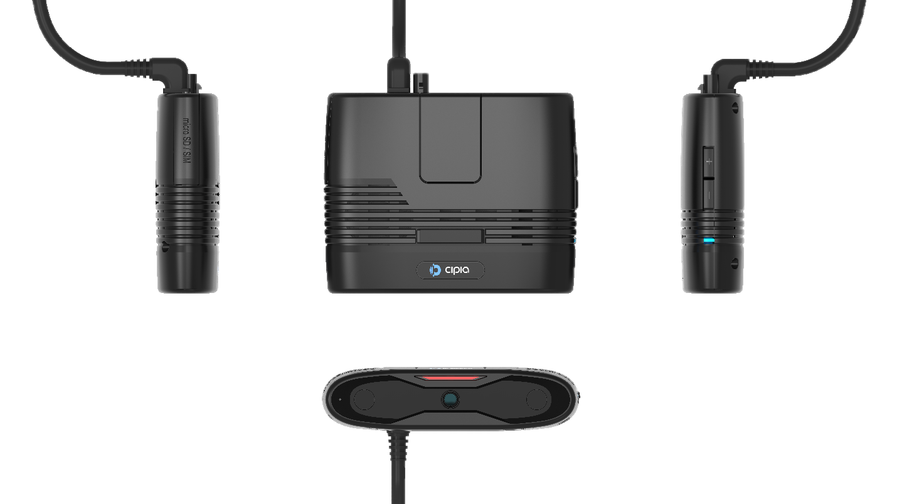
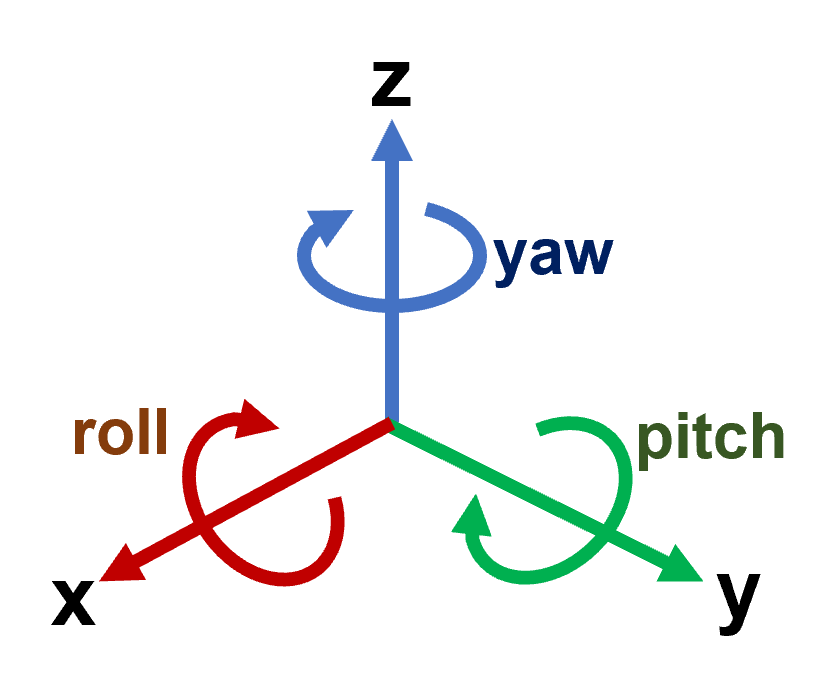
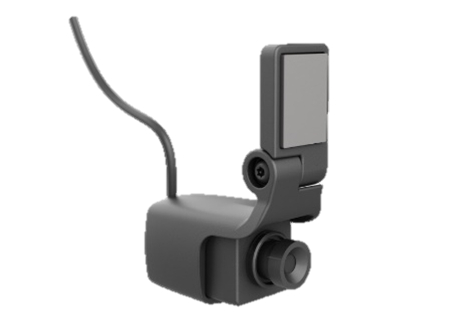
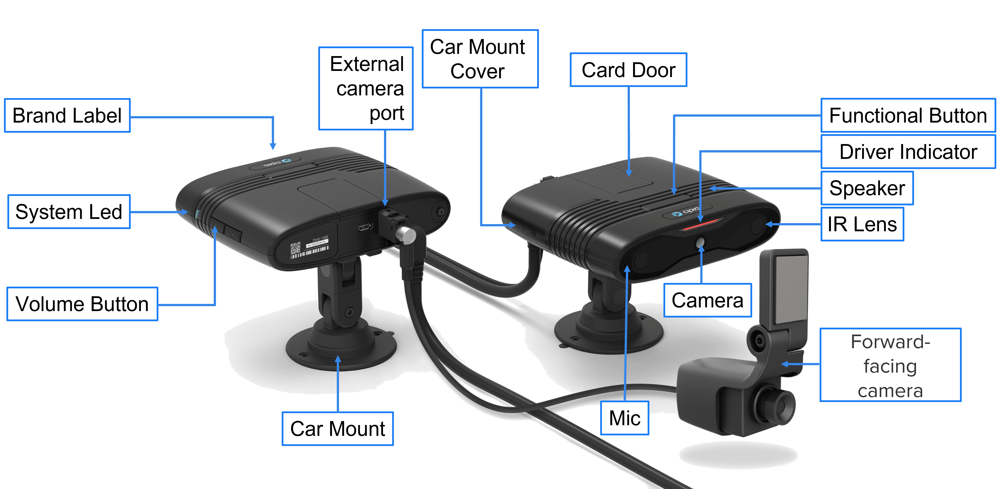
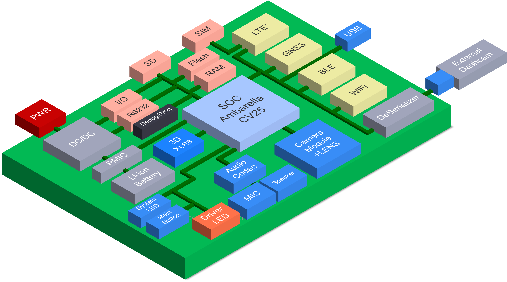

# Cipia-FS10 (Manual de Producto)
## Acerca de este manual
### Público objetivo
Este manual del producto está destinado a los equipos de desarrollo de productos, soporte técnico y servicios profesionales dentro de los proveedores de servicios telemáticos (TSP) y los proveedores de plataformas de software, que planean utilizar las capacidades telemáticas de video Cipia-FS10 como parte de su oferta de productos.

### Alcance del documento
Los objetivos principales de este documento son describir el valor, el propósito, la funcionalidad, las características y las interfaces de usuario del dispositivo Cipia-FS10.
### Documentación relacionada
Los siguientes documentos deben usarse junto con este manual para proporcionar a los equipos una imagen completa que cubra el alcance del trabajo, las herramientas y los recursos disponibles y/o necesarios para el proceso de integración exitoso.
- [Manual de Integración Cipia-FS10](01_Cipia-FS10_Integration_Manual_ES.md)
- [Manual de inicio rápido Cipia-FS10 EVK](02_Cipia-FS10_EVK_Start_Guide_ES.md)
- [Descripción de los protocolos OTA de Cipia-FS10](03_Cipia-FS10_OTA_Protocols_Description_ES.md)
- [Descripción de la API de la aplicación del instalador](04_Cipia-FS10_Installer_App_Manual_ES.md)
- [Manual del instalador de la aplicación](05_Cipia-FS10_Installer_App_Manual_ES.md)
- [Documento API de Middleware](06_Cipia-FS10_Middleware_document_ES.md)
- [Manual de protocolo serial Cipia-FS10](07_Cipia-FS10_Serial_Protocol_manual_ES.md)

## Tabla de contenidos
El siguiente manual está distribuido en la siguiente organización:
1. [Acerca de este manual](#Acerca-de-este-manual)
2. [Descripción general de Cipia-FS10](#Descripción-general-de-Cipia-FS10)
3. [Cipia-FS10 Hardware and Interfaces](#Cipia-FS10-hardware-and-interfaces)
   1. [Conceptos básicos del dispositivo Cipia-FS10](#Conceptos-básicos-del-dispositivo-Cipia-FS10)
   2. [Bloques de construcción del sistema](#Bloques-de-construcción-del-sistema)
   3. [Especificación de hardware](#Especificaciones-del-hardware)
   - Cable de instalación y pines
   - Cumplimiento ambiental
   - Certificaciones y estándares de la industria
4. Uso de Cipia-FS10
   4.1. Arquitectura de la solución
   4.2. Estados y modos de operación
   4.3. Características y funciones del modo estándar
   4.4. Aprovisionamiento y mantenimiento de Cipia-FS10
        4.4.1. Cambios en el archivo de configuración
        4.4.2. Gestión de archivos de configuración por Cipia-FS10
        4.4.3. Entorno de depuración
        4.4.4. Proceso de instalación y calibración
        4.4.5. Inscripción de identificación de conductor
        4.4.6. Gestión de archivos de audio
        4.4.7. Restablecimiento del dispositivo
        4.4.8. Propiedades del dispositivo
   4.5. Integración con Mobileye 6/8
   4.6.	Eventos Cipia-FS10
   4.7.	Configuración
   4.8.	Interfaces de comunicación
        4.8.1.	Conexión RS232
        4.8.2.	USB
        4.8.3.	Bluetooth
        4.8.4.	Wi-Fi
        4.8.5.	LTE (en inglés)
   4.9.	Priorización de canales de comunicación
   4.10.	Seguridad de las comunicaciones
        4.10.1.	MQTT
        4.10.2.	SSH
5.	Cipia-FS10 HMI
6.	Kit de prueba y evaluación
7.	Control de errores del sistema
8.	Avisos de normas y reglamentos
    8.1.	FCC
    8.2.	IC
    8.3.	RED

## Descripción general de Cipia-FS10
[Ir al Inicio](#cipia-fs10-manual-de-producto) | [Tabla de contenidos](#Tabla-de-contenidos)

Cipia-FS10 es un dispositivo de videotelemática con capacidades integradas de visión artificial. Está diseñado para mejorar la seguridad del conductor y la flota a través de aplicaciones de videotelemática. El dispositivo Cipia-FS10 detecta la somnolencia del conductor, las distracciones y las acciones peligrosas, proporcionando alertas del conductor en tiempo real, así como alertas e información personalizadas del administrador de flotas a través de su servidor de gestión de flotas.

El dispositivo Cipia-FS10 es un dispositivo en el automóvil que incorpora el motor de software de monitoreo del conductor de Cipia y está destinado a las ventas en el segmento de posventa de gestión de flotas. Los clientes objetivo incluyen proveedores de servicios telemáticos (TSP), distribuidores, revendedores e integradores, así como grandes flotas comerciales con su propia solución telemática.

El sistema tiene recursos de hardware de visión artificial integrados y está destinado a proporcionar capacidades de monitoreo, alerta e informes en tiempo real cuando el conductor está somnoliento, dormido o no está atento a la carretera.

El sistema puede conectarse opcionalmente a un sistema telemático a bordo, u otro dispositivo conectado  en el vehículo, para informar eventos de seguridad en tiempo real a la aplicación de back-end (en caso de que no esté equipado con sus propios recursos de conectividad celular).

Las principales características y funciones del sistema Cipia-FS10 incluyen:
- **Análisis del estado del controlador**
Las capacidades de análisis del estado del controlador Cipia-FS10 incluyen la detección de:
  -	**Distracción del conductor:** basada en la dirección de la mirada y el análisis de otros rasgos faciales, alerta cuando el conductor no está mirando al centro de la carretera. Las alertas se correlacionan con el estado del vehículo (velocidad, marcha, etc.)
  -	**Somnolencia del conductor (fatiga):** informar y alertar cuando el conductor está somnoliento o dormido.
  -	**Uso del teléfono móvil:** alerta cuando el conductor sostiene su teléfono móvil.
  -	**Uso del cigarrillo:** alertar cuando se identifica al conductor como fumador.
  -	**Uso del cinturón de seguridad:** alerta cuando el vehículo se está moviendo pero el conductor no usa el cinturón de seguridad.
- **Detección de identidad del conductor**
Después de un breve proceso de inscripción, que permite agregar un controlador específico a la base de datos del dispositivo, cuando se reconoce un controlador, el sistema informa su ID. Esta información se puede utilizar para las políticas de autenticación de conductores dentro de la flota.

- **A prueba de manipulaciones**
El sistema puede informar cuando la cámara tiene diferentes fallas, como sobreexposición, cámara bloqueada, desconexión de cables, desplazamiento del dispositivo, etc.

- **Informes de eventos de ADAS**
El sistema puede conectarse opcionalmente también a un dispositivo Mobileye, desde el cual puede recibir y analizar varios eventos ADAS que luego pueden analizarse, filtrarse e informarse al servidor para proporcionar una solución completa de seguridad para el conductor y la flota.

- **Captura de vídeo**
Cipia-FS10 permite la captura de vídeo de las siguientes maneras:
   - **De forma autónoma:** active la captura de video del conductor durante unos segundos antes y después de un evento de seguridad detectado por los algoritmos de visión artificial.
   - **Desde el dispositivo conectado:** active la captura de video del conductor durante unos segundos antes y después de un evento de seguridad detectado por un dispositivo conectado.
   - **Comando del servidor (instantáneo):** active la duración predefinida, la captura de video inmediata del controlador una vez que se recibe un comando del backend.
   - **Comando del servidor (DVR):** recupere imágenes del búfer de grabación de video digital en curso en la tarjeta SD, de acuerdo con los marcos de tiempo definidos en el comando.
   - 
- **Métodos de alerta e informes**
Cipia-FS10 informa sobre comportamientos y eventos detectados a:
   - **Conductor:** alertas auditivas (tanto señales como del habla), visuales y/o hápticas (por ejemplo, vibración del asiento o del cinturón de seguridad) al detectar un comportamiento no deseado.
   - **Administrador de flota:** alertas en tiempo real de eventos peligrosos con o sin imágenes de video capturadas alrededor del momento del evento detectado.

## Cipia-FS10 - hardware e interfaces
[Ir al Inicio](#Cipia-FS10-Manual-de-Producto) | [Tabla de Contenidos](#Tabla-de-contenidos)

### Conceptos básicos del dispositivo Cipia-FS10
[Tabla de Contenidos](#Tabla-de-contenidos) | [Inicio de sección](#Cipia-FS10---hardware-e-interfaces)

  
  
<strong>Fig. 1</strong> - Imagen del dispositivo Cipia-FS10.

- **Dimensiones** – Las dimensiones del producto son (excluyendo accesorios de montaje) 120mm (L) X 95mm (W) X 30mm. El dispositivo Cipia-FS10 no compromete el campo de visión del conductor de una manera incómoda o ilegal.
- **Peso:** el dispositivo pesa ~390 g, incluido el arnés y el brazo de montaje.
- **Ajuste de la orientación del dispositivo:** el dispositivo tiene un brazo de montaje que permite el movimiento 3D y proporciona la mayor flexibilidad de instalación mientras mantiene la cara del conductor dentro del punto de vista de la cámara. El brazo de montaje se puede bloquear y se puede instalar en la consola o en el parabrisas, utilizando adhesivo de doble cara y/o tornillos. Las cabezas de tornillo especiales son solo para uso profesional.

  
  
<strong>Fig. 2</strong> - Sistema coordenado del dispositivo Cipia-FS10.

En el diagrama anterior, el eje *x* apunta al controlador.
- **Cable  de instalación:** el cable de instalación está conectado/soldado a la placa interna y sale de la superficie de la carcasa a través de un alivio de tensión de silicona que garantiza la elasticidad y la resistencia contra la tracción. Todos los cables están cubiertos por una sola chaqueta que sale de la carcasa del dispositivo.
- **Cámara y ventana de LED IR:** la carcasa incluye una cubierta transparente IR para la lente de la cámara y los LED IR. La iluminación IR no es visible para el conductor.
- **Cámara externa orientada hacia la carretera:**  Las versiones de Cipia-FS10 Plus admiten la conexión de una cámara orientada hacia adelante (carretera) para monitorear, grabar e informar eventos de la carretera y / o video continuo.

  
  
<strong>Fig. 3</strong> - Cámara delantera para Cipia-FS10 Plus.

- **Interfaces de usuario:** existen las siguientes interfaces mecánicas para las características de usuario.

  
  
<strong>Fig. 4</strong> - Interfaz de dispositivo.

|Interfaz|Descripción|
|--------|-----------|
|Puerta de SD|Tarjetas SIM/SD. Utilizado por técnicos e instaladores durante la instalación o servicio|
|Botón funcional|Activación/ restablecimiento de HW ó activación de eventos|
|LED de conductor|El LED rojo se utiliza para proporcionar retroalimentación visual al conductor|
|Parlante|Para señales audible y alertas|
|Micrófono|Para la grabación de voz de cabina (configurable)|
|LED del Sistema|LED Tricolor para reportar los eventos del sistema|
|Botón de Volumen|Control de volumen (configurable)|
|Puerto USB (micro)|Puerto micro USB para el servicio de depuración y la carga de datos en caso de que los eventos y las secuencias de video no se puedan cargar de forma inalámbrica.|

### Bloques de construcción del sistema
[Tabla de Contenidos](#Tabla-de-contenidos) | [Inicio de sección](#Cipia-FS10---hardware-e-interfaces)

El siguiente diagrama muestra los principales bloques de construcción, interconexiones e interfaces del dispositivo Cipia-FS10.

  
  
<strong>Fig. 5</strong> - Diagrama de bloques interno.

### Especificación de hardware
[Tabla de Contenidos](#Tabla-de-contenidos) | [Inicio de sección](#Cipia-FS10---hardware-e-interfaces)

|Componente|Descripción|
|----------|-----------|
|**Núcleo de la plataforma**||
|Procesador principal (SOC)|Ambarella CV25|
|RAM|1GB|
|ROM|8GB|
|Tarjeta de memoria|Ranura para tarjeta Micro SD – Hasta 1TB, exFAT, SDHC/SDXC|
|Perro guardián|- Controlado por SW: para la recuperación de aplicaciones|
| |-HW controlado – para la recuperación del sistema|
|Sensor de movimiento|Acelerómetro 3D / (±16g, 12bit, 100Hz o mejor)|
|Sistema operativo|Linux based|
|**Interfaz del controlador**||
|Botones físicos| - 1 x configurable, multipropósito|
| | +/- Teclas de volumen|
|LEDs| - 1 x Estado del sistema (3 colores)|
| | - 3 x eventos del conductor|
|Micrófono interno|Alta sensibilidad, omnidireccional|
|Bocina interna|Max 85dB @ 1m / 2W, 600Hz ~ 20Khz|
|**Comunicación inalámbrica**||
|Celular| - LTE CAT4|
| | - FDD 1/2/3/4/5/7/8/12/13/17/20/28 (Territorios/aplicaciones no compatibles: Japón, FirstNet)|
| | - GSM 850/900/1800/1900|
| | - WCDMA 1/2/4/5/8 (DC-HSPA+)|
| | - 3FF, Micro SIM (interna)|
|Módulo GNSS| - 50 canales, NMEA 0183, soporte AGPS|
| | - Soporte de sistemas satelitales: GPS, GLONASS, Galileo
|LAN inalámbrica| - Wi-Fi – 802.11 b / g / n / ac,|
| | - Bandas de frecuencia - 2.4G (B1-13) / 5G (B36-165)|
| | - Soporte de modo dual AP y / o Hotspot|
|Bluetooth | BLE V4.2|
|**Cámaras integradas**||
|Hacia el conductor (DMS) | - Sensor de imagen monocromo de 1,2 MP (1280 x 960)|
| |Enfoque fijo. Profundidad de visión 40-111cm min|
| |VOAF: 510, VFOV: 390|
| |Obturador global IR 940nm|
| |30 fps|
| | - F# 2.05|
| | - LEDs IR x 2|
|Orientación a la carretera||
|(Modelos FS10-XXX-ADS)| - 2MP (1920x1280), sensor de imagen de 2.8μ|
| | - Amplio rango dinámico – 120dB|
| | - Excepcional sensibilidad a la luz baja: 0.01Lux|
| | - 30 fps|
| | - F# 2.9|
| | - VOAF: 620, VFOV: 340|
| | - Interfaz física – Conector FAKRA|
| | - Tipo de interfaz FPD-LINK III|
| | - Alimentación: 12 V, ±8 %, pico de 400 mA, AVG de <150 mA|
| | - Carcasa: Aleación de aluminio|
|**Interfaces de comunicación**||
|RS-232| - 1 x RS-232 (Tx, Rx, GND)|
|USB| - 1 x USB 2.0 Dispositivo/host (puerto Micro-USB)|
|**Control de periféricos**||
|GPIO| - 1 x sentido de encendido.|
| | - 1 x entrada (0 – VCC). Digital o analógico.|
| | - 1 x salida de colector abierto.|
| | - 1 x E/S – Totalmente configurable por SW.|
|**Potencia**||
|Potencia de entrada| - Conexión directa de la batería del vehículo (9V-32V)|
| | - Cumple con ISO 7637 y 16750|
|Batería interna| Li-Ion 3.7V / 550mAh - Admite un minuto de funcionalidad completa y apagado ordenado en el corte de energía.|
|Corriente promedio @ inactivo|<3mA @ 12V|
|Corriente media @ activo| - FS10-LOC: <475mA @12V|
| | - FS10-LTE @12V <540 mA|

### Cable de instalación y pines
[Tabla de Contenidos](#Tabla-de-contenidos) | [Inicio de sección](#Cipia-FS10---hardware-e-interfaces)

### Cumplimiento ambiental
[Tabla de Contenidos](#Tabla-de-contenidos) | [Inicio de sección](#Cipia-FS10---hardware-e-interfaces)

### Certificaciones y estándares de la industria
[Tabla de Contenidos](#Tabla-de-contenidos) | [Inicio de sección](#Cipia-FS10---hardware-e-interfaces)

4. Uso de Cipia-FS10
4.1. Arquitectura de la solución
4.2. Estados y modos de operación
4.3. Características y funciones del modo estándar
4.4. Aprovisionamiento y mantenimiento de Cipia-FS10
4.4.1. Cambios en el archivo de configuración
4.4.2. Gestión de archivos de configuración por Cipia-FS10
4.4.3. Entorno de depuración
4.4.4. Proceso de instalación y calibración
4.4.5. Inscripción de identificación de conductor
4.4.6. Gestión de archivos de audio
4.4.7. Restablecimiento del dispositivo
4.4.8. Propiedades del dispositivo
4.5. Integración con Mobileye 6/8
4.6.	Eventos Cipia-FS10
4.7.	Configuración
4.8.	Interfaces de comunicación
4.8.1.	Conexión RS232
4.8.2.	USB
4.8.3.	Bluetooth
4.8.4.	Wi-Fi
4.8.5.	LTE (en inglés)
4.9.	Priorización de canales de comunicación
4.10.	Seguridad de las comunicaciones
4.10.1.	MQTT
4.10.2.	SSH
5.	Cipia-FS10 HMI
6.	Kit de prueba y evaluación
7.	Control de errores del sistema
8.	Avisos de normas y reglamentos
8.1.	FCC
8.2.	IC
8.3.	RED

## Licencia
Todos los derechos están reservados por [Cipia Vision Ltd](https://www.cipia.com) formerly Eyesight - 2023.
