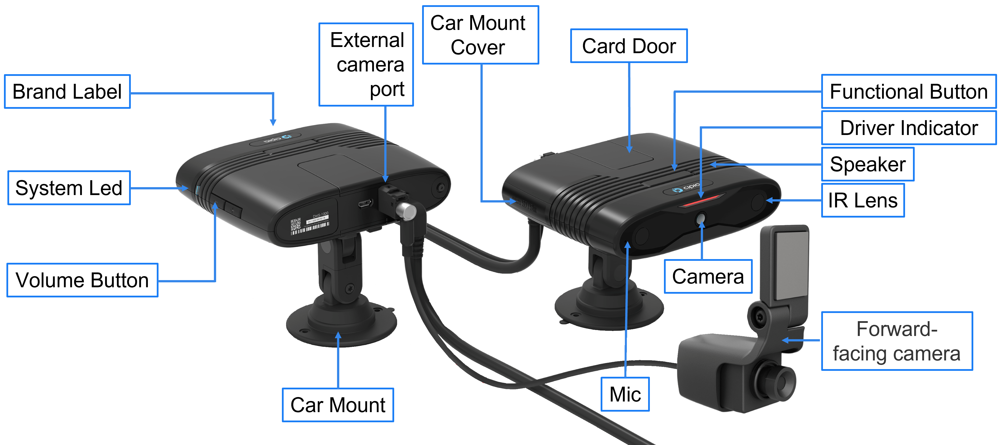

# Cipia-FS10 (Manual de Producto)
## Acerca de este manual
### Público objetivo
Este manual del producto está destinado a los equipos de desarrollo de productos, soporte técnico y servicios profesionales dentro de los proveedores de servicios telemáticos (TSP) y los proveedores de plataformas de software, que planean utilizar las capacidades telemáticas de video Cipia-FS10 como parte de su oferta de productos.

### Alcance del documento
Los objetivos principales de este documento son describir el valor, el propósito, la funcionalidad, las características y las interfaces de usuario del dispositivo Cipia-FS10.
### Documentación relacionada
Los siguientes documentos deben usarse junto con este manual para proporcionar a los equipos una imagen completa que cubra el alcance del trabajo, las herramientas y los recursos disponibles y/o necesarios para el proceso de integración exitoso.
- [Manual de Integración Cipia-FS10](01_Cipia-FS10_Integration_Manual_ES.md)
- [Manual de inicio rápido Cipia-FS10 EVK](02_Cipia-FS10_EVK_Start_Guide_ES.md)
- [Descripción de los protocolos OTA de Cipia-FS10](03_Cipia-FS10_OTA_Protocols_Description_ES.md)
- [Descripción de la API de la aplicación del instalador](04_Cipia-FS10_Installer_App_Manual_ES.md)
- [Manual del instalador de la aplicación](05_Cipia-FS10_Installer_App_Manual_ES.md)
- [Documento API de Middleware](06_Cipia-FS10_Middleware_document_ES.md)
- [Manual de protocolo serial Cipia-FS10](07_Cipia-FS10_Serial_Protocol_manual_ES.md)

## Tabla de contenidos
El siguiente manual está distribuido en la siguiente organización:
1. [Acerca de este manual](#Acerca-de-este-manual)
2. [Descripción general de Cipia-FS10](#Descripción-general-de-Cipia-FS10)
3. [Cipia-FS10 Hardware and Interfaces](#Cipia-FS10-hardware-and-interfaces)
   - [Conceptos básicos del dispositivo Cipia-FS10](#Conceptos-básicos-del-dispositivo-Cipia-FS10)
   - [Bloques de construcción del sistema](#Bloques-de-construcción-del-sistema)
   - [Especificación de hardware](#Especificaciones-del-hardware)
   - Cable de instalación y pines
   - Cumplimiento ambiental
   - Certificaciones y estándares de la industria
4. Uso de Cipia-FS10
   - Arquitectura de la solución
   - Estados y modos de operación
   - Características y funciones del modo estándar
   - Aprovisionamiento y mantenimiento de Cipia-FS10
        - Cambios en el archivo de configuración
        - Gestión de archivos de configuración por Cipia-FS10
        - Entorno de depuración
        - Proceso de instalación y calibración
        - Inscripción de identificación de conductor
        - Gestión de archivos de audio
        - Restablecimiento del dispositivo
        - Propiedades del dispositivo
   - Integración con Mobileye 6/8
   - Eventos Cipia-FS10
   - Configuración
   - Interfaces de comunicación
        - Conexión RS232
        - USB
        - Bluetooth
        - Wi-Fi
        - LTE (en inglés)
   - Priorización de canales de comunicación
   - Seguridad de las comunicaciones
        - MQTT
        - SSH
5.	Cipia-FS10 HMI
6.	Kit de prueba y evaluación
7.	Control de errores del sistema
8.	Avisos de normas y reglamentos
    - FCC
    - IC
    - RED

## Descripción general de Cipia-FS10
[Ir al Inicio](#cipia-fs10-manual-de-producto) | [Tabla de contenidos](#Tabla-de-contenidos)

Cipia-FS10 es un dispositivo de videotelemática con capacidades integradas de visión artificial. Está diseñado para mejorar la seguridad del conductor y la flota a través de aplicaciones de videotelemática. El dispositivo Cipia-FS10 detecta la somnolencia del conductor, las distracciones y las acciones peligrosas, proporcionando alertas del conductor en tiempo real, así como alertas e información personalizadas del administrador de flotas a través de su servidor de gestión de flotas.

El dispositivo Cipia-FS10 es un dispositivo en el automóvil que incorpora el motor de software de monitoreo del conductor de Cipia y está destinado a las ventas en el segmento de posventa de gestión de flotas. Los clientes objetivo incluyen proveedores de servicios telemáticos (TSP), distribuidores, revendedores e integradores, así como grandes flotas comerciales con su propia solución telemática.

El sistema tiene recursos de hardware de visión artificial integrados y está destinado a proporcionar capacidades de monitoreo, alerta e informes en tiempo real cuando el conductor está somnoliento, dormido o no está atento a la carretera.

El sistema puede conectarse opcionalmente a un sistema telemático a bordo, u otro dispositivo conectado  en el vehículo, para informar eventos de seguridad en tiempo real a la aplicación de back-end (en caso de que no esté equipado con sus propios recursos de conectividad celular).

Las principales características y funciones del sistema Cipia-FS10 incluyen:
- **Análisis del estado del controlador**
Las capacidades de análisis del estado del controlador Cipia-FS10 incluyen la detección de:
  -	**Distracción del conductor:** basada en la dirección de la mirada y el análisis de otros rasgos faciales, alerta cuando el conductor no está mirando al centro de la carretera. Las alertas se correlacionan con el estado del vehículo (velocidad, marcha, etc.)
  -	**Somnolencia del conductor (fatiga):** informar y alertar cuando el conductor está somnoliento o dormido.
  -	**Uso del teléfono móvil:** alerta cuando el conductor sostiene su teléfono móvil.
  -	**Uso del cigarrillo:** alertar cuando se identifica al conductor como fumador.
  -	**Uso del cinturón de seguridad:** alerta cuando el vehículo se está moviendo pero el conductor no usa el cinturón de seguridad.
- **Detección de identidad del conductor**
Después de un breve proceso de inscripción, que permite agregar un controlador específico a la base de datos del dispositivo, cuando se reconoce un controlador, el sistema informa su ID. Esta información se puede utilizar para las políticas de autenticación de conductores dentro de la flota.

- **A prueba de manipulaciones**
El sistema puede informar cuando la cámara tiene diferentes fallas, como sobreexposición, cámara bloqueada, desconexión de cables, desplazamiento del dispositivo, etc.

- **Informes de eventos de ADAS**
El sistema puede conectarse opcionalmente también a un dispositivo Mobileye, desde el cual puede recibir y analizar varios eventos ADAS que luego pueden analizarse, filtrarse e informarse al servidor para proporcionar una solución completa de seguridad para el conductor y la flota.

- **Captura de vídeo**
Cipia-FS10 permite la captura de vídeo de las siguientes maneras:
   - **De forma autónoma:** active la captura de video del conductor durante unos segundos antes y después de un evento de seguridad detectado por los algoritmos de visión artificial.
   - **Desde el dispositivo conectado:** active la captura de video del conductor durante unos segundos antes y después de un evento de seguridad detectado por un dispositivo conectado.
   - **Comando del servidor (instantáneo):** active la duración predefinida, la captura de video inmediata del controlador una vez que se recibe un comando del backend.
   - **Comando del servidor (DVR):** recupere imágenes del búfer de grabación de video digital en curso en la tarjeta SD, de acuerdo con los marcos de tiempo definidos en el comando.
   - 
- **Métodos de alerta e informes**
Cipia-FS10 informa sobre comportamientos y eventos detectados a:
   - **Conductor:** alertas auditivas (tanto señales como del habla), visuales y/o hápticas (por ejemplo, vibración del asiento o del cinturón de seguridad) al detectar un comportamiento no deseado.
   - **Administrador de flota:** alertas en tiempo real de eventos peligrosos con o sin imágenes de video capturadas alrededor del momento del evento detectado.

## Cipia-FS10 - hardware e interfaces
[Ir al Inicio](#Cipia-FS10-Manual-de-Producto) | [Tabla de Contenidos](#Tabla-de-contenidos)

### Conceptos básicos del dispositivo Cipia-FS10
[Tabla de Contenidos](#Tabla-de-contenidos) | [Inicio de sección](#Cipia-FS10---hardware-e-interfaces)
<div align="center">
  
  <p align="center"><strong>Fig. 1</strong> - Imagen del dispositivo Cipia-FS10.</p>
</div>

- **Dimensiones** – Las dimensiones del producto son (excluyendo accesorios de montaje) 120mm (L) X 95mm (W) X 30mm. El dispositivo Cipia-FS10 no compromete el campo de visión del conductor de una manera incómoda o ilegal.
- **Peso:** el dispositivo pesa ~390 g, incluido el arnés y el brazo de montaje.
- **Ajuste de la orientación del dispositivo:** el dispositivo tiene un brazo de montaje que permite el movimiento 3D y proporciona la mayor flexibilidad de instalación mientras mantiene la cara del conductor dentro del punto de vista de la cámara. El brazo de montaje se puede bloquear y se puede instalar en la consola o en el parabrisas, utilizando adhesivo de doble cara y/o tornillos. Las cabezas de tornillo especiales son solo para uso profesional.

<div align="center">
  
  <p align="center"><strong>Fig. 2</strong> - Sistema coordenado del dispositivo Cipia-FS10.</p>
</div>

En el diagrama anterior, el eje *x* apunta al controlador.
- **Cable  de instalación:** el cable de instalación está conectado/soldado a la placa interna y sale de la superficie de la carcasa a través de un alivio de tensión de silicona que garantiza la elasticidad y la resistencia contra la tracción. Todos los cables están cubiertos por una sola chaqueta que sale de la carcasa del dispositivo.
- **Cámara y ventana de LED IR:** la carcasa incluye una cubierta transparente IR para la lente de la cámara y los LED IR. La iluminación IR no es visible para el conductor.
- **Cámara externa orientada hacia la carretera:**  Las versiones de Cipia-FS10 Plus admiten la conexión de una cámara orientada hacia adelante (carretera) para monitorear, grabar e informar eventos de la carretera y / o video continuo.

<div align="center">
  
  <p align="center"><strong>Fig. 3</strong> - Cámara delantera para Cipia-FS10 Plus.</p>
</div>

- **Interfaces de usuario:** existen las siguientes interfaces mecánicas para las características de usuario.

<div align="center">
  
  <p align="center"><strong>Fig. 4</strong> - Interfaz de dispositivo.</p>
</div>

|Interfaz|Descripción|
|--------|-----------|
|Puerta de SD|Tarjetas SIM/SD. Utilizado por técnicos e instaladores durante la instalación o servicio|
|Botón funcional|Activación/ restablecimiento de HW ó activación de eventos|
|LED de conductor|El LED rojo se utiliza para proporcionar retroalimentación visual al conductor|
|Parlante|Para señales audible y alertas|
|Micrófono|Para la grabación de voz de cabina (configurable)|
|LED del Sistema|LED Tricolor para reportar los eventos del sistema|
|Botón de Volumen|Control de volumen (configurable)|
|Puerto USB (micro)|Puerto micro USB para el servicio de depuración y la carga de datos en caso de que los eventos y las secuencias de video no se puedan cargar de forma inalámbrica.|

### Bloques de construcción del sistema
[Tabla de Contenidos](#Tabla-de-contenidos) | [Inicio de sección](#Cipia-FS10---hardware-e-interfaces)

El siguiente diagrama muestra los principales bloques de construcción, interconexiones e interfaces del dispositivo Cipia-FS10.

<div align="center">
  
  <p align="center"><strong>Fig. 5</strong> - Diagrama de bloques interno.</p>
</div>

### Especificación de hardware
[Tabla de Contenidos](#Tabla-de-contenidos) | [Inicio de sección](#Cipia-FS10---hardware-e-interfaces)

|Componente|Descripción|
|----------|-----------|
|**Núcleo de la plataforma**||
|Procesador principal (SOC)|Ambarella CV25|
|RAM|1GB|
|ROM|8GB|
|Tarjeta de memoria|Ranura para tarjeta Micro SD – Hasta 1TB, exFAT, SDHC/SDXC|
|Perro guardián|- Controlado por SW: para la recuperación de aplicaciones|
| |-HW controlado – para la recuperación del sistema|
|Sensor de movimiento|Acelerómetro 3D / (±16g, 12bit, 100Hz o mejor)|
|Sistema operativo|Linux based|
|**Interfaz del controlador**||
|Botones físicos| - 1 x configurable, multipropósito|
| | +/- Teclas de volumen|
|LEDs| - 1 x Estado del sistema (3 colores)|
| | - 3 x eventos del conductor|
|Micrófono interno|Alta sensibilidad, omnidireccional|
|Bocina interna|Max 85dB @ 1m / 2W, 600Hz ~ 20Khz|
|**Comunicación inalámbrica**||
|Celular| - LTE CAT4|
| | - FDD 1/2/3/4/5/7/8/12/13/17/20/28 (Territorios/aplicaciones no compatibles: Japón, FirstNet)|
| | - GSM 850/900/1800/1900|
| | - WCDMA 1/2/4/5/8 (DC-HSPA+)|
| | - 3FF, Micro SIM (interna)|
|Módulo GNSS| - 50 canales, NMEA 0183, soporte AGPS|
| | - Soporte de sistemas satelitales: GPS, GLONASS, Galileo
|LAN inalámbrica| - Wi-Fi – 802.11 b / g / n / ac,|
| | - Bandas de frecuencia - 2.4G (B1-13) / 5G (B36-165)|
| | - Soporte de modo dual AP y / o Hotspot|
|Bluetooth | BLE V4.2|
|**Cámaras integradas**||
|Hacia el conductor (DMS) | - Sensor de imagen monocromo de 1,2 MP (1280 x 960)|
| |Enfoque fijo. Profundidad de visión 40-111cm min|
| |VOAF: 510, VFOV: 390|
| |Obturador global IR 940nm|
| |30 fps|
| | - F# 2.05|
| | - LEDs IR x 2|
|Orientación a la carretera||
|(Modelos FS10-XXX-ADS)| - 2MP (1920x1280), sensor de imagen de 2.8μ|
| | - Amplio rango dinámico – 120dB|
| | - Excepcional sensibilidad a la luz baja: 0.01Lux|
| | - 30 fps|
| | - F# 2.9|
| | - VOAF: 620, VFOV: 340|
| | - Interfaz física – Conector FAKRA|
| | - Tipo de interfaz FPD-LINK III|
| | - Alimentación: 12 V, ±8 %, pico de 400 mA, AVG de <150 mA|
| | - Carcasa: Aleación de aluminio|
|**Interfaces de comunicación**||
|RS-232| - 1 x RS-232 (Tx, Rx, GND)|
|USB| - 1 x USB 2.0 Dispositivo/host (puerto Micro-USB)|
|**Control de periféricos**||
|GPIO| - 1 x sentido de encendido.|
| | - 1 x entrada (0 – VCC). Digital o analógico.|
| | - 1 x salida de colector abierto.|
| | - 1 x E/S – Totalmente configurable por SW.|
|**Potencia**||
|Potencia de entrada| - Conexión directa de la batería del vehículo (9V-32V)|
| | - Cumple con ISO 7637 y 16750|
|Batería interna| Li-Ion 3.7V / 550mAh - Admite un minuto de funcionalidad completa y apagado ordenado en el corte de energía.|
|Corriente promedio @ inactivo|<3mA @ 12V|
|Corriente media @ activo| - FS10-LOC: <475mA @12V|
| | - FS10-LTE @12V <540 mA|

### Cable de instalación y pines
[Tabla de Contenidos](#Tabla-de-contenidos) | [Inicio de sección](#Cipia-FS10---hardware-e-interfaces)

El cable de instalación Cipia-FS10 consta de 2 partes:
1. Cable estilo Pigtail de un metro de largo, conectado internamente a la placa principal del dispositivo y con conector automotriz de 10 pines en el extremo.

*****IMAGEN*****

2. Cable de extensión de un metro de largo equipado con un conector automotriz mate y cables abiertos en el extremo.

*****IMAGEN*****

Esta estructura garantiza que los instaladores tengan la máxima flexibilidad en caso de que sea necesario cambiar la configuración de la instalación o corregir el hardware.

La siguiente tabla describe el pinout del dispositivo FS10:
|Pin|Señal|Observación|
|---|-----|-----------|
|1|PWR_IN|Rojo|
|2|PWR_GND|Negro|
|3|PWR_IGN|Morado|
|4|RS232_TxD|Amarillo/Naranja|
|5|RS232_RxD|Gris/Naranja|
|6|COM_GND|Blanco|
|7|GP_IN|Verde|
|8|GP_OUT|Azul|
|9|GP_IO|Gris|
|10|Repuesto|Rojo/Negro|

Para grantizar el mínimo de conexiones para que el Cipia-FS10 funcione, los pines (1), (2) y (3) son requeridos.

### Cumplimiento ambiental
[Tabla de Contenidos](#Tabla-de-contenidos) | [Inicio de sección](#Cipia-FS10---hardware-e-interfaces)

El dispositivo Cipia-FS10 cumple con los estándares ambientales detallados en la siguiente tabla:

|Variable|Descripción|
|--------|-----------|
|**Rango de temperatura**| - Temperatura de funcionamiento (arranque/funcionamiento): -30 °C a +70 °C|
| | - Continuo (rendimiento completo): -20 °C a +40 °C|
| | - De la batería: -20°C a +60°C|
| | - Almacenamiento: -30 °C a +80 °C|
|**Humedad** | - 95% ±5% HR @ +40°C, sin condensación|
|**IP** | - IP40|
|**Empaquetado** | - ASTM/ ISTA|
|**RoHS** | - RoHS II|
|**REACH/COP** | - Cumple con REACH/POP (Unión Europea)|
|**Minerales de conflicto** |  - Cumple con la ley de minerales de conflicto|
|**Vibración** |  - ISO16750|
|**Choque mecánico** |  - ISO16750|
|**UV** | - Material plástico resistente a los rayos UV|

### Certificaciones y estándares de la industria
[Tabla de Contenidos](#Tabla-de-contenidos) | [Inicio de sección](#Cipia-FS10---hardware-e-interfaces)

El dispositivo Cipia-FS10 cumple con los siguientes estándares de certificación:
- FCC IDENTIFIER: XMR201903EG25GCE/RED
- IC (Canada Industrial)
- RCM
- E-mark
- RSSC (solo los modelos LTE)
- PTCRB (solo los modelos LTE)
- GCF (solo los modelos LTE)
- IEC62471 (Protección Visual)

## Uso de Cipia-FS10
[Ir al Inicio](#Cipia-FS10-Manual-de-Producto) | [Tabla de Contenidos](#Tabla-de-contenidos)
### Arquitectura de la solución
[Tabla de Contenidos](#Tabla-de-contenidos) | [Inicio de sección](#Uso-de-Cipia-FS10)

El siguiente diagrama muestra los diversos bloques de construcción e interfaces opcionales del Cipia-FS10 cuando se integra en un entorno de solución telemática
   
### Estados y modos de operación
[Tabla de Contenidos](#Tabla-de-contenidos) | [Inicio de sección](#Uso-de-Cipia-FS10)

La aplicación Cipia-FS10 tiene tres modos operativos:
1. Modo de instalación y calibración: utilizado durante la instalación por un técnico profesional / certificado.
2. Modo de mantenimiento: utilizado durante debug el mantenimiento por técnicos o ingenieros de aplicaciones de campo.
3. Modo estándar: se utiliza durante el funcionamiento normal del sistema.

En la tabla siguiente se definen los atributos principales de cada uno de estos modos operativos.
El dispositivo Cipia-FS10 mantiene dos indicadores en su memoria no volátil para designar si el dispositivo se instaló profesionalmente y si se calibró. Estos indicadores se establecen/borran de acuerdo con los eventos de transición de modo descritos en el diagrama siguiente y pueden ser consultados por el lado del servidor como parte de la consulta de propiedades del dispositivo (consulte el Manual de integración de Cipia-FS10).

*****IMAGEN*****

Los diferentes modos de operación y atributos per cada uno se detallan en la tabla a continuación.

|Número|Modo|Actividades y atributos|
|------|----|-----------------------|
|1| Instalación y calibración | - El motor lógico de monitoreo de vehículos y conductores está inactivo.|
| | | - Todos los módulos de comunicación están habilitados independientemente de la configuración de configuración.|
| | | - Adquisición y almacenamiento de ángulos de instalación física para su posterior detección de manipulaciones.|
| | | - Gestión de archivos de configuración por instalador/técnico.|
| | | - Proceso de calibración de la cámara.|
| | | - Inscripción en Face ID.|
|2| Mantenimiento | - El estado del vehículo y la lógica de supervisión del conductor están activos.|
| | | - Todos los canales de comunicación están habilitados independientemente de la configuración de configuración.|
| | | - Acceso completo a NVM, RAM, SD tarjeta por usuarios autorizados.|
| | | - Acceso completo a los recursos de depuración por parte de usuarios autorizados.|
| | | - Gestión de archivos de configuración local.|
| | | - Inscripción en Face ID.|
| | | - Inyección de vídeo pregrabado.|
| | | - Actualizaciones de la biblioteca, OS/App/DMS.|
|3 | Estándar | - El estado del vehículo y la lógica de supervisión del conductor están activos.|
| | | - El sistema funciona de acuerdo con la configuración del archivo de configuración.|
| | | - Gestión de archivos de configuración desde el servidor a través de protocolos definidos.|

### Características y funciones del modo estándar
[Tabla de Contenidos](#Tabla-de-contenidos) | [Inicio de sección](#Uso-de-Cipia-FS10)

En la tabla siguiente se enumeran todas las características y funciones compatibles con el
dispositivo Cipia-FS10 en modo de funcionamiento estándar.

|Número|Función|Descripción|
|------|-------|-----------|
|1| Lógica de monitoreo de vehículos y conductores| - El dispositivo Cipia-FS10 supervisa todos los parámetros y condiciones enumerados en la sección Eventos del archivo de configuración y activa eventos cuando se cumplen las condiciones.|
|2| Gestión de eventos en memoria | - Cada evento generado por la aplicación Cipia-FS10 está asociado con un identificador numérico único y se registra en NVM hasta que se recibe un ACK del GW de comunicación del servidor que indica que el mensaje se recibió correctamente.|
| | | - El número máximo de eventos registrados antes de que el sistema comience a anularse se establece en el archivo de configuración.|
|3| ID de viaje| - Tras la detección de un evento de encendido (Logic Rise de la línea IGN), o tras la detección de un cambio de conductor sin apagar el motor, el dispositivo Cipia-FS10 establece un nuevo ID de viaje como el número del viaje anterior + 1.|
| | | - Cada evento generado por el dispositivo Cipia-FS10 se envía al backend FMS con el ID de viaje como parte de la estructura del mensaje.|
| | | - El ID de viaje es un entero de 3 bytes y se restablece a 0 al alcanzar D16,777,215.|
|4| Gestión de datos del vehículo| - La biblioteca DMS utiliza datos del vehículo para activar, desactivar o adaptar correctamente inattentiveness desatentos.|
| | |- Si la información del vehículo está disponible, la aplicación principal informa de los siguientes parámetros a la biblioteca DMS:|
| | |  - **Velocidad del vehículo (desde GPS):** cuando los datos GPS no están disponibles o no están actualizados, o son inexactos (puntuación de baja calidad), la aplicación principal transfiere un valor acordado que designa la "velocidad no disponible" a la biblioteca. La aplicación principal aplica el algoritmo de "detección de movimiento" mientras los datos GPS no están disponibles y si el vehículo no se mueve, 'velocidad = 0' se informa a la biblioteca para evitar que la biblioteca informe eventos innecesarios.|
| | |  - **Dirección del vehículo (estado de marcha adelante / marcha atrás):** si el indicador del interruptor de marcha atrás está conectado a una de las entradas del dispositivo y la entrada está configurada correctamente como señal de "marcha atrás", cada vez que se detecta una marcha atrás, los eventos DMS se desactivan.|
| | |  - **Estado del indicador de giro (intermitentes):** si el indicador de giro está conectado a una de las entradas del dispositivo.|
| | |  - **Velocidad de guiñada del vehículo:** designa el cambio en el ángulo de rumbo del vehículo en comparación con el ángulo de rumbo anterior recibido del receptor GPS, siempre que los datos GPS estén disponibles y sean precisos.|
|5| Gestión del tiempo| - El sistema operativo Cipia-FS10 mantiene una "hora del sistema" precisa en GMT basada en fuentes de reloj disponibles como la red celular y / o GPS.|
| | | - Si ninguno de los dos existe o está "actualizado", el dispositivo CipiaFS10 gestiona la hora exacta (utilizando el reloj interno en tiempo real) con una desviación máxima de 86 segundos por 24 horas (0,1%).|
|6| Gestión de ubicaciones| - La aplicación principal Cipia-FS10 actualiza el registro de ubicación preciso (RAM) al menos cada 1 segundo durante todo el viaje.|
| | |- La primera ubicación en un nuevo viaje se registra solo después de que el sistema GNSS adquiere un FIX preciso.|
| | |- El registro de ubicación no se actualiza si el parámetro de calidad FIX no supera un umbral predefinido.|
| | |- Cada nuevo registro de ubicación se registra junto con su <parámetro de calidad de reparación>, <tiempo de adquisición de ubicación>, velocidad (m/s) y ángulo <rumbo>|
| | |- Siempre que el registro de ubicación no se actualiza durante más tiempo que el parámetro de configuración TH, el dispositivo Cipia-FS10 genera un evento de "pérdida de GPS".|
|7| Captura de vídeo y subida | - La aplicación Cipia-FS10 gestiona dos búferes cíclicos de vídeo, para cada cámara conectada (DMS y ADAS-opcional):|
| | | - Búfer de vídeo de eventos en RAM, destinado a guardar unos segundos de vídeo antes y después de la ocurrencia de un evento de seguridad.|
| | | - Búfer cíclico global en la tarjeta SD, destinado a permitir la recuperación de secuencias de vídeo a petición de la aplicación móvil o el servidor (si está habilitado en la configuración (consulte el parámetro 'ContRecording'').|
| | |- El video en el búfer cíclico global se comprime utilizando el códec H.264 que puede ser utilizado también por el FMS para reproducir el video.|
| | |- El búfer de vídeo de eventos de la RAM se captura y se guarda en NVM cuando se produce el evento y de acuerdo con los ajustes del archivo de configuración.|
| | | - Es posible indicar al dispositivo Cipia-FS10 que "comience a grabar ahora" un metraje con una longitud máxima de EventVideoLen al recibir dicho comando del servidor. El video capturado incluye el "pre-buffer" que estaba en la RAM en el momento en que se recibió el comando.|
| | |- El dispositivo Cipia-FS10 admite la carga de secuencias de vídeo desde el búfer cíclico global, de acuerdo con el marco de tiempo definido en un comando, si el marco de tiempo todavía está disponible en la memoria del dispositivo y si el período de tiempo solicitado no es superior a 10 minutos|
| | |- El protocolo bidireccional OTA admite los comandos de captura de vídeo descritos:|
| | |  - Comando 'Comience a grabar ahora'.|
| | |  - Comando 'Recuperar material de archivo de la memoria'.|
|8| Gestión de energía | - La aplicación Cipia-FS10 distingue entre 3 modos de potencia: (1) ON, (2) OFF, (3) Standby/sleep.|
| | | - La línea de encendido es el desencadenante habitual para las transiciones entre los modos ON y SLEEP.|
| | | - El modo OFF es el estado de energía del dispositivo durante el envío o después de la pérdida de energía externa y el agotamiento de la batería de respaldo interna.|
| | | - En funcionamiento normal, después de que el dispositivo esté conectado a una fuente de 9- alimentación de 32 V, nunca se apagará, a menos que se desconecte la fuente de alimentación principal.|
| | | - Si el parámetro 'MainButtonSettings' 'DeviceTurnOnEnable' está configurado en 'enabled', presionando el botón principal durante cualquier momento entre 5 y 10 segundos, mientras el dispositivo CipiaFS10 está encendido, activa el dispositivo para entrar en modo de suspensión.|
| | | - Si el parámetro 'MainButton settings' 'DeviceTurnOnEnable' se establece en 'disabled', el usuario nunca podrá poner el dispositivo en modo SLEEP.|
| | | - Independientemente de la configuración de los parámetros MainButtonSettings, si el dispositivo está encendido, supervisa la línea de encendido y se mueve entre los modos SLEEP y ON en consecuencia.|
| | | - Las transiciones entre modos de energía is notifican al servidor si los eventos correspondientes están habilitados.|
| | | - Tras la detección de una caída de energía por debajo de 7V, en la línea de entrada de alimentación, durante más de 2 segundos, el dispositivo Cipia-FS10 genera un evento de error con la razón apropiada (y el búfer de video cíclico) y comienza un procedimiento de apagado que se completa en menos de 20 segundos.|
| | | - El dispositivo Cipia-FS10 se despierta de nuevo una vez reconectado a una fuente de alimentación estable de 9-32V.|
| | | - Si no hay conexión con el servidor en el momento de la pérdida de energía, el evento se almacena en NVM y se carga en el siguiente encendido exitoso.|
|9| Detección de manipulación| - La aplicación Cipia-FS10 monitorea continuamente los ángulos de instalación del dispositivo utilizando su acelerómetro 3D integrado, y si se identifica una desviación de la instalación original (como se adquirió durante la calibración), se genera un evento "TamperingDetection". Además, si se pierde la imagen (la cámara está bloqueada) o no se detecta actividad, durante el estado DRIVE durante más de 30 segundos, se genera un evento de error con el motivo apropiado (bloqueo de la cámara / borroso / otro).|
|10| Gestión de la carga de la batería | - La carga interna de la batería de iones de litio es administrada por la aplicación principal Cipia-FS10, o un servicio paralelo administrado por el sistema operativo de acuerdo con las mejores prácticas de carga conocidas para baterías de iones de litio (temperatura, envejecimiento, perfil de uso) para lograr la vida útil efectiva más larga posible sin comprometer la capacidad de la batería para alimentar el dispositivo durante al menos un minuto después de la pérdida de energía.|
| | | - Dado que la batería interna se usa solo como respaldo para incidentes de pérdida de energía y, en escenarios de casos de uso normales, la batería no pasará por ciclos de carga / descarga, la aplicación principal administra el voltaje de la batería en el rango de 3.9V a 4.05V siempre.|
|11| Gestión de la temperatura interna del núcleo| - La aplicación Cipia-FS10 monitorea la temperatura en los componentes críticos del dispositivo (CPU, MCU, sensor de imagen) y realiza acciones como módulos de HW o apagado de comunicación para evitar daños permanentes si se identifica un sobrecalentamiento.|
| | | - En el caso de un incidente de sobrecalentamiento, el sistema genera y envía el evento de error por adelantado antes de un posible apagado en la comunicación.|
|12| FOTA| - La aplicación principal o un agente de servicio en segundo plano administra las capacidades de actualización de firmware por aire (FOTA) mediante el servicio de actualización FW de un tercero.|
| | | - El agente FOTA mantiene una conexión periódica con el servidor OTA para comprobar si hay actualizaciones disponibles y puede actualizar/degradar, si se le indica, tres capas diferentes del SW: OS, aplicación principal y bibliotecas DMS.|
| | | - Para dispositivos conectados mediante BLE o RS232, la actualización de FOTA debe realizarse utilizando un punto de acceso Wi-Fi, ya sea localmente en el vehículo o en algún hub al que llegue el vehículo.|
|13| Señalización telemática GPI| - Es posible definir en el archivo de configuración una entrada digital del Cipia-FS10 que se activará cada vez que se detecte un evento de comportamiento del controlador por una caja telemática conectada.|
| | | - Tras la activación de esta entrada, el dispositivo Cipia-FS10 activa un evento y captura una imagen o secuencias de vídeo tal como se define en el archivo de configuración (con pre y post-buffers).|
| | | - El dispositivo Cipia-FS10 envía los datos del evento seguidos del archivo de imagen/vídeo. El nombre de archivo de imagen/vídeo incluye un ID que también se incluye en los datos del evento para facilitar la asociación en el lado del servidor.|
|14| Activación de salida | - La aplicación principal FS10 puede activar salidas de propósito general en uno de los siguientes casos:|
| | |    1. Cuando la biblioteca DMS requiere dicha activación como medida para advertir al conductor o llamar su atención (por ejemplo, cuando la salida está conectada al timbre del asiento)|
| | |    2. Cuando se recibe un comando desde el servidor (MQTT) o desde el puerto serie (T-Box) o desde el enlace BT (T-Box) o desde la CLI.|
| | | - Algunas notas de la aplicación de activación de salida:|
| | |   - El comando Server tiene mayor prioridad sobre la activación de DMS si existe un conflicto entre dos activaciones.|
| | |   - El puerto GPIO solo puede activarlo el servidor, mientras que el puerto GPO puede activarse mediante lógica interna o el servidor.|
| | |   - Destado de salida default es "Normalmente abierto" (desconectado). Una vez activado, la salida se conecta a GND.|
|15| Actualización de la base de datos de controladores| - Tras la adquisición de un archivo de imagen/vector mejorado de una cara de controlador que ya existe en la base de datos Cipia-FS10, Cipia-FS10 genera un evento apropiado y lo envía al backend junto con el archivo de datos mejorado.|

### Aprovisionamiento y mantenimiento de Cipia-FS10
[Tabla de Contenidos](#Tabla-de-contenidos) | [Inicio de sección](#Uso-de-Cipia-FS10)

Las características y capacidades del dispositivo Cipia-FS10, que normalmente se utilizan durante las fases de aprovisionamiento y mantenimiento del ciclo de vida del dispositivo, se describen en este capítulo: 

#### Cambios en el archivo de configuración
[Tabla de Contenidos](#Tabla-de-contenidos) | [Inicio de sección](#Aprovisionamiento-y-mantenimiento-de-Cipia-FS10)

Es posible modificar los parámetros del archivo de configuración, antes o después de la  instalación, utilizando uno de los siguientes modos de conexión: 

- Aplicación backend a través de redes celulares/Wi-Fi (solo archivo completo). 
- Aplicación móvil a través de conectividad BT/Wi-Fi (ya sea parámetros específicos compatibles con las pantallas de la aplicación o como una selección de archivos). 
- PC a través de SSH (ya sea parámetro discreto o como un archivo completo) *solo usuarios autorizados. 
- Aplicación backend a través de un dispositivo telemático conectado a través de RS232 (solo archivo completo, depende del soporte del dispositivo telemático). 

Al cargar un nuevo archivo de configuración, el dispositivo aplica los cambios inmediatamente. Algunos cambios de parámetros requieren un reinicio del dispositivo para que el cambio surta efecto. 

Consulte el manual de integración para obtener más información sobre la administración de archivos de configuración. 

#### Gestión de archivos de configuración por Cipia-FS10
[Tabla de Contenidos](#Tabla-de-contenidos) | [Inicio de sección](#Aprovisionamiento-y-mantenimiento-de-Cipia-FS10)

La aplicación principal de Cipia-FS10 aplica el formato JSON y el proceso de validación de contenido cuando: 

- El archivo de configuración JSON se recibe desde el lado de la aplicación móvil o del servidor. 
- Al arrancar el sistema: se debe validar la copia del archivo de configuración de la carpeta de datos.
  
Si el formato de archivo JSON está dañado o no es válido al arrancar, se utilizará la versión del archivo JSON "Última válida conocida" y se generará el mensaje correspondiente "Error del sistema" con el motivo "InvalidConfigRejected". 

Si el formato de un archivo JSON recibido del servidor / móvil está dañado, la operación de carga JSON será rechazada. 

La primera copia de seguridad del archivo config.json se creará una vez que Cipia-FS10 reciba un archivo de configuración de usuario válido de Middleware o de la aplicación móvil.

Al finalizar el proceso de instalación en el que la comunicación con el servidor se estableció con éxito (o en cada apretón de manos de comunicación exitoso con el servidor, incluso sin completar el proceso de instalación completo), el sistema operativo Cipia-FS10 almacena el archivo de configuración utilizado en una ubicación segura que no se puede eliminar durante el proceso de actualización OTA. Esta copia del archivo de configuración se considera "Última validez conocida". 

Además de la obtención automática de esta copia, al detectar un archivo de configuración dañado, se puede usar un patrón de activación secreto de HW, que representa el desencadenador "Recovery Reset" para activar un "restablecimiento de recuperación de archivos de configuración". 

Una vez que el dispositivo identifica dicho disparador, el sistema se inicia con el archivo de configuración JSON almacenado en la ubicación segura y se genera el mensaje "System OK" con el motivo "ConfigFileRecovery". 

De forma predeterminada, si el sistema nunca pasó el proceso de instalación correcto, esta ubicación contendría una copia del archivo de configuración predeterminado utilizado en la línea de producción.


#### Entorno de depuración
[Tabla de Contenidos](#Tabla-de-contenidos) | [Inicio de sección](#Aprovisionamiento-y-mantenimiento-de-Cipia-FS10)

Un escritorio conectado a un dispositivo a través de una conexión segura USB / Wi-Fi (SSH) permite al usuario o técnico depurar completamente el dispositivo y observar sus propiedades (ID, MAC, configuración), estados y modos de operación, eventos generados, estado de E/S, estado de conexión, mensajes de error, etc.
Tras la detección del inicio de sesión SSH mientras el dispositivo está encendido, el dispositivo Cipia-FS10 entra inmediatamente en modo de mantenimiento y está listo para la comunicación con la CLI del PC para los siguientes propósitos: 

- Descarga/eliminación de búferes de vídeo. 
- Revisión/cambio de archivos de configuración. 
- Depurar (registros de error/actividad). 
- Actualización de versiones: tanto el sistema operativo como la aplicación CipiaFS10. 
- Transmisión de video a PC para fines de evaluación y depuración. 

El acceso al sistema de archivos Cipia-FS10 y las capacidades de depuración están restringidos solo a usuarios autorizados. Solicite al equipo de soporte de Cipia para obtener más información sobre el uso de las funciones de depuración y evaluación. 

#### Proceso de instalación y calibración
[Tabla de Contenidos](#Tabla-de-contenidos) | [Inicio de sección](#Aprovisionamiento-y-mantenimiento-de-Cipia-FS10)

Hay dos procesos principales que deben completarse durante la instalación y la calibración: 
- *Calibración de la cámara de cabina:* permite que el Cipia-FS10 establezca su posición relativa en el compartimiento del pasajero en comparación con la posición del conductor y, a través de eso, proporcione cálculos precisos de la postura de la cabeza y la mirada.
- *Calibración de la cámara de carretera:* permite al instalador del Cipia-FS10 ajustar la ubicación, la elevación y la inclinación de la cámara de carretera para lograr el mejor rendimiento de supervisión de carreteras.
- *Captura de ángulos de instalación:* permite que el dispositivo Cipia-FS10 "recuerde" su orientación de instalación 3D y detecte manipulaciones físicas. 
Una vez que el proceso de instalación y calibración se ha completado correctamente, el instalador sale del modo de calibración (utilizando la aplicación móvil) y entra en el modo de operación estándar. Los ajustes de calibración se guardan en el NVM del dispositivo y la aplicación los pasa al motor Driver Sense al inicio. Si el proceso de calibración falla, el instalador recibe una alerta en la aplicación de instalación.

Mientras está en modo estándar, es posible recalibrar el dispositivo enviando un comando desde el backend o desde una aplicación móvil. Los comandos anteriores también son compatibles con la API y los protocolos del middleware del servidor. 

Consulte el Manual de instalación para obtener una descripción detallada del proceso de instalación y calibración del Cipia-FS10.

#### Inscripción de identificación de conductor
[Tabla de Contenidos](#Tabla-de-contenidos) | [Inicio de sección](#Aprovisionamiento-y-mantenimiento-de-Cipia-FS10)

Hay algunas opciones para agregar información de la cara del controlador a la base de datos del dispositivo Cipia-FS10: 

- Enviando un comando desde la aplicación móvil para capturar los atributos faciales que actualmente miran la cámara. 
- Enviando un comando desde la aplicación backend para capturar los atributos faciales que actualmente mira la cámara. 
- Mediante el envío de datos de usuario inscrito (vector de características) al dispositivo Cipia-FS10, de atributos faciales previamente capturados y guardados 
en otra ubicación (utilizando la misma cámara que se utiliza en el vehículo).

Cada entrada en la base de datos de controladores del dispositivo, administrada por la aplicación principal Cipia-FS10, contiene los siguientes atributos: 

- *ID de conductor global:* un identificador único, asignado por el TSP o por la aplicación móvil del instalador (este no es el ID privado asignado por la biblioteca DMS al inscribirse correctamente en el conductor) y notificado como ID de controlador para cualquier evento generado por Cipia-FS10.
- *Identificación privada:* la identificación del conductor asignada por la biblioteca DMS al inscribirse correctamente. Este es el ID que informa la biblioteca DMS, tras la identificación exitosa del conductor a la aplicación principal.
- *Face-ID 'archivo vectorial de características'*: Generado por la biblioteca DMS tras la inscripción exitosa. Este archivo también se informa al lado del servidor, tras el procedimiento de inscripción exitoso, para la posterior inscripción remota del conductor en otros dispositivos Cipia-FS10 instalados dentro de la operación de la flota.
- Estado de permiso: el estado del permiso: 
  - 0 – Lista negra (no autorizada) 
  - 1 – Lista blanca (autorizada) 
  - 2 – Reconocido – permiso predeterminado en caso de que no esté predefinido
  
Un bucle de inscripción cerrado significa que tanto el dispositivo Cipia-FS10 como la base de datos de administración de flotas contienen el ID de controlador global, el estado de  permiso y el archivo vectorial per cada controlador inscrito. 

Cuando se inscribe un conductor desde la aplicación móvil, se admite el siguiente flujo:
- El instalador inserta el número de licencia de conducir (Global Driver ID). 
- El instalador realiza el proceso de inscripción en la aplicación móvil. 
- La aplicación de instalación carga el número de licencia de conducir (ID de controlador global), la foto y el archivo vectorial de características, al final del proceso de instalación/inscripción, como parte de la estructura de datos del informe de instalación.
  
Cuando un conductor está inscrito mientras está sentado en el vehículo, a través de un comando backend, se admite el siguiente flujo (esto también se aplica cuando se inscriben conductores en la oficina): 
1. El servidor envía comandos al dispositivo con el ID global asignado y el estado de permiso (este proceso solo se realiza cuando el motor del vehículo está en marcha y hay una sincronización entre el conductor y el operador) para inscribir a un nuevo conductor. 
2. Una vez que el comando se recibe y ejecuta con éxito, Cipia-FS10 envía la imagen del controlador (foto) y el archivo vectorial de características al servidor. 
3. La aplicación FMS recupera los archivos vectoriales y de imagen para cerrar el bucle.
    
Cuando la aplicación FMS inscribe a un conductor ya inscrito, en otros vehículos: 
1. Por vehículo (dispositivo Cipia-FS10), se llama a la API de middleware con el número de ID global, el archivo vectorial y el estado del permiso. Este proceso no se realiza necesariamente cuando el motor del vehículo está en marcha y, por lo tanto, el dispositivo puede no estar disponible durante un período.
2. Cuando el dispositivo está disponible, el servidor envía el comando al dispositivo Cipia-FS10 para inscribir un nuevo controlador junto con el archivo vectorial de características, el estado de permiso y el ID de controlador global.

El proceso descrito anteriormente es también el proceso utilizado cuando el administrador de la flota desea actualizar el estado de permiso de un conductor en un vehículo específico: simplemente anula el registro existente con un nuevo conjunto de datos para el mismo ID de conductor global. La aplicación principal Cipia-FS10 comprueba si el ID de controlador global ya existe en la base de datos del controlador y, de ser así, lo anula con el nuevo conjunto de datos.

#### Gestión de archivos de audio
[Tabla de Contenidos](#Tabla-de-contenidos) | [Inicio de sección](#Aprovisionamiento-y-mantenimiento-de-Cipia-FS10)

Cipia-FS10 activa efectos de sonido y mensajes de voz. 

Hay una asignación fija de espacio de memoria no volátil para una carpeta de efectos de sonido, independiente del idioma de los mensajes de voz definido por el usuario.

- Hay una asignación fija de espacio NVM para 128 carpetas diferentes de mensajes de voz, que varían según idioma, dialecto, género de voz o tono e 
indexadas entre 0 (predeterminado) y 127.
- Es posible modificar/añadir una carpeta de mensajes de voz sin necesidad de actualizar el sistema operativo o la aplicación principal del dispositivo 
Cipia-FS10. 
- Es posible actualizar o agregar carpetas de voz a través del protocolo OTA o una conexión USB a un PC. 
- La aplicación Cipia-FS10 activa el archivo adecuado de acuerdo con el tipo de evento y los parámetros del archivo de configuración (lenguaje activo). 
- El conjunto predeterminado de carpetas de efectos de sonido y mensajes de voz (inglés) se carga en la línea de producción.
- Cada paquete de mensajes de voz va acompañado de archivo JSON que describe sus atributos. Por ejemplo:
  
```bash
"set": 5, 
"language": "Spanish-US", 
"description": "Female", 
"version": "1.1" 
```

- Los paquetes de voz disponibles / instalados en un dispositivo instalado se pueden recuperar a través del mensaje de propiedades del dispositivo (ver a 
continuación).

#### Restablecimiento del dispositivo
[Tabla de Contenidos](#Tabla-de-contenidos) | [Inicio de sección](#Aprovisionamiento-y-mantenimiento-de-Cipia-FS10)

Los dispositivos Cipia-FS10 admiten diferentes opciones de restablecimiento del sistema, incluyendo: 
- Restablecimiento de HW iniciado presionando el botón principal. 
- Autorrestablecimiento activado por los mecanismos de vigilancia del dispositivo. 
- Comando OTA reset que se define como parte del protocolo OTA bidireccional del dispositivo (seguro y autenticado). 
A cada evento de restablecimiento se le asigna un identificador de motivo diferente, notificado por el dispositivo al backend al arrancar. 

#### Propiedades del dispositivo
[Tabla de Contenidos](#Tabla-de-contenidos) | [Inicio de sección](#Aprovisionamiento-y-mantenimiento-de-Cipia-FS10)

Es posible enviar una consulta de propiedades del dispositivo al dispositivo Cipia-FS10 a través de OTA (tanto del lado del servidor como de la aplicación instaladora) o mediante la conexión USB. Después de recibir el informe de consulta, y después de cada arranque del sistema, el dispositivo Cipia-FS10 informa de sus propiedades con los siguientes campos en formato JSON estándar:

|Número|Campo|Descripción|
|------|-----|-----------|
|1.| ID de unidad| Cadena de 10 caracteres asignada en la línea de producción.|
|2.| Versión HW| Un identificador que designa de forma exclusiva la versión de la PCB principal del dispositivo. Esto debe incluir la especificación para el modelo de MCU, los tamaños de memoria y las revisiones.|
|3.| Versión del sistema operativo|Incluido el arranque cargado, si está separado.|
|4.| Versión principal de la aplicación| Por ejemplo: "1.0.1.31"|
|5.| Versión de la biblioteca DMS| Por ejemplo: "7.10.4"|
|6.| Versión del módem| Revisiones de hardware y software.|
|7.| Versión GPS| Revisiones de hardware y software.|
|8.| Fecha de producción| Fecha de prueba exitosa de la línea de producción.|
|9.| ID del banco de pruebas| |
|10.| Versión del archivo de configuración| Nota: Si se cambiaron parámetros específicos en lugar de todo el archivo a través de la aplicación de instalación, el nombre del archivo de configuración original se revisa con la fecha y hora de la actualización.|
|11.| Paquete de audio| Atributos de cada conjunto disponible en el esquema JSON, incluidos: "id", "language", "description" y "version".|
|12.| Número de tarjeta SIM| ICCID.|
|13.| IMSI| Identificador de tarjeta SIM.|
|14.| IMEI| Identificador de módem celular.|
|15.| Versión del módulo Wi-Fi/BT| Revisiones de hardware y software.|
|16.| Dirección MAC de BT| |
|17.| Dirección MAC de Wi-Fi| |
|18.| Tarjeta SD| Tamaño y tipo, si están disponibles.|
|19.| Dispositivo instalado| Hora y fecha de la última instalación o NULL.|
|20.| Calibración de la cámara de cabina| Hora y fecha de la última calibración o NULL.|
|21.| Calibración de la cámara delantera| Hora y fecha de la última calibración o NULL.|
|22.| Tipo de dispositivo| Con o sin soporte de cámara ADAS|
|23.| Nivel de API admitido| Designa la última versión del protocolo compatible con la versión instalada|
|24.| Volante a la izquierda| Indica si el dispositivo está configurado para el controlador del lado izquierdo o derecho|
|25.| Datos de calibración DMS| Valores de la matriz de calibración Cipia-FS10|

### Integración con Mobileye 6/8
[Tabla de Contenidos](#Tabla-de-contenidos) | [Inicio de sección](#Uso-de-Cipia-FS10)

El dispositivo Cipia-FS10 también admite la integración opcional con el dispositivo de posventa Mobileye. Esta integración equipa al Cipia-FS10 con capacidades ADAS para ofrecer una solución telemática de video completa para los clientes que ya instalaron dispositivos Mobileye fuera de línea en sus flotas.

La integración física se logra utilizando el convertidor CANàRS232 que convierte los mensajes CANBUS enviados periódicamente por el dispositivo ME (resolución de 10 mseg), que representan diferentes alertas e indicaciones de estado, en el protocolo serie RS232 que puede ser analizado por el Cipia-FS10 para detectar e informar eventos de la cámara orientados hacia adelante. A continuación se muestra una ilustración de las interconexiones del dispositivo ME en el vehículo con la conexión opcional al dispositivo Cipia-FS10. 
A través de la integración con los dispositivos Mobileye, el Cipia-FS10 debe ser capaz de detectar eventos aplicables a Mobileye y proporcionar retroalimentación al conductor y/ o transmitir eventos, imágenes y videos en consecuencia. El Cipia-FS10 admite los siguientes tipos de eventos:

1. PCW – Advertencia de colisión de peatones 
2. UFCW – Advertencia de colisión frontal urbana 
3 . FCW – Advertencia de colisión frontal 
4. HW – Advertencia de avance (Tailgating)
5. LDW – Advertencia de salida de carril

Siempre que la cámara orientada hacia adelante esté conectada al dispositivo Cipia-FS10, es posible cargar imágenes y filmaciones, al recibir el evento ADAS, no solo desde la cámara en cabina sino también desde la cámara orientada hacia adelante para obtener un contexto visual completo de los eventos generados por el dispositivo Mobileye. 

### Eventos Cipia-FS10
[Tabla de Contenidos](#Tabla-de-contenidos) | [Inicio de sección](#Uso-de-Cipia-FS10)

La siguiente tabla describe los diversos tipos de eventos que pueden ser detectados e informados a la aplicación backend por el dispositivo Cipia-FS10 en función del estado del vehículo (interruptor de encendido / velocidad / cambio de ángulo de rumbo), disparadores externos, comportamiento del conductor o cambios de estado del sistema. 

Cada evento generado por la máquina de estado del dispositivo Cipia-FS10 se envía a la aplicación de servidor (si está habilitada en el archivo de configuración) con los siguientes atributos de evento: 

- ID del dispositivo : una cadena única de diez caracteres en todos los dispositivos Cipia-FS10 fabricados. 
- Tipo de evento: cadena que designa el tipo de evento que se muestra en la tabla siguiente. 
- ID del mensaje : una marca de tiempo Unix de 13 dígitos, resolución de milisegundos. 
- Self-IP: dirección IP si está conectado a través de un módem celular o punto de acceso (debe ser 0.0.0.0 si está conectado a través de BT/RS232). 
- ID de viaje: un numerador que permite al lado del servidor agrupar eventos dentro de un solo viaje realizado por un determinado conductor. 
- ID del conductor: el número de identificación del conductor si está identificado. Si el controlador no está identificado por el dispositivo Cipia-FS10, este campo contiene ceros. El ID de conductor se envía junto con el estado de permiso del conductor específico (si está inscrito). 
- Fecha y hora del evento: tras la detección del evento por parte del algoritmo DMS, la aplicación Cipia-FS10 obtiene la hora exacta del sistema y la asocia con el evento generado. 
- Última ubicación conocida : tras la detección de eventos por el algoritmo DMS, la aplicación Cipia-FS10 obtiene la ubicación del sistema (LAT/LONG, representación de ángulo decimal) y la asocia con el evento generado. 
- Hora de ubicación: tras la detección de eventos por parte del algoritmo DMS, la aplicación Cipia-FS10 obtiene la "última hora de ubicación" y la asocia con el evento generado. Si la hora de ubicación es diferente de la hora del evento, significa que la ubicación / velocidad / rumbo del evento no son necesariamente precisos
- Calidad de ubicación : tras la detección de eventos por parte del algoritmo DMS, la aplicación Cipia-FS10 obtiene la calidad FIX (HDOP) y la associate con el evento generado. Si la calidad FIX es mayor o cercana al umbral (HDOP<3), significa que puede haber una desviación significativa en la "Última ubicación conocida" de la ubicación real del dispositivo en el momento de la generación del evento. 
- Velocidad (m/seg): tras la detección de eventos por parte del algoritmo DMS, la aplicación Cipia-FS10 obtiene el registro de velocidad y lo asocia con el evento generado.
- Ángulo de rumbo : tras la detección de eventos por parte del algoritmo DMS, la aplicación Cipia-FS10 obtiene el registro del ángulo de rumbo y lo asocia con el evento generado. 
- Potencia ext (mV): voltaje de entrada externo en el momento de la detección del evento. 
- Batería interna Potencia (mV): voltaje interno de la batería de respaldo en el momento de la detección del evento. 
- Estado de la matriz de E/S: objeto que representa el estado de todas las entradas y salidas discretas/analógicas del dispositivo Cipia-FS10, incluyendo: 
   - PortID (IGN/GPI/GPIO/GPO),
   - Tipo (entrada / salida),
   - Estado lógico actual (Activo / Inactivo)
   - Nivel de voltaje del puerto (entero) 
- Evento Attr1 : información adicional relacionada con el tipo de evento proporcionado, como el tipo de error de arranque del sistema, el tipo de restablecimiento, el motivo del evento de seguridad, el motivo de activación externa, etc. Si el evento generado no tiene información adicional, este campo se 
pone a cero. 
- Existe instantánea: un campo que designa si se capturó la imagen para este evento, cuál es la fuente de la cámara y el número de instantáneas para cada 
cámara. 
- Existe material de archivo: un campo que designa si se capturó material de archivo para este evento y desde qué cámara.

El protocolo Cipia-FS10 admite la autenticación de dispositivos y tiene un mecanismo de detección de errores para verificar la validez y autenticidad del mensaje. 

Cada tipo de evento se controla mediante parámetros de configuración que definen: 

• Si el evento está habilitado o deshabilitado. Controlado por el parámetro booleano del archivo de configuración "Activation".
- Los conjuntos de datos y medios (imagen / video) que deben enviarse al servidor al generar el evento. Controlado por el parámetro booleano del archivo de 
configuración: "ReportEvent".
- Los medios (imagen / video) establecen que deben enviarse al servidor al generar el evento. Controlado por los parámetros del archivo de configuración 
"ReportImage", "ReportFootage" que puede aceptar los siguientes valores:
   - Imagen del informe: 
      - SingleDMS (imagen única de la cámara DMS) 
      - SingleADAS (imagen única de la cámara ADAS)
      - BothSingle (imagen única de cámaras DMS y ADAS)
      - TimelapseDMS (5 imágenes de la cámara DMS)
      - TimelapseADAS (5 imágenes de la cámara ADAS)
      - BothTimelaps (10 imágenes de cámaras DMS y ADAS)
      - Ninguno
   - Imágenes del informe:
      - DMS (imágenes de la cámara DMS)
      - ADAS (imágenes de la cámara ADAS)
      - Ambos (imágenes de cámaras DMS y ADAS)
      - Ninguno 
- Los patrones de comentarios del usuario se activaron en la detección de eventos. Controlado por los parámetros booleanos del archivo de configuración: 
   - "FeedbackVisual": proporciona retroalimentación visual (LED) sobre event al conductor.
   - "FeedbackAudio": proporciona retroalimentación de audio (pitido) sobre event al conductor.
   - "FeedbackSpeech": dar speak retroalimentación al conductor sobre el evento.
   - "FeedbackOutput": activa la salida de propósito general al detectar eventos. 

Cuando el audio y la voz están habilitados, el sonido de alerta es seguido por el mensaje de voz. 

Los valores predeterminados de los archivos de configuración mencionados anteriormente se pueden revisar en el archivo de configuración predeterminado 
acompañado de cada versión de SO lanzada del Cipia-FS10. 

Cada evento generado se reenvía a través del enlace preferido/activo como se establece en el archivo de configuración. Consulte el capítulo de comunicación priorizada para obtener más información sobre el enlace de comunicación seleccionado.
Cuando se define la activación de salida, se utiliza GP_OUT.

### Configuración
[Tabla de Contenidos](#Tabla-de-contenidos) | [Inicio de sección](#Uso-de-Cipia-FS10)

### Interfaces de comunicación
[Tabla de Contenidos](#Tabla-de-contenidos) | [Inicio de sección](#Uso-de-Cipia-FS10)

#### Conexión RS232
[Tabla de Contenidos](#Tabla-de-contenidos) | [Inicio de sección](#Interfaces-de-comunicación)

#### USB
[Tabla de Contenidos](#Tabla-de-contenidos) | [Inicio de sección](#Interfaces-de-comunicación)

#### Bluetooth
[Tabla de Contenidos](#Tabla-de-contenidos) | [Inicio de sección](#Interfaces-de-comunicación)

#### Wi-Fi
[Tabla de Contenidos](#Tabla-de-contenidos) | [Inicio de sección](#Interfaces-de-comunicación)

#### LTE (US)
[Tabla de Contenidos](#Tabla-de-contenidos) | [Inicio de sección](#Interfaces-de-comunicación)

### Priorización de canales de comunicación

### Seguridad de las comunicaciones
#### MQTT
#### SSH

## Cipia-FS10 HMI

## Kit de prueba y evaluación

## Control de errores del sistema

## Avisos de normas y reglamentos
### FCC
### IC
### RED


## Licencia
Todos los derechos están reservados por [Cipia Vision Ltd](https://www.cipia.com) formerly Eyesight - 2023.
